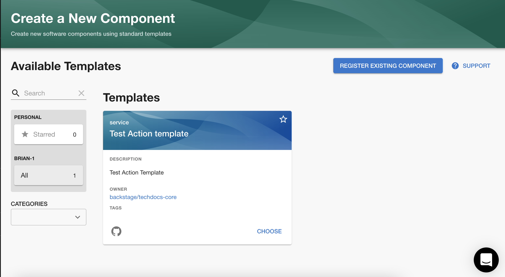
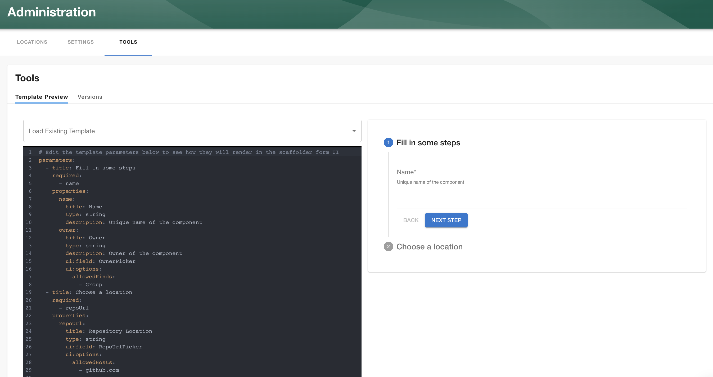

## Overview

The Roadie Backstage scaffolder is a feature that allows you to define software templates to create new software projects, update existing ones or simply perform repeated tasks in a consistent manner.

Scaffolder templates are defined in YAML files and loaded into the Backstage catalog in the same way that other entities are loaded into Backstage. A template contains one or more `steps` which run sequentially during execution.

A Scaffolder template is then run on demand by the users of Backstage to execute the software template. Roadie will execute the software template in an ephemeral container that is destroyed after the execution completes.

## Components of a Template

A Scaffolder template is a configurable process that will run one or more Scaffolder `steps`. The template will be run when a user visits the "Create Component" page in Backstage. `https://<tenant-name>.roadie.so/create`.



Templates are defined by a Backstage Entity YAML file with a `Template` kind and imported into the Backstage catalog. You can create multiple templates, each of which can perform a different set of steps. For example, you can have one template that creates a React application, and another that creates a serverless app.

Here is an example of a very basic Scaffolder template that prompts the user for a name, and then prints back the text "Hello, name!"

```yaml
apiVersion: scaffolder.backstage.io/v1beta3
kind: Template
metadata:
  name: hello-world-template
  title: Hello World
  description: Says Hello to a specified name.
spec:
  owner: backstage/techdocs-core
  type: service

  parameters:
    - title: You are about to say hello to your first Backstage Template
      required:
        - name
      properties:
        name:
          type: string

  steps:
    - id: log-message
      name: Log Message
      action: debug:log
      input:
        message: 'Hello, ${{ parameters.name }}!'
```

## Template preview

Tools section provides a preview page for templates, where you can see a live preview of the template form. This is done in order to provide an easy way to preview scaffolder template form UIs without running your own local instance of the plugin or committing changes to the template.



## Header Section

The header section is required for every `template` and contains information to configure the task and show details about the task on the "Create Component" page.

```yaml
apiVersion: scaffolder.backstage.io/v1beta3
kind: Template
metadata:
  name: hello-world-template
  title: Hello World
  description: Says Hello to a specified name.
spec:
  owner: default/engineering
  type: service
```

## `apiVersion`

This is a required field and should be set to `scaffolder.backstage.io/v1beta3`

## `kind`

A Scaffolder template is also an Entity in Backstage. In order to configure this entity as a template you must set the kind to `Template`

## `metadata`

The metadata field contains some data that appears on the template card that appears on the "Create Component" page.

## `spec`

The spec field contains `owner` and `type`. Owner refers to the Backstage group or user that owns the Scaffolder task e.g. `default/engineering`. Type refers to the type of template. It can be set to anything and appears on the scaffolder template card in the "Create Component" page.

## `parameters`

The parameters property is a list of parameters that can be prompted from the user when they run a template. Each array element contains the configuration for a single page of items to be filled by the user running the template. The parameter pages must contain `title`, `required` and `properties`.

You can choose to break up the parameter prompting into `form steps` or collect all of the parameters in one single step.
Each parameter can be one of a few types: `string`, `number`, `array` or `object`.

Here is the most basic example:

```yaml
parameters:
  properties:
    name:
      type: string
```

### `string`

You may collect text data from the user by using the string type. Here is the most basic example. It will prompt the user for a name.

```yaml
parameters:
  properties:
    name:
      type: string
```

You can prompt the user with a list of catalog entities using the `ui:field: EntityPicker` option as follows:

```yaml
parameters:
  properties:
    entity:
      type: string
      ui:field: EntityPicker
```

Alternatively if you would like the user to only select entities that they already own, you might want to use the OwnedEntityPicker.

```yaml
parameters:
  properties:
    ownedEntity:
      type: string
      ui:field: OwnedEntityPicker
```

If you would like a little validation when the user enters an Entity name, you can use the EntityNamePicker. It will prevent the user from entering an entity name that is not an acceptable entity name.

```yaml
parameters:
  properties:
    ownedEntity:
      type: string
      ui:field: EntityNamePicker
```

The respository picker can allow the user to select the name and location of a new respository. The picker restricts the target location of the repository to make it a little easier for the user to select a target location.

The following example, will only allow the user to enter a new repository name targetting the GitHub using the AcmeInc organization.

```yaml
parameters:
  properties:
    repoUrl:
      type: string
      ui:field: RepoUrlPicker
      ui:options:
        allowedHosts:
          - github.com
        allowedOwners:
          - AcmeInc
```

The `RepoUrlPicker` uses the `allowedHosts` to decide how to build the repo url output value. If you use `bitbucket.org` it will output a valid repo url for Bitbucket.

```yaml
parameters:
  properties:
    repoUrl:
      type: string
      ui:field: RepoUrlPicker
      ui:options:
        allowedHosts:
          - bitbucket.org
```

The owner picker, allows the user to select a user / group in the Backstage catalog. e.g.

```yaml
parameters:
  properties:
    owner:
      type: string
      ui:field: OwnerPicker
```

### `number`

You can allow the user to enter a number using the `number` type:

```yaml
parameters:
  properties:
    size:
      type: number
```

### `object`

The `object` allows the collection of more complex types of data from the user. It contains the `properties` option to add variables to the object as follows:

```yaml
parameters:
  properties:
    person:
      type: object
      properties:
        name:
          type: string
        age:
          type: number
```

You may choose to make an object property to be mandatory using the `required` property.

```yaml
parameters:
  properties:
    person:
      type: object
      required:
        - name
      properties:
        name:
          type: string
        age:
          type: number
```

### `array`

You can prompt for an array of properties using the array option. The `items` option can be any type: `array`, `object`, `string` or `number` as you like.

```yaml
parameters:
  properties:
    languages:
      type: array
      items:
        type: string
```

If you would like to prompt the user to add entity tags, you can use the `ui:field: EntityTagPicker` as shown below.

```yaml
parameters:
  properties:
    entityTags:
      type: array
      ui:field: EntityTagsPicker
```

### Outputs

Parameters can be retrieved later on by steps using parameter outputs. Here is an example of a parameter `name` being used by a `debug:log` step.

```yaml
parameters:
  properties:
    name:
      type: string
steps:
  - id: log-message
    name: Log Message
    action: debug:log
    input:
      message: 'Hello, ${{ parameters.name }}!'
```

If you need to reference elements of an array parameter you can refer to them using the following syntax:

```yaml
steps:
  - id: log-message
    name: Log Message
    action: debug:log
    input:
      message: 'Hello, ${{ parameters.names[0] }}!'
```

An `object` parameter values can be reference in the way you might expect.

```yaml
steps:
  - id: log-message
    name: Log Message
    action: debug:log
    input:
      message: 'Hello, ${{ parameters.person.name }}!'
```

### Common Options

If you would like to default the value of a field you can use the `default` option:

```yaml
parameters:
  properties:
    name:
      type: string
      default: 'world!'
```

If you would like to prompt the users for a fixed list of options, you may use the `enum` option.

```yaml
parameters:
  properties:
    size:
      type: number
      enum: [50, 100, 200]
```

You can display a more human description to a field value by using `title` and `description`

```yaml
parameters:
  properties:
    name:
      type: string
      title: 'Name'
      description: 'Name to say hello to'
```

### Form Steps

It might be jarring for your user to enter a lot of parameters one after another on the same page, especially if some of the properties require validation. As such Backstage have provided form steps.

You can make use of form steps using the following example.

```yaml
parameters:
  - title: 'Fill in the Name'
    properties:
      name:
        type: string
  - title: 'Fill in the Age'
    properties:
      age:
        type: number
```

### More Reading

You can read more about parameter configuration in the official backstage docs [here](https://backstage.io/docs/features/software-templates/writing-templates).

## `steps`

Steps define the actions that are taken by the scaffolder template when it is run as a task. The scaffolder initially creates a temporary directory referred to as the _workspace_, in which files are downloaded, generated, updated and pushed to some external system. Each step that is defined is run in order.

Parameters taken from the user earlier may be used in the action steps using the syntax `${{ parameters.name }}`.

### `fetch:plain`

Downloads content and places it in the workspace.

```yaml
steps:
  - action: fetch:plain
    id: fetch-plain
    name: Fetch plain
    input:
      url: ./plain
```

Optionally, if you would prefer the data to be downloaded to a subdirectory in the workspace you may specify the 'targetPath' input option.

```yaml
steps:
  - action: fetch:plain
    id: fetch-plain
    name: Fetch plain
    input:
      url: ./plain
      targetPath: fetched-data
```

#### Outputs

The `fetch:plain` action does not output any data.

### `fetch:template`

This downloads a directory containing templated files. It then renders all of the templates variables into the files and directory names and content, and places the result in the workspace.

```yaml
steps:
  - action: fetch:template
    id: fetch-template
    name: Fetch template
    input:
      url: ./template
      values:
        name: ${{ parameters.name }}
```

The templated files themselves can contain refererces to the values in the following way `${{ values.name }}`. It uses the nunjucks templating language. More details can be found [here](https://mozilla.github.io/nunjucks/).

Optionally, if you would prefer the data to be downloaded to a subdirectory in the workspace you may specify the 'targetPath' input option.

```yaml
steps:
  - action: fetch:template
    id: fetch-template
    name: Fetch template
    input:
      url: ./template
      targetPath: fetched-data
      values:
        name: ${{ parameters.name }}
```

You can also choose to not template specific files downloaded by the task by using the `copyWithoutRender` option. It may use file paths or globs.

```yaml
steps:
  - action: fetch:template
    id: fetch-template
    name: Fetch template
    input:
      url: ./template
      copyWithoutRender:
        - README.md
        - src/**.ts
      values:
        name: ${{ parameters.name }}
```

If you would like to limit the templating to very specific files, you can optionally add the `.njk` extension to the files and use the `templateFileExtension` option.

```yaml
steps:
  - action: fetch:template
    id: fetch-template
    name: Fetch template
    input:
      url: ./template
      templateFileExtension: true
      values:
        name: ${{ parameters.name }}
```

#### Outputs

The `fetch:template` action does not output any data.

### `publish:github`

This action creates a new GitHub repository and publishes the files in the workspace directory to the repository. There is one mandatory parameter `repoUrl`. The repo url picker described in the `string` parameter description above.

The `repoUrl` must be in the format `github.com?repo=<reponame>&owner=<owner org>`

```yaml
steps:
  - action: publish:github
    id: publish-repository
    name: Publish Repository to Github
    input:
      repoUrl: 'github.com?repo=newreponame&owner=AcmeInc'
```

By default it will create a repository with a `master` branch. If you would prefer to use `main` you can do the following:

```yaml
steps:
  - action: publish:github
    id: publish-repository
    name: Publish Repository to Github
    input:
      repoUrl: 'github.com?repo=newreponame&owner=AcmeInc'
      defaultBranch: main
```

The `access` input parameter adds an admin collaborator to the repository. It can be a reference to a GitHub user or a team in GitHub.

```yaml
steps:
  - action: publish:github
    id: publish-repository
    name: Publish Repository to Github
    input:
      repoUrl: 'github.com?repo=newreponame&owner=AcmeInc'
      access: AcmeInc/engineering
```

You can enable code owner reviews using the `requireCodeOwnerReviews` option:

```yaml
steps:
  - action: publish:github
    id: publish-repository
    name: Publish Repository to Github
    input:
      repoUrl: 'github.com?repo=newreponame&owner=AcmeInc'
      requireCodeOwnerReviews: true
```

The `repoVisibility` option allows the repository to be made public. By default it will be a private repository.

```yaml
steps:
  - action: publish:github
    id: publish-repository
    name: Publish Repository to Github
    input:
      repoUrl: 'github.com?repo=newreponame&owner=AcmeInc'
      repoVisibility: 'public'
```

To cause merges to delete the source branch, you can enabled the `deleteBranchOnMerge` setting.

```yaml
steps:
  - action: publish:github
    id: publish-repository
    name: Publish Repository to Github
    input:
      repoUrl: 'github.com?repo=newreponame&owner=AcmeInc'
      deleteBranchOnMerge: true
```

If you want to disable merge commits, squash merge and rebase merge you can do that with the settings `allowMergeCommit`, `allowSquashMerge` and `allowRebaseMerge`. By default, these are enabled.

```yaml
steps:
  - action: publish:github
    id: publish-repository
    name: Publish Repository to Github
    input:
      repoUrl: 'github.com?repo=newreponame&owner=AcmeInc'
      allowMergeCommit: false
      allowSquashMerge: false
      allowRebaseMerge: false
```

By default the repository will be populated with the files contained in the workspace directory. If you need to use a subdirectory, you can use the `sourcePath` option.

```yaml
steps:
  - action: publish:github
    id: publish-repository
    name: Publish Repository to Github
    input:
      repoUrl: 'github.com?repo=newreponame&owner=AcmeInc'
      sourcePatch: './repoRoot'
```

Collaborators can be added to the repository using the `collaborators` option. It takes an array of `username` and `access`. `username` is the GitHub username to allow collaboration. The `access` option gives the user specfic type of permissions. The options are `pull`, `push`, `admin`, `maintain` or `triage`.

```yaml
steps:
  - action: publish:github
    id: publish-repository
    name: Publish Repository to Github
    input:
      repoUrl: 'github.com?repo=newreponame&owner=AcmeInc'
      collaborators:
        - username: user1
          access: read
```

The `topics` allows adding topics to the created repository when its created.

```yaml
steps:
  - action: publish:github
    id: publish-repository
    name: Publish Repository to Github
    input:
      repoUrl: 'github.com?repo=newreponame&owner=AcmeInc'
      topics:
        - java
        - ruby
```

#### Outputs

The `publish:github` action produces two step outputs.

| Name            | Description                                   |
| --------------- | --------------------------------------------- |
| remoteUrl       | Url for the newly created repository          |
| repoContentsUrl | Url that shows the contents of the repository |

These outputs can be retrieved by a subsequent step using:

```yaml
steps:
  - id: log-message
    name: Log Message
    action: debug:log
    input:
      message: 'RemoteURL: ${{ steps.publish-repository.output.remoteUrl }}, ${{ steps.publish-repository.output.repoContentsUrl }}!'
```

### `publish:github:pull-request`

This action creates a pull request against a pre-existing repository using the files contained in the workspace directory. The most basic example is:

```yaml
steps:
  - action: publish:github:pull-request
    id: create-pull-request
    name: Create a pull request
    input:
      repoUrl: 'github.com?repo=reponame&owner=AcmeInc'
      branchName: ticketNumber-123
      title: 'Make some changes to the files'
      description: 'This pull request makes canges to the files in the reponame repository in the AcmeInc organization'
```

If the updated code is contained in a subdirectory to the workspace directory, you can use the `sourcePath` to select it. If the files you want to target to update are in a subdirectory of the repository you can use the `targetPath` option.

```yaml
steps:
  - action: publish:github:pull-request
    id: create-pull-request
    name: Create a pull request
    input:
      repoUrl: 'github.com?repo=reponame&owner=AcmeInc'
      branchName: ticketNumber-123
      title: 'Make some changes to the files'
      description: 'This pull request makes canges to the files in the reponame repository in the AcmeInc organization'
      sourchPath: ./subdirectory
      targetPath: ./subdirectory
```

#### Outputs

The `publish:github:pull-request` action produces two outputs.

| Name              | Description                          |
| ----------------- | ------------------------------------ |
| remoteUrl         | Url to the new pull request          |
| pullRequestNumber | Shows the number of the pull request |

They can be accessed in subsequent steps as follows:

```yaml
steps:
  - id: log-message
    name: Log Message
    action: debug:log
    input:
      message: 'RemoteURL: ${{ steps.create-pull-request.output.remoteUrl }}, ${{ steps.create-pull-request.output.pullRequestNumber }}!'
```

### `publish:bitbucket`

This action creates a new Bitbucket repository and publishes the files in the workspace directory to the repository. There is one mandatory parameter `repoUrl`. The repo url picker described in the `string` parameter description above.

The `repoUrl` must be in the format `bitbucket.org?repo=<project name>&workspace=<workspace name>&project=<project name>`

```yaml
steps:
  - action: publish:bitbucket
    id: publish-repository
    name: Publish Repository to Bitbucket
    input:
      repoUrl: 'bitbucket.org?repo=newprojectname&workspace=workspacename&project=projectname'
```

You can optionally add a `description` to the new repository.

```yaml
steps:
  - action: publish:bitbucket
    id: publish-repository
    name: Publish Repository to Bitbucket
    input:
      repoUrl: 'bitbucket.org?repo=newprojectname&workspace=workspacename&project=projectname'
      description: 'My new project'
```

By default the project will be created as a private repository. It can be made public using the `repoVisibility` option.

```yaml
steps:
  - action: publish:bitbucket
    id: publish-repository
    name: Publish Repository to Bitbucket
    input:
      repoUrl: 'bitbucket.org?repo=newprojectname&workspace=workspacename&project=projectname'
      repoVisibility: 'public'
```

By default the repository is created with a "master" branch. If you would like to use "main" instead you can us the `defaultBranch` option.

```yaml
steps:
  - action: publish:bitbucket
    id: publish-repository
    name: Publish Repository to Bitbucket
    input:
      repoUrl: 'bitbucket.org?repo=newprojectname&workspace=workspacename&project=projectname'
      defaultBranch: 'main'
```

By default the repository will be populated with the files contained in the workspace directory. If you need to use a subdirectory, you can use the `sourcePath` option.

```yaml
steps:
  - action: publish:bitbucket
    id: publish-repository
    name: Publish Repository to Bitbucket
    input:
      repoUrl: 'bitbucket.org?repo=newprojectname&workspace=workspacename&project=projectname'
      sourcePatch: './repoRoot'
```

#### Outputs

The `publish:bitbucket` action produces the following outputs.

| Name            | Description                                   |
| --------------- | --------------------------------------------- |
| remoteUrl       | Url for the newly created repository          |
| repoContentsUrl | Url that shows the contents of the repository |

### `catalog:register`

This action manually registers a component with the catalog.

You may want to do this if you haven't [configured autodiscovery](../location-management) of components or if you're using a filename which doesn't match your autodiscovery pattern.

It has two sets of options. The first allows you to configure the location as a complete url through `catalogInfoUrl`.

```yaml
steps:
  - action: catalog:register
    id: register-with-catalog
    name: Manually register with the catalog
    input:
      catalogInfoUrl: https://github.com/RoadieHQ/sample-service/blob/master/catalog-info-1.yaml
      # optional: false # default
```

The second allows you to configure the repo containing the catalog file through `repoContentsUrl` and optionally a filepath through `catalogInfoPath `. You might use this along with the publish:github action.

```yaml
steps:
  - action: catalog:register
    id: register-with-catalog
    name: Manually register with the catalog
    input:
      repoContentsUrl: ${{ steps.publish-repository.output.repoContentsUrl }}
      # catalogInfoPath: catalog-info.yaml # default
      # optional: false # default
```

In both cases you can pass an `optional` flag which determines if the location can be created before the catalog files exists.

### `catalog:write`

This action creates a `catalog-info.yaml` file into the workspace directory. It takes an object that will be serialized as YAML into the body of the file.

```yaml
steps:
  - action: catalog:write
    id: create-catalog-info-file
    name: Create catalog file
    input:
      entity:
        apiVersion: backstage.io/v1alpha1
        kind: Component
        metadata:
          name: test
          annotations: {}
        spec:
          type: service
          lifecycle: production
          owner: default/owner
```

If you would like to create the catalog file in a custom location you can do that with the `filePath` option.

```yaml
steps:
  - action: catalog:write
    id: create-catalog-info-file
    name: Create catalog file
    input:
      filePath: '.backstage/catalog-info.yaml'
      entity:
        apiVersion: backstage.io/v1alpha1
        kind: Component
        metadata:
          name: test
          annotations: {}
        spec:
          type: service
          lifecycle: production
          owner: default/owner
```

#### Outputs

The `catalog:write` action does not have any outputs.

### `fs:delete`

This action deletes items in the workspace. It has one input parameter `files` that can be provided an array of items to delete.

```yaml
steps:
  - action: fs:delete
    id: delete-filds
    name: Delete files
    input:
      files:
        - files/deleteme
        - otherfiletodelete
```

#### Outputs

The `fs:delete` action does not have any outputs.

### `fs:rename`

This action allows you to move `files` within the workspace. The `files` option takes an array of objects containing `from` and `to` options.

```yaml
steps:
  - action: fs:rename
    id: rename-files
    name: Rename files
    input:
      files:
        - from: copyfrom
          to: copyto
        - from: copyfrom1
          to: copyfrom2
```

#### Outputs

The `fs:rename` action does not have any outputs.

### `github:actions:dispatch`

The `github:actions:dispatch` action allows you to trigger the execution of a GitHub action on a repository. The `repoUrl` option is a repo url for GitHub. The `RepoUrlPicker` documented above can generate this value. The `workflowId` can be the workflow id from the GitHub API or you can just use the filename for the workflow file itself. The `branchOrTagName` indicates which commit to run the workflow against.

This example will run the workflow defined in the "my-workflow-file.yaml" file on the "newreponame" repository on the "main" branch.

```yaml
steps:
  - action: github:actions:dispatch
    id: trigger-build
    name: Trigger Build
    input:
      repoUrl: 'github.com?repo=newreponame&owner=AcmeInc'
      workflowId: 'my-workflow-file.yaml'
      branchOrTagName: 'main'
```

If the workflow takes additional inputs, you can pass these along with the `workflowInputs` option.

```yaml
steps:
  - action: github:actions:dispatch
    id: trigger-build
    name: Trigger Build
    input:
      repoUrl: 'github.com?repo=newreponame&owner=AcmeInc'
      workflowId: 'my-workflow-file.yaml'
      branchOrTagName: 'main'
      workflowInputs:
        parameter1: value1
        parameter2: value2
```

#### Outputs

The `github:actions:dispatch` action does not have any outputs.

### `github:webhook`

You can configure a webhook on an existing repository in GitHub using this action. It takes `repoUrl` and `webhookUrl`. The `repoUrl` option needs to be in a the GitHub repo format. The `RepoUrlPicker` documented above will generate a url in the correct format.

```yaml
steps:
  - action: github:webhook
    id: add-webhook
    name: Add Webhook
    input:
      repoUrl: 'github.com?repo=newreponame&owner=AcmeInc'
      webhookUrl: 'https://webhook-handler-service.abc/handle-webhook'
```

You can configure a webhook secrect using the `webhookSecret` option. You will likely want to provide this via an output from a previous step.

```yaml
steps:
  - action: github:webhook
    id: add-webhook
    name: Add Webhook
    input:
      repoUrl: 'github.com?repo=newreponame&owner=AcmeInc'
      webhookUrl: 'https://webhook-handler-service.abc/handle-webhook'
      webhookSecret: 'mysupersecretwebhooksecret'
```

You can configure the types of `events` that trigger the webhook. For a full list of options see [here](https://docs.github.com/en/developers/webhooks-and-events/webhooks/webhook-events-and-payloads)

```yaml
steps:
  - action: github:webhook
    id: add-webhook
    name: Add Webhook
    input:
      repoUrl: 'github.com?repo=newreponame&owner=AcmeInc'
      webhookUrl: 'https://webhook-handler-service.abc/handle-webhook'
      events:
        - push
        - pull_request
```

If you would like the webhook to receive every event, you can set the events to contain "\*".

```yaml
steps:
  - action: github:webhook
    id: add-webhook
    name: Add Webhook
    input:
      repoUrl: 'github.com?repo=newreponame&owner=AcmeInc'
      webhookUrl: 'https://webhook-handler-service.abc/handle-webhook'
      events:
        - '*'
```

By default the payload of the webhook is form encoded, if you prefer json you can use `contentType: json`

```yaml
steps:
  - action: github:webhook
    id: add-webhook
    name: Add Webhook
    input:
      repoUrl: 'github.com?repo=newreponame&owner=AcmeInc'
      webhookUrl: 'https://webhook-handler-service.abc/handle-webhook'
      contentType: json
```

You can disable SSL on the webhook request using the `insecureSsl` option but it is not advised.

```yaml
steps:
  - action: github:webhook
    id: add-webhook
    name: Add Webhook
    input:
      repoUrl: 'github.com?repo=newreponame&owner=AcmeInc'
      webhookUrl: 'https://webhook-handler-service.abc/handle-webhook'
      insecureSsl: true
```

#### Outputs

The `github:webhook` action does not have any outputs.

### `http:backstage:request`

This action allows the Scaffolder task to run a HTTP request against the Backstage Backend API and handle the response. It can be useful for extending the scaffolder to call out to third party APIs. You can do this by configuring a proxy and then calling the proxy with this action.

```yaml
steps:
  - action: http:backstage:request
    id: http-request
    name: Create a thing on the acme service
    input:
      method: POST
      path: '/api/proxy/acme/thing'
```

You can optionally add request `params`.

```yaml
steps:
  - action: http:backstage:request
    id: http-request
    name: Create a thing on the acme service
    input:
      method: POST
      path: '/api/proxy/acme/thing'
      params:
        state: 'bar'
```

The `headers` parameter allows setting headers on the request:

```yaml
steps:
  - action: http:backstage:request
    id: http-request
    name: Create a thing on the acme service
    input:
      method: POST
      path: '/api/proxy/acme/thing'
    headers:
      Accept: 'application/json'
```

The `body` param allows you to set a request body. This is most likely going to be useful for `POST` requests.

```yaml
steps:
  - action: http:backstage:request
    id: http-request
    name: Create a thing on the acme service
    input:
      method: POST
      path: '/api/proxy/acme/thing'
      body: 'thingname=abc1'
```

You can also have the action generate a `json` formatted body by setting a custom "Content-Type" header to "application/json" and then providing a object to the `body` param.

```yaml
steps:
  - action: http:backstage:request
    id: http-request
    name: Create a thing on the acme service
    input:
      method: POST
      path: '/api/proxy/acme/thing'
      headers:
        'Content-Type': 'application/json'
      body:
        thingname: 'foo'
```

#### Outputs

The `http:backstage:request` action has three outputs.

| Name    | Description                                                        |
| ------- | ------------------------------------------------------------------ |
| code    | Status code of the http response                                   |
| headers | Dictionary containing all of the response headers and their values |
| body    | Body of the response                                               |

If there is a content-type header containing `application/json` the `body` param will contain the parsed object. Otherwise it will contain an object with a single param `message` containing a string representing the body of the response.

### `debug:log`

Use the `debug:log` action to print some information to the task console.

```yaml
steps:
  - action: debug:log
    id: debug-log
    name: Log Hello World
    input:
      message: 'Hello, World!'
```

#### Outputs

The `debug:log` action does not have any outputs.

### Other Actions

You can find all of the actions available to your Backstage instance by visiting the following page from within Backstage:

`https://<tenant-name>.roadie.so/create/actions`

## Advanced

### Calling an internal API

If you need a scaffolder step to contact a custom authenticated service or any public API for that matter that is not currently supported by a built in action, you can do that using a combination of the `http:backstage:request` action and a [backstage proxy configuration](/docs/custom-plugins/proxy/).

Start by creating a proxy configuration as described in [this page](/docs/custom-plugins/proxy/)

Then you can add a step to call that API using the `http:backstage:request` action as follows:

```yaml
steps:
  - action: http:backstage:request
    id: http-request
    name: Create a thing on the acme service
    input:
      method: POST
      path: "/api/proxy/acme/thing"
  - action: debug:log
    id: log-result
    name: Log the result of creating the thing
    input:
      message: "The response code was ${{ steps.http-request.output.code }}
```

## Troubleshooting

Writing templates can be a little cumbersome at times. We have compiled a list of errors that we have seen in the past, that might help you determine the cause of your issue.

### Resource not accessible by integration

This error is referring to actions that interact GitHub. It means that the Roadie GitHub app is unable to read, create or update the resource/s that are being touched by the Scaffolder step.
