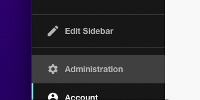
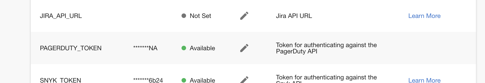
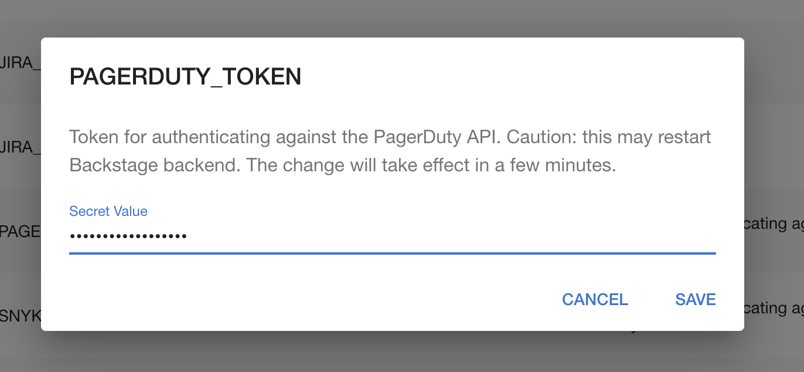

## Introduction

Many Backstage plugins require authentication to work. This tutorial shows you how to set authentication tokens securely in Roadie.

## Step 1: Visit the secrets page

The secrets page is available in your Backstage instance at:

```
https://<tenant-name>.roadie.so/administration/settings/secrets
```

To navigate to this page, follow these steps:

1. Click the Administration link in the bottom left of the application.



2. Click the Settings tab along the top of the Administration page.


3. Click on Secrets in the left sidebar.


## Step 2: Edit the secret you need

1. Find the secret name in the table. For example: `PAGERDUTY_TOKEN`.



2.. Click the pencil icon to open a dialog where you can set a token.



3. Paste your token into the input and click SAVE. The specific details of where to get the token will depend on the plugin you are configuring.
