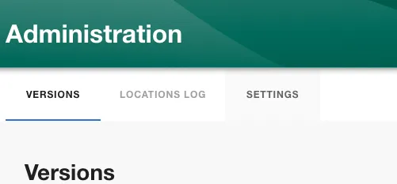
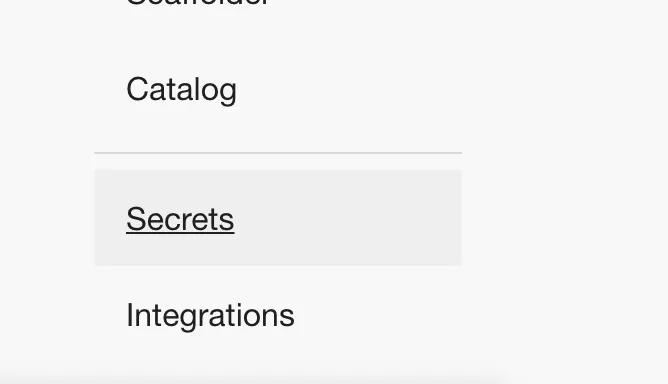
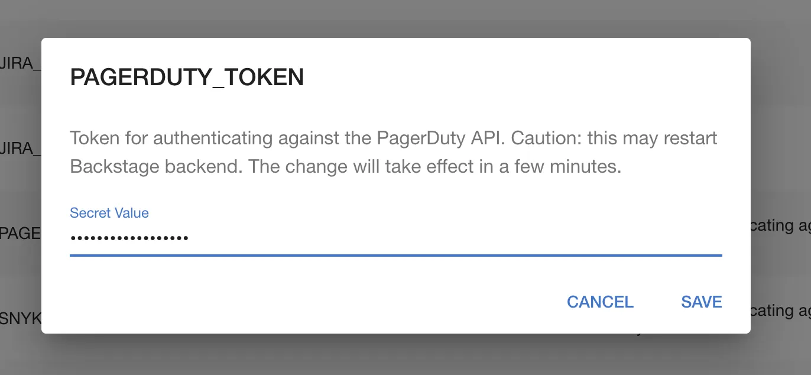
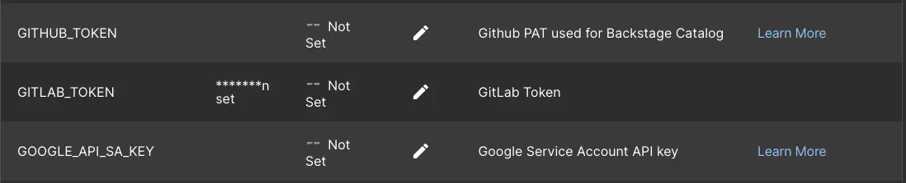

## Introduction

Many Backstage plugins require authentication to work. This tutorial shows you how to set authentication tokens securely in Roadie.

## Step 1: Visit the secrets page

The secrets page is available in your Backstage instance at:

```
https://<tenant-name>.roadie.so/administration/secrets
```

To navigate to this page, follow these steps:

1. Click the Administration link in the bottom left of the application.


2. Click the Settings tab along the top of the Administration page.



3. Click on Secrets in the left sidebar.




## Step 2: Edit the secret you need

1. Find the secret name in the table. For example: `PAGERDUTY_TOKEN`.


2.. Click the pencil icon to open a dialog where you can set a token.



3. Paste your token into the input and click SAVE. The specific details of where to get the token will depend on the plugin you are configuring.

## Step 3: Unsetting or deleting a secret

If you need to delete a saved secret, you can easily do so by editing the secret and entering the value `unset`.

1. Find the secret you want to delete in the table.

2. Click the pencil icon to edit the secret.

3. In the input field, type `unset` and click SAVE. This will remove the secret from the system.



Once the secret is removed, it will no longer be available for use by any plugins or integrations.