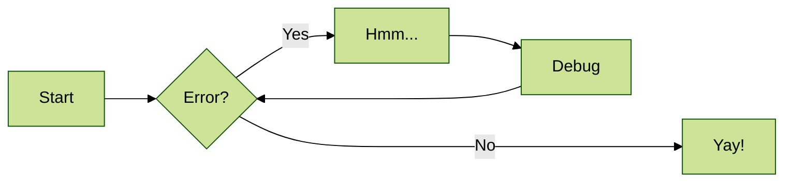
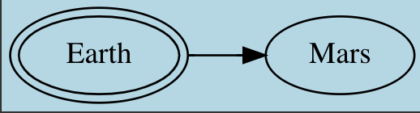

The TechDocs feature of Roadie Backstage allows markdown files written alongside the code of your components to appear in Backstage as styled HTML documentation. 


## MkDocs Plugins

Under the hood, Backstage uses the popular [MkDocs library](https://www.mkdocs.org/) to render documentation. This library is very feature rich thanks to its extensive range of available plugins.

We currently include the following MkDocs plugins in our build process:
- [search](https://www.mkdocs.org/user-guide/configuration/#search)
- [mkdocs-monorepo-plugin](https://github.com/backstage/mkdocs-monorepo-plugin)
- [admonition](https://squidfunk.github.io/mkdocs-material/reference/admonitions/#admonitions) - include side content without significantly interrupting the document flow
- [toc](https://python-markdown.github.io/extensions/toc/) - generates a Table of Contents for your doc
- [pymdown](https://facelessuser.github.io/pymdown-extensions/) - a collection of the following extensions:
    - caret: Insert superscripts and place text in an <ins> tag.
    - critic: [Critic Markup](https://fletcher.github.io/MultiMarkdown-6/syntax/critic.html) allows you to track changes.
    - details: Collapsible elements with <details> and <summary> tags.
    - emoji: Add emojis.
    - superfences: Split up your docs with [fences](https://python-markdown.github.io/extensions/fenced_code_blocks/) to make them more readable.
    - inlinehilite: Highlights inline code.
    - magiclink: Linkafies URL and email links without having to wrap them in Markdown syntax. Also, shortens repository issue, pull request, and commit links automatically for popular code hosting providers.
    - mark: Mark words easily.
    - smartsymbols: Inserts commonly used Unicode characters via simple ASCII representations: =/= → ≠.
    - highlight: Configure the syntax highlighting of SuperFences and InlineHilite. Also passes standard Markdown indented code blocks through the syntax highlighter.
    - extra: Extra is just like Python Markdown's Extra package except it uses PyMdown Extensions to substitute similar extensions.
    - tabbed: Allows for tabbed Markdown content.
    - tasklist: Lists with check boxes.
    - tilde: Adds support for inserting subscripts and adds an easy way to place text in a tag.
- [markdown_inline_graphviz](https://pypi.org/project/markdown-inline-graphviz/) - replaces inline Graphviz definitions with inline SVGs or PNGs
- [plantuml_markdown](https://pypi.org/project/plantuml-markdown/) - specify a PlantUML diagram which will be converted into an image and inserted in the document
- [mdx_truly_sane_lists](https://pypi.org/project/mdx-truly-sane-lists/) - custom indents for nested lists, better linebreaks and paragraphs between lists.

- [mkdocs-awesome-pages-plugin](https://github.com/lukasgeiter/mkdocs-awesome-pages-plugin) - simplifies configuring page titles and their order
- [mkdocs-schema-reader](https://pypi.org/project/mkdocs-schema-reader/) - converts JSON Schema files into markdown
- [mkdocs-minify-plugin](https://github.com/byrnereese/mkdocs-minify-plugin) - minify HTML, JS or CSS files
- [mkdocs-git-revision-date-localized-plugin](https://github.com/timvink/mkdocs-git-revision-date-localized-plugin) - enables displaying the date of the last git modification of a page
- [mkdocs-glightbox](https://github.com/blueswen/mkdocs-glightbox) - display images, iframes, inline content and videos
- [markdown-inline-mermaid](https://github.com/mermaid-js/mermaid) - generate diagrams from markdown-like text.


## Theme and Styling
Backstage uses an opinionated theme based on [material-mkdocs](https://github.com/backstage/mkdocs-techdocs-core#theme).

NB: Some styles will always be overridden regardless of the mkdocs-material plugin theme settings and this can cause unexpected behavior for those who override the theme setting in a mkdocs.yaml file.


## Testing and previewing your documentation

You can generate / serve your docs locally to view what they would look like when they are deployed to Roadie.

To generate the docs to the site directory of the project you can run the following command:

```bash
npx @techdocs/cli generate --docker-image roadiehq/techdocs
```

To start a local server at port 3000 containing the generated docs, you can run the following command:
```bash
npx @techdocs/cli serve --docker-image roadiehq/techdocs
```

NB: We have seen some issues generating and serving plantuml and mermaid diagrams sometimes on M1 Macbooks due to unresolved
bugs in open source dependencies. Please reach out to us anyway if you run into any difficulties. 

## Navigation and Titles

By default, the structure of the docs pages will mirror that of the file system. You can also explicitly describe your
page structure using the `nav` object in your mkdocs.yaml. Both approaches are described [here](https://www.mkdocs.org/user-guide/writing-your-docs/#file-layout).

Similarly, mkdocs will determine a title for your document according to [these rules](https://www.mkdocs.org/user-guide/writing-your-docs/#meta-data).

## Graphs and Diagrams

### Using Mermaid Diagrams

Roadie supports using Mermaid JS to render diagrams. It must first be enabled in your `mkdocs.yaml`:

```yaml
markdown_extensions:
  - markdown_inline_mermaid
```

Then you can add mermaid diagrams as follows:
````

````

### Customizing graph styling

In order to customize the look of the graphs you will need to use the [Graphviz attributes](https://graphviz.org/doc/info/attrs.html). Setting different values for specific set of attributes will result in graph being rendered that way. For example, let's say we want to change background color from white to lightblue in following graph:


which could be defined in TechDocs with following code:

```

```

Adding 'bgcolor' attribute in the Graphviz code above (so its final form is):

```

```

will result in graph being rendered in lightblue color.




This way you can customize the graph adding or removing any attribute you want.


## Using a Documentation Monorepo

If you need to have a place to store docs that are not related to a specific codebase or component, you may want to use a single repository to collect that meta documentation.

Nested file structures and sub-directories can be modeled using the [Monorepo plugin for techdocs](https://github.com/backstage/mkdocs-monorepo-plugin).

1. Add to your root `mkdocs.yaml` file.
```yaml
plugins:
  - monorepo
```

2. Reference other `mkdocs.yaml` files in sub-directories using the `!include` syntax like so:

```yaml
nav:
  - Intro: 'index.md'
  - Authentication: 'authentication.md'
  - API:
    - v1: '!include ./v1/mkdocs.yml'
    - v2: '!include ./v2/mkdocs.yml'
```

Standalone repos for documentation not related to a codebase or component should still be modeled in Roadie Backstage
with a catalog-info.yaml file. The docs repo entity can be described with the following kind and spec type:

```yaml
---
apiVersion: backstage.io/v1alpha1
kind: Component
...
spec: 
  type: documentation
...
```

## Including existing markdown files

Mkdocs only processes markdown files in the mkdocs directory (defaults to `docs/`). If you've existing docs
which live closer to the code e.g. a README.md in the root or at some other level they can't be referenced in the mkdocs.yaml.

It is possible to use the [PyMdown snippets extension](https://facelessuser.github.io/pymdown-extensions/extensions/snippets/#snippets) to include markdown files from outside the mkdocs docs directory in markdown files within it.

To enable this extension update your mkdocs.yaml:

```yaml
markdown_extensions:
  # ... other extensions 
  - pymdownx.snippets:
      check_paths: true
```

Then you can include snippets in your markdown files. If a snippet is the only content in a file then the content is replaced
by the referenced file. For example, to include a file TEST.md at the root of our repo we could do the following:
- Create a file under the docs directory e.g. `docs/test.md`
- Add a snippet to test.md (the snippet path is relative to the mkdocs.yaml file)
   ```markdown
   --8<-- "TEST.md"
   ```


## Building and Publishing Techdocs Via CI

You can build and publish techdocs via your own CI pipelines so that the latest version is always ready to view in Roadie and you don't have to wait for a new build when viewing an updated version of your docs.

- Send us your AWS account id so we can set up the role to access your Roadie techdocs s3 bucket in our infra.
- Create Github action to build and publish the docs https://backstage.io/docs/features/techdocs/configuring-ci-cd/
- Configure your action to connect securely with the Roadie AWS S3 bucket - bucketName: <your-roadie-tenant-name>-roadie-tech-docs, region: eu-west-1

Roadie hosts tech docs in a dedicated AWS S3 bucket. To be able to generate and publish the tech docs yourself we can set up secured access to this bucket for you.

### Building all docs or only some docs via CI

You can choose to switch wholesale to build all your techdocs via CI (the recommended approach as this gives the best user experience). 

Or you can use an annotation to only build specific docs via CI and leave the others to build on viewing. 

```yaml
metadata: 
  ...
  annotations: 
    roadie.io/techdocs-builder: 'ci'
...
```

### Connecting to Roadie

You can generate and publish tech docs with the techdocs-cli using one of two ways:
* (Preferred) Assuming a role on our AWS account
  - For us to grant access to you to assume this role we need you to provide the AWS account id you would be using to publish tech docs
  - We will generate a role you can assume using your AWS credentials from the account you provided to publish tech docs to your Roadie instance.
* (In case role assumption can't work for you) We can provide you an access key and secret
  - To get credentials you can contact support 
  - Add the environment variables: `AWS_ACCESS_KEY_ID` and `AWS_SECRET_ACCESS_KEY` to your CI workflow for use by the cli

If you are running the CI job in your own AWS account and assuming a role in the Roadie environment, you don't need to set up the above variables.

Additionally, you need to defined the correct AWS region to be used when publishing tech docs to Roadie. This can be done using an environment variable as well. Currently the region is eu-west-1:
`AWS_REGION=eu-west-1`


### Publishing with Techdocs CLI
The publishing procedure follows the structure of the techdocs-cli.
`techdocs-cli publish --publisher-type awsS3 --storage-name <the-aws-bucket-name-we-have-provided-you> --entity default/Component/my-service --awsRoleArn <the-aws-role-arn-we-have-provided-you>`

