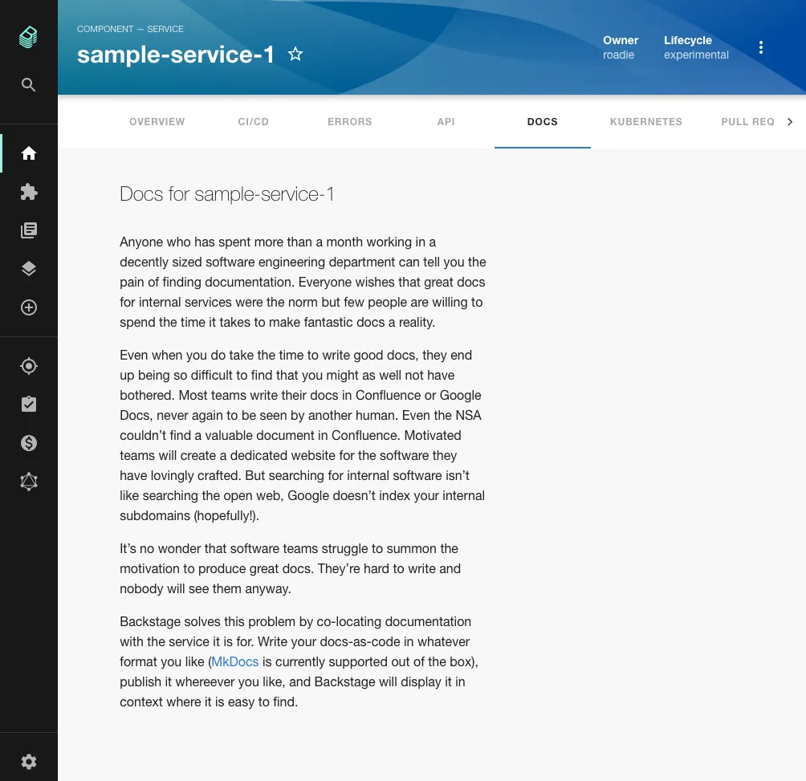
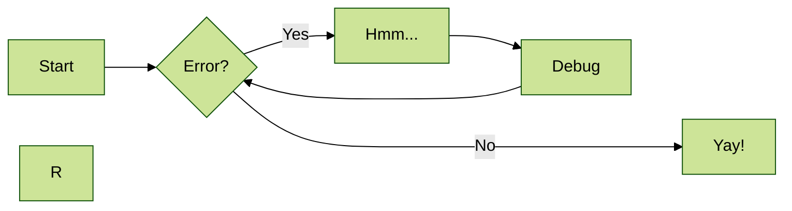
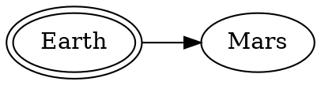
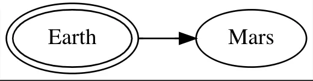
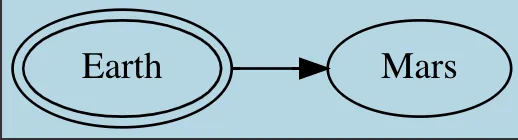

The TechDocs feature of Roadie Backstage allows markdown files written alongside the code of your components to appear in Backstage as styled HTML documentation. 




## MkDocs Plugins

Under the hood, Backstage uses the popular [MkDocs library](https://www.mkdocs.org/) to render documentation. This library is very feature rich thanks to its extensive range of available plugins.

We currently include the following MkDocs plugins in our build process:
- [search](https://www.mkdocs.org/user-guide/configuration/#search)
- [mkdocs-monorepo-plugin](https://github.com/backstage/mkdocs-monorepo-plugin)
- [admonition](https://squidfunk.github.io/mkdocs-material/reference/admonitions/#admonitions) - includes side content without significantly interrupting the document flow
- [toc](https://python-markdown.github.io/extensions/toc/) - generates a Table of Contents for your doc
- [pymdown](https://facelessuser.github.io/pymdown-extensions/) - a collection of the following extensions:
    - caret: Inserts superscripts and place text in an <ins> tag.
    - critic: [Critic Markup](https://fletcher.github.io/MultiMarkdown-6/syntax/critic.html) allows you to track changes.
    - details: Collapsible elements with `details` and `summary` tags.
    - emoji: Adds emojis.
    - superfences: Splits up your docs with [fences](https://python-markdown.github.io/extensions/fenced_code_blocks/) to make them more readable.
    - inlinehilite: Highlights inline code.
    - magiclink: Linkifies URL and email links without having to wrap them in Markdown syntax. Also, shortens repository issue, pull request, and commit links automatically for popular code hosting providers.
    - mark: Marks words easily.
    - smartsymbols: Inserts commonly used Unicode characters via simple ASCII representations like: =/= → ≠.
    - highlight: Configures the syntax highlighting of SuperFences and InlineHilite. Also passes standard Markdown indented code blocks through the syntax highlighter.
    - extra: Extra is just like Python Markdown's Extra package except it uses PyMdown Extensions to substitute similar extensions.
    - tabbed: Allows for tabbed Markdown content.
    - tasklist: Lists with check boxes.
    - tilde: Adds support for inserting subscripts and adds an easy way to place text in a tag.
- [markdown_inline_graphviz](https://pypi.org/project/markdown-inline-graphviz/) - replaces inline Graphviz definitions with inline SVGs or PNGs
- [plantuml_markdown](https://pypi.org/project/plantuml-markdown/) - inserts a PlantUML diagram as an image in your document
- [mdx_truly_sane_lists](https://pypi.org/project/mdx-truly_sane_lists/) - adds custom indents for nested lists, better linebreaks and paragraphs between lists.

- [mkdocs-awesome-pages-plugin](https://github.com/lukasgeiter/mkdocs-awesome-pages-plugin) - simplifies configuring page titles and their order
- [mkdocs-schema-reader](https://pypi.org/project/mkdocs-schema-reader/) - converts JSON Schema files into markdown
- [mkdocs-minify-plugin](https://github.com/byrnereese/mkdocs-minify-plugin) - minifies HTML, JS or CSS files
- [mkdocs-glightbox](https://github.com/blueswen/mkdocs-glightbox) - displays images, iframes, inline content and videos
- [mkdocs-kroki-plugin](https://github.com/AVATEAM-IT-SYSTEMHAUS/mkdocs-kroki-plugin) - A diagram library supporting multiple different diagram formats. See https://kroki.io/ for more information.
- [mkdocs-print-site-plugin](https://timvink.github.io/mkdocs-print-site-plugin/index.html) - Allows you to render a whole doc with all pages so that you can export it to PDF or HTML via the browser.
- [mkdocs-git-revision-date-localized-plugin](https://pypi.org/project/mkdocs-git-revision-date-localized-plugin/) - Displays the localized date of the last git revision for each page. **Note that this plugin requires the `git` command and thus is only applicable if you are using the CI build pipeline of tech docs**
- [mkdocs-literate-nav](https://pypi.org/project/mkdocs-literate-nav/) - Define the navigation structure in a Markdown file (e.g., `SUMMARY.md`).
- [mkdocs-section-index](https://pypi.org/project/mkdocs-section-index/) - Treats `index.md` files as the index page for their section, making the section itself clickable in the navigation.
- [mkdocs-same-dir](https://pypi.org/project/mkdocs-same-dir/) - Allows organizing source files in subdirectories without reflecting that structure in the navigation URLs or layout.

**NB: To use these plugins you must include them in your `mkdocs.yml` file like so:**

Generic Markdown plugins are listed under `markdown_extensions:` while MkDocs plugins are under `plugins:`

```yaml
...
plugins:
  - techdocs-core
  - glightbox 
markdown_extensions:
  - attr_list
```

Note that the [`techdocs-core`](https://github.com/backstage/mkdocs-techdocs-core?tab=readme-ov-file#mkdocs-plugins-and-extensions) plugin packages many of the above plugins already.

## Theme and Styling

Backstage uses an opinionated theme based on [material-mkdocs](https://github.com/backstage/mkdocs-techdocs-core#theme).

NB: Some styles will always be overridden regardless of the mkdocs-material plugin theme settings and this can cause unexpected behavior for those who override the theme setting in a mkdocs.yaml file.


## Testing and previewing your documentation

You can generate / serve your docs locally to view what they would look like when they are deployed to Roadie.

To generate the docs to the site directory of the project you can run the following command:

```bash
npx @techdocs/cli generate --docker-image roadiehq/techdocs
```

To start a local server at port 3000 containing the generated docs, you can run the following command:
```bash
npx @techdocs/cli serve --docker-image roadiehq/techdocs
```

NB: We have seen some issues generating and serving plantuml and mermaid diagrams sometimes on M1 Macbooks due to unresolved
bugs in open source dependencies. Please reach out to us anyway if you run into any difficulties. 

## Navigation and Titles

By default, the structure of the docs pages will mirror that of the file system. You can also explicitly describe your
page structure using the `nav` object in your `mkdocs.yaml`. Both approaches are described [here](https://www.mkdocs.org/user-guide/writing-your-docs/#file-layout).

Similarly, MkDocs will determine a title for your document according to [these rules](https://www.mkdocs.org/user-guide/writing-your-docs/#meta-data).

By default MkDocs will create a navigation menu where a menu item that has child pages will not link to the index page for that parent item. To fix this we have added a MkDocs plugin called `section-index`. To enable this plugin you can add it to the plugins list in the `mkdocs.yaml` file.


```yaml
plugins:
  - section-index
  - ...
```

## Exporting and printing

You can print docs from Roadie using the inbuilt browser print options, such as printing to PDF (`File -> Print` for most browsers).

### Requirements

You must have Light Theme enabled when doing the export (`/administration/account` -> Appearance) and the Table of Contents turned off. 

You can remove the Table of Contents from the export using the cog icon on the top right of the docs page to hide it. This is a user setting so it will not affect other viewers of the docs, and you can re-enable both dark theme and Table of Contents after exporting the doc. 

### Exporting/Printing all pages
You can use the [mkdocs-print-site-plugin](https://timvink.github.io/mkdocs-print-site-plugin/index.html) to build a single page view of your docs with all pages, that you can then use to export to PDF via your browser. This can be useful for auditing purposes or to share docs with someone that does not have access to Roadie. 

You will need to add the plugin to your `mkdocs.yml` file first like so:

```yaml
plugins:
  - print-site
```

NB: This plugin currently requires each page to have an H1 header - [see currently open issue](https://github.com/timvink/mkdocs-print-site-plugin/issues/94)


## Graphs and Diagrams

### Using Mermaid Diagrams

Roadie supports displaying Mermaid diagrams via tech docs. The diagrams work by default using a Javascript based Mermaid renderer [`mermaid`](https://www.npmjs.com/package/mermaid) 

You can add mermaid diagrams as follows:
````

````

### Using Graphs

The Graphviz plugin can render graphs inside your TechDocs. 

1. Add it to your `mkdocs.yml` file like so:

```yaml
...
markdown_extensions:
  - mkdocs_graphviz
...
```

2. Add a basic graph to a docs page like so: 



See the plugin README for more info and customization options: [https://gitlab.com/rod2ik/mkdocs-graphviz](https://gitlab.com/rod2ik/mkdocs-graphviz)


#### Customizing Graphviz Graphs

In order to customize the look of the graphs you will need to use the [Graphviz attributes](https://graphviz.org/doc/info/attrs.html). Setting different values for specific set of attributes will result in graph being rendered that way. For example, let's say we want to change background color from white to lightblue in following graph:



which could be defined in TechDocs with following code:

```

```

Adding 'bgcolor' attribute in the Graphviz code above (so its final form is):

```

```

will result in graph being rendered in lightblue color.




This way you can customize the graph adding or removing any attribute you want.


## Using a Documentation Monorepo

If you need to have a place to store docs that are not related to a specific codebase or component, you may want to use a single repository to collect that meta documentation.

Nested file structures and sub-directories can be modeled using the [Monorepo plugin for TechDocs](https://github.com/backstage/mkdocs-monorepo-plugin).

1. Add to your root `mkdocs.yaml` file.
```yaml
plugins:
  - monorepo
```

2. Reference other `mkdocs.yaml` files in sub-directories using the `!include` syntax like so:

```yaml
nav:
  - Intro: 'index.md'
  - Authentication: 'authentication.md'
  - API:
    - v1: '!include ./v1/mkdocs.yml'
    - v2: '!include ./v2/mkdocs.yml'
```

Standalone repos for documentation not related to a codebase or component should still be modeled in Roadie
with a catalog-info.yaml file. The docs repo entity can be described with the following kind and spec type:

```yaml
---
apiVersion: backstage.io/v1alpha1
kind: Component
...
spec: 
  type: documentation
...
```

## Including existing markdown files

MkDocs only processes markdown files in the MkDocs directory (defaults to `docs/`). If you've existing docs
which live closer to the code e.g. a README.md in the root or at some other level they can't be referenced in the `mkdocs.yaml`.

It is possible to use the [PyMdown snippets extension](https://facelessuser.github.io/pymdown-extensions/extensions/snippets/#snippets) to include markdown files from outside the mkdocs docs directory in markdown files within it.

To enable this extension update your `mkdocs.yaml`:

```yaml
markdown_extensions:
  # ... other extensions 
  - pymdownx.snippets:
      check_paths: true
```

Then you can include snippets in your markdown files. If a snippet is the only content in a file then the content is replaced
by the referenced file. For example, to include a file TEST.md at the root of our repo we could do the following:
- Create a file under the docs directory e.g. `docs/test.md`
- Add a snippet to `test.md` - the snippet path is relative to the `mkdocs.yaml` file.
   ```markdown
   --8<-- "TEST.md"
   ```
  
## Emoji support

Emojis can be used across Tech Docs using various different approaches. The most basic is adding them via emoji code inline to your title or body. 

If you don't override the generated nav in your `mkdocs.yml` file you can add them to titles and they will appear in your nav. 

```markdown
# 😇 Emoji test
```

or 

```markdown
---
title: 🤫 Nav title
---

# Something else
```

If you need an overridden nav, you can add them in the nav titles in your `mkdocs.yml` file like so:

```yaml
nav:
  - First page: index.md
  - 😇 Emoji test: test.md
```

## Embedding content using iframes

You can embed most content inside Tech Docs using iframes which allows integration with most popular documentation, video and diagramming tools such as Microsoft Onedrive documents, Excel sheets and Powerpoint presentations. 

*NB: The default embed code for Microsoft Docx and PPT iframes includes a link inside the iframe which must be removed for the iframe to render correctly.*

TechDocs uses DOMPurify to strip away extraneous or potentially harmful HTML tags from the produced content. This includes iframes to URLs that are not on the list of sanctioned targets. 

You can add domain names to be allowed in iframes within the Roadie settings section. Navigate to `Administration` -> `Settings` -> `Tech Docs` and add domains which you are comfortable to be included as iframes into your generated tech docs.


## Further reading

1. Backstage TechDocs uses MkDocs under the hood and the [MkDocs configuration and user guide](https://www.mkdocs.org/user-guide/) will broadly apply to your Backstage documentation setup. In particular, the ["Writing your docs"](https://www.mkdocs.org/user-guide/writing-your-docs/) page is a good place to start
2. You can see the rendering rules used by the plugin here - [https://python-markdown.github.io/](https://python-markdown.github.io/) NB: they are slightly different from Github Flavoured Markdown.
3. The [official Backstage TechDocs guide](https://backstage.io/docs/features/techdocs/techdocs-overview).
