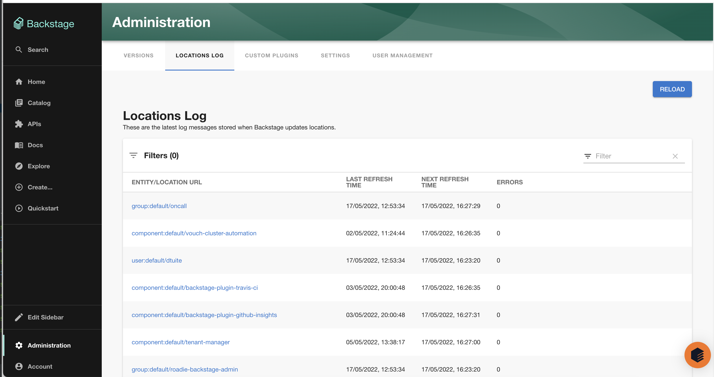
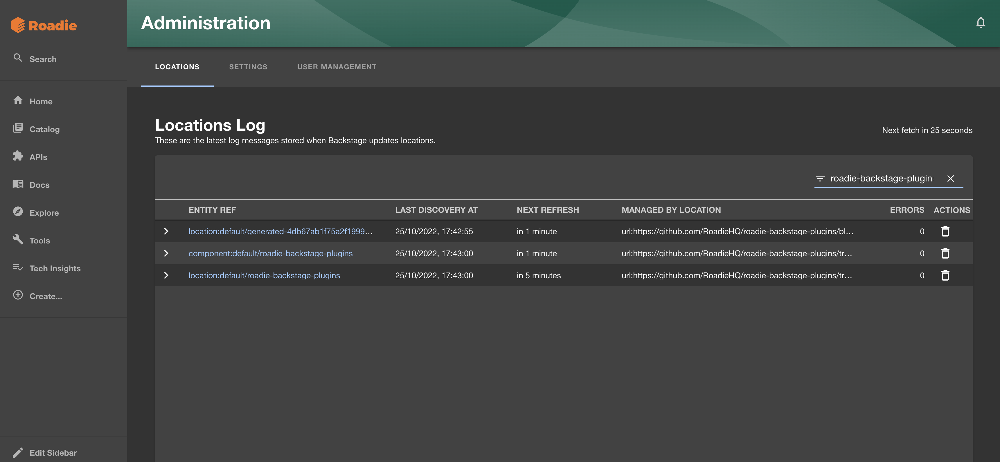
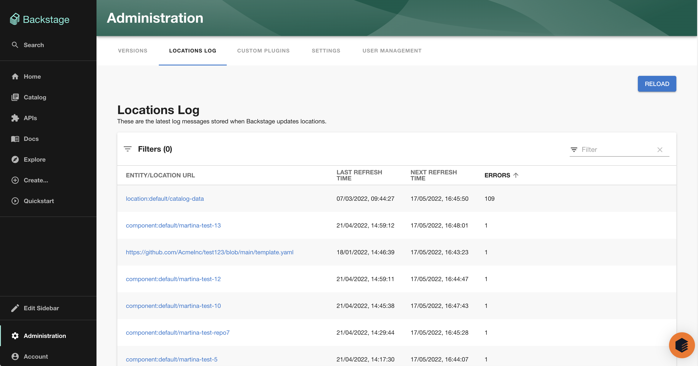
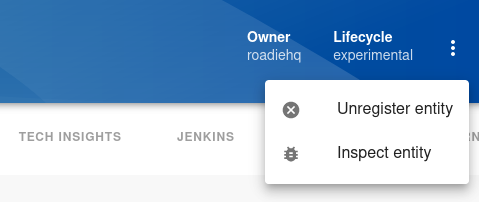
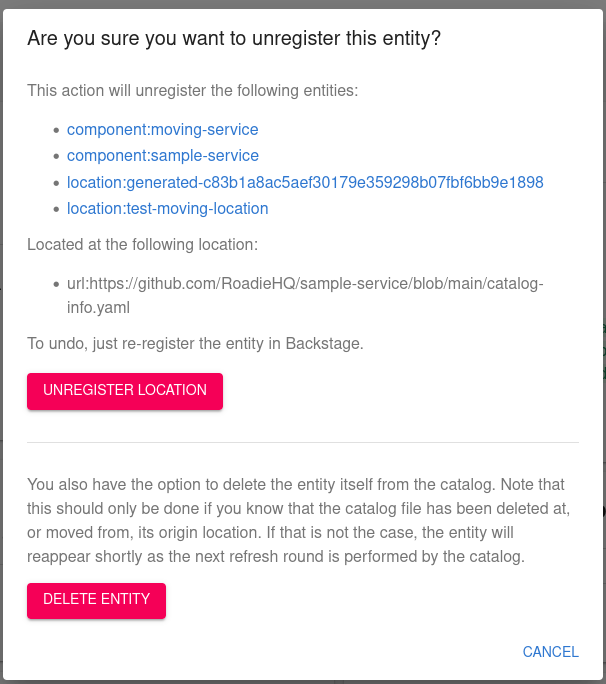
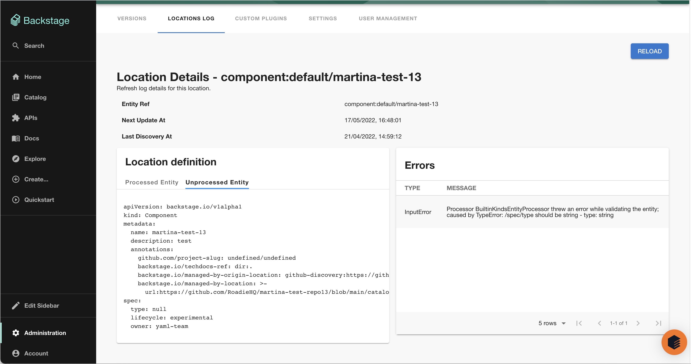
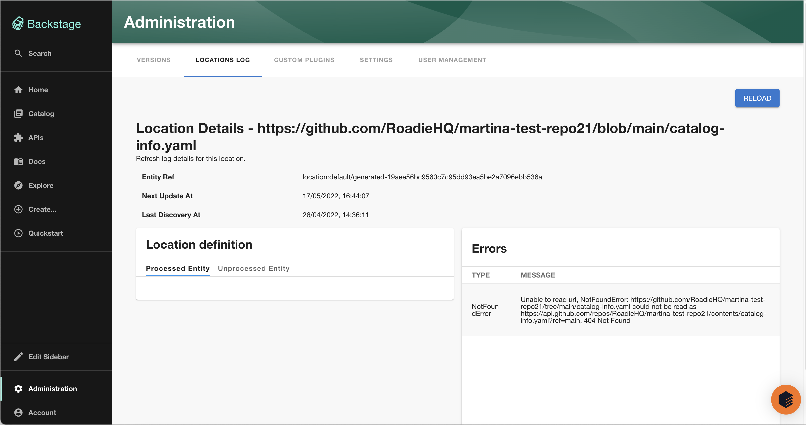

## About Locations

The Backstage catalog uses location entities to point to external sources which define entities. Roadie will 
update your entities in backstage whenever one of the repositories defined in a location is updated.

While locations are themselves entities they are generally considered internal to the workings of Backstage and not part 
of your catalog (though you may need to create locations directly in some use cases).

## Using the Locations log

The locations log provides information on the scheduling of the catalog refresh cycle and surfaces any errors.

### Searching for an entity

You can search for an entity using the filter input (Top right of the table). The filter operates on the `entity/location url`
column. The values in this column are [entity refs](https://backstage.io/docs/features/software-catalog/references#string-references) (e.g. kind:namespace/entity-name) 
or for a location entity the target URL. In practice you'll want to search on either your entity name or perhaps
the URL of a catalog info YAML file. To view details for a particular entity click the entity link.

### Checking the refresh schedule

The `last refresh time` column above gives the time of the most recent update to the entity. The column `next refresh time`
gives the time the catalog will next check for updates. However updates should come through in real time also if using 
GitHub. It should be noted the last refresh time only updates when there are changes rather than on every check.

### Viewing errors

The errors column of the locations log gives you the number of errors with that entity or location. You can sort the
table by this column by clicking on the column header to view rows with errors.

Viewing a particular entry you can view the list of errors, the raw entity data and also the processed entity (if available).
You can use this information to diagnose and fix errors with catalog info YAML files.

## Common Errors

### Entity stopped updating after moved/renamed catalog file

At times the catalog might get into an inconsistent state if a catalog manifest file that was previously present is lost from the system's perspective. Common reasons for this to happen are if the name or the location of the catalog manifest has changed after it has already been registered to the catalog. 

If you end up in such a situation you have an option to remove the individual stale entity which will eventually force a hard refresh of the parent location itself. Steps to do this are the following:

1. Navigate to the offending, stale entity that has stopped from being automatically updated
2. Click the kebab menu item in the top right corner of the entity

3. Select Unregister Entity
4. Click Advanced Options
5. Click Delete Entity button at the bottom of the dialog 

This will unregister the individual entity without affecting other entities or locations in the same discovery tree. The moved/renamed catalog manifest file will be then picked up on the catalog refresh loop. 

### Processor BuiltinKindsEntityProcessor threw an error while validating the entity

This means that the entity definition in your catalog YAML file is not valid. You can solve this by reading the cause
(e.g. `caused by TypeError: /spec/type should be string - type: string`) and looking at the `unprocessed entity` tab
in the location definition card and making a PR to fix the YAML file. In this case below `spec.type` has been set to `null`
but this is not valid.

### Unable to read URL, NotFoundError

This error can often be ignored. When the GitHub discovery processor is enabled it creates a location for every
repo in the organisation even if the catalog file doesn't exist. You can check if this is the case by navigating to
the URL in the title to see if the catalog file location really exists. If it does exist and you're getting this error
contact support.

