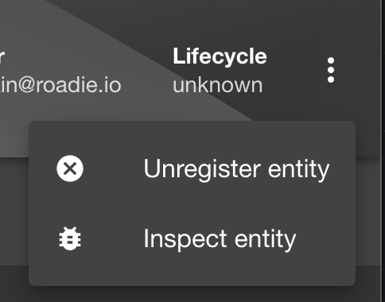
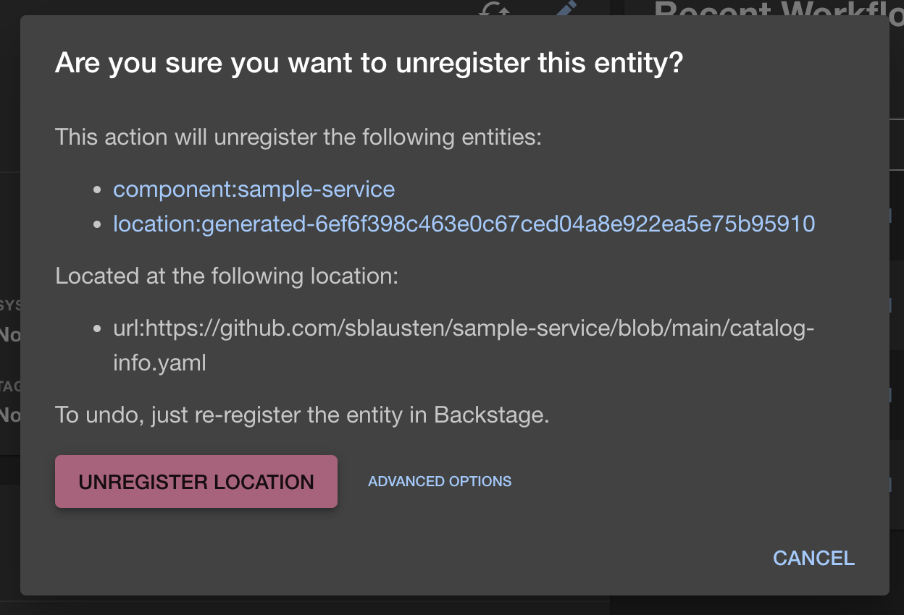

You can remove a component from Roadie Backstage by unregistering it. 

Go to the component in question i.e. `/catalog/default/component/sample-service` and click the kebab menu on the top right.

Then confirm you want to unregister the Location (you can always add it again via `/catalog-import`).

