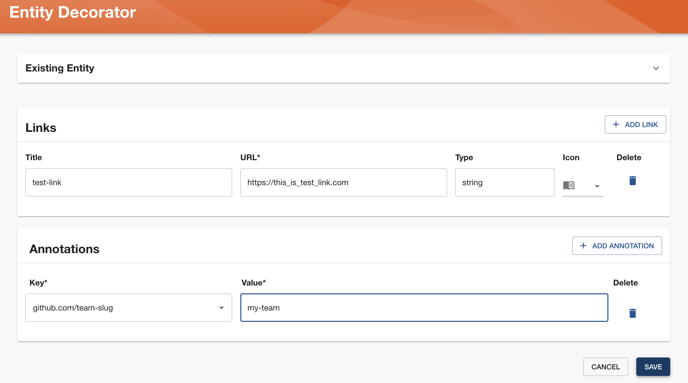

Catalog is built around the concept of metadata YAML files, therefore, any change you wish to make to your entities, needs to be done via editing those files. However, as YAML files can grow in complexity, they can become challenging to read and maintain. Furthermore, adding or editing those files, can sometimes be a long process, especially if ownership is shared accross the teams or organization in general.

Entity Decorator provides an easy way to enhance readability and usability for different entities used in your organization, through specifically designated Entity Decorator Form.

By using our Entity Decorator form, you can add new properties to your entities, through UI, without a need to manually edit YAML files in your version control system.

## Benefits of using Entity Decorator

Using entity decorator has numerous advantages such as:

### Simplicity: 
This approach abstract the complexities of YAML syntax, allowing you to focus on the content rather than formatting.

### Visual Aid:
It provides a visual representation of the YAML structure, in Existing Entity section of the form,  making it easier to grasp the hierarchy and relationships between fields.

### Error Prevention:
Form provides validation, which, reduces the risk of syntax errors.

### Team Collaboration: 
With entity decorator, team members, including those not familiar with YAML, can easily edit and understand configuration files.

## Entity Decorator Form 

In order to decorate the entity, navigate to entity page and select 'Decorate entity' from kebab menu at top right corner:

This will provide you a form in which you can easily add new properties. For now you can add links and annotations, but we will be adding more in the future. 

