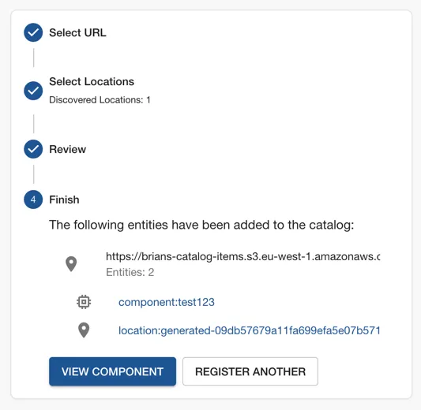

##  Get the roadie IAM details

Navigate to `Administration > Settings > AWS S3` and make a note of the Roadie backend role ARN and account ID. This is mentioned on the title text of the AWS S3 integration settings page.

##  Create a federated role in your account for Roadie

Follow the steps [here](/docs/details/accessing-aws-resources) to create the role.

The role needs to follow this naming convention `arn:aws:iam::*:role/<tenant-name>-roadie-read-only-role` where <tenant-name> matches your organisation's name used in the url of your Roadie instance.

You'll need to attach a policy which allows access to the required S3 buckets such as `AmazonS3ReadOnlyAccess`. This policy grants roadie read access to all buckets.
If you do not want to grant this access you can [create your own policy](https://docs.aws.amazon.com/IAM/latest/UserGuide/access_policies_create-console.html)
which restricts access to only certain buckets. An example minimal policy needed to retrieve files from S3 buckets is below


<details>

<summary>An example minimal S3 Read policy</summary>

```json
{
  "Version": "2012-10-17",
  "Statement": [
    {
      "Effect": "Allow",
      "Action": [
        "s3:GetObject"
      ],
      "Resource": "arn:aws:s3:::my-bucket/*"
    },
    {
      "Effect": "Allow",
      "Action": [
        "s3:ListBucket"
      ],
      "Resource": "arn:aws:s3:::my-bucket"
    }
  ]
}
```
</details>


##  Configure your Roadie instance to use the new role

On the AWS S3 settings page `Administration > Settings > Aws S3` in Roadie click `Add Item` and enter the newly created
role ARN and external ID. The S3 host is only required if you're using different roles for different buckets.

After the role configuration is done, you can click the 'Test Role' button to check if integration configuration has succeeded.


### Create a catalog file in code repository

In the S3 bucket create a `catalog-info.yaml` file with the contents shown in the panel on the right.

### Import the catalog file

Copy the Object URL of the catalog file you created by visiting the file in S3 in the properties tab. The URL looks like: `https://<bucket name>.s3.<region>.amazonaws.com/<object file path>`

Visit the import page in Roadie. `https://<tenant-name>.roadie.so/import/entity`, and paste the URL into the box. Click analyze and then import.



Now you can click on the entity link to visit the entity that you have just created.

### Next Steps

* [Add a TechDocs page](/docs/getting-started/technical-documentation/) to the component you now have in the catalog.
* [Write a scaffolder template](/docs/scaffolder/writing-templates/) to create or update software projects.
