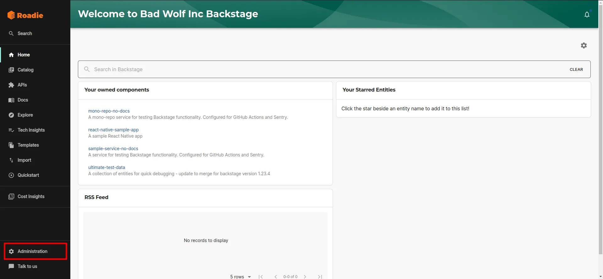
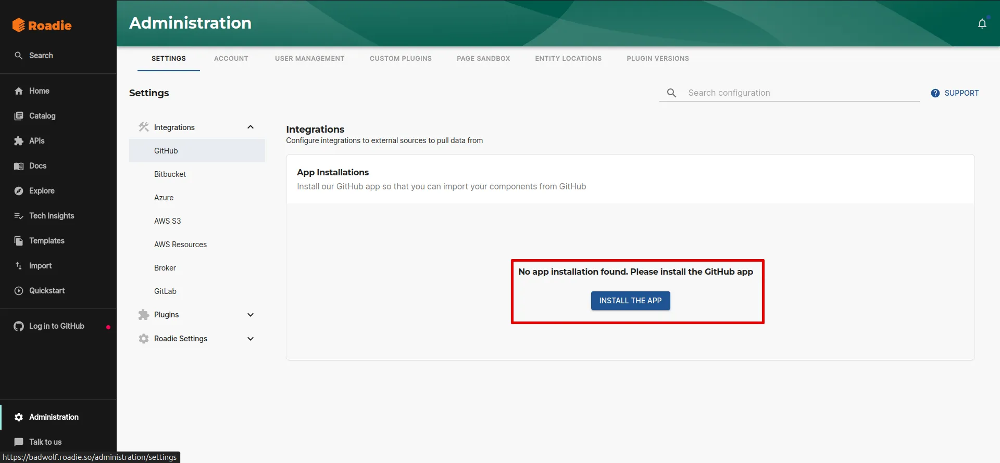
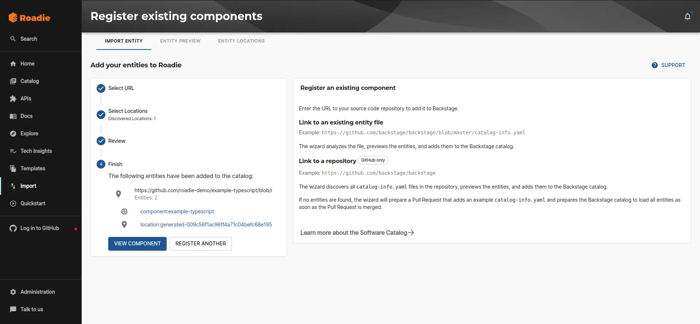

### Install the GitHub App

Installing the GitHub App will allow Roadie to access the YAML metadata files that Backstage needs to operate. Learn more about the [permissions required](/docs/integrations/github-app-permissions/).

1. Click the Administration link in the bottom left of the application.

2. From **Settings** > **Integrations** > **GitHub**, press `INSTALL THE APP`.

4. Choose your GitHub organization and follow the steps to install the app.

### Upload a catalog item to a repository

In one of the GitHub repos in your project create a `catalog-info.yaml` with the contents shown in the panel on the right.

### Import the catalog file

Copy the URL of the catalog file you created by visiting the file in your browser and copying the url from the location bar. The URL may look like this: `https://github.com/<org-name>/<repo-name>/blob/<branch-name>/catalog-info.yaml`.

Visit the import page in Roadie. `https://<your tenant>.roadie.so/import/entity`, and paste the URL into the box. Click analyze and then import.

Now you can click on the entity link to visit the entity that you have just created.

### Next Steps

* [Configure auto-discovery](/docs/integrations/github-discovery/) so that Roadie can automatically discover and import catalog-info.yaml files.
* [Explore the Getting Started Repo](https://github.com/roadie-demo/getting-started/tree/main) for examples of scaffolder templates.
* [Use a scaffolder template](https://github.com/roadie-demo/getting-started/tree/main/scaffolder/register-new-component) to give users a streamlined interface that they can use to generate the YAML file you used earlier in this tutorial.
* [Add a TechDocs page](/docs/getting-started/technical-documentation/) to the component you now have in the catalog.
