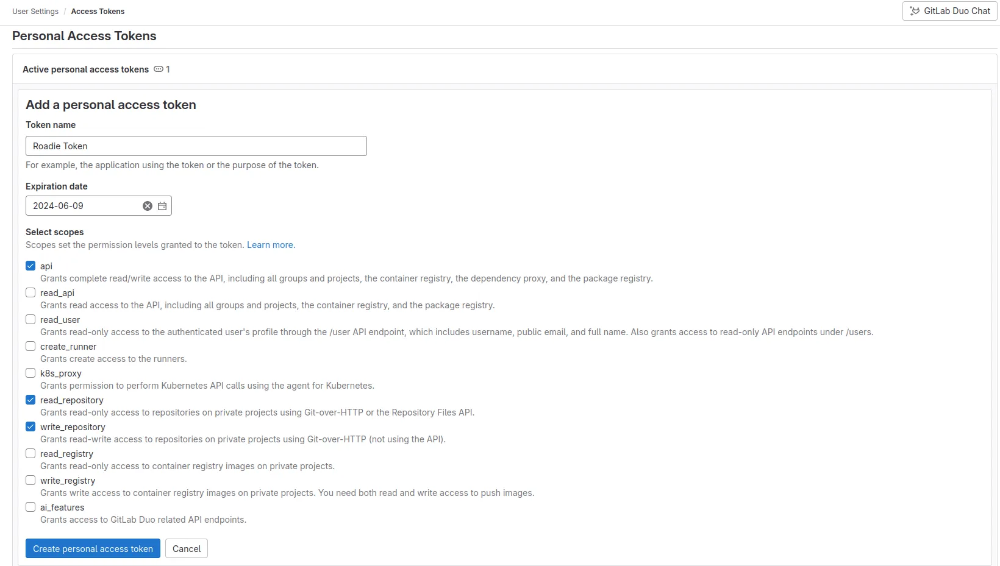
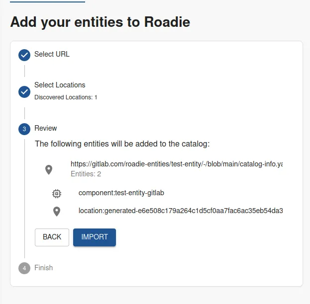

###  Generate GitLab personal access token (PAT)

In your GitLab instance navigate to your User Settings > Access Tokens page. In GitLab cloud the URL is `https://gitlab.com/-/profile/preferences`. Within this page you can generate a token to grant Roadie access to read your entity manifest files.

1. Click 'Add new token'
2. Create an access token with _at least_ permissions `api`, `read_repository`, `write_repository`.

### Store GitLab token as a secret in Roadie

Navigate to `https://<your-tenant>.roadie.so/administration/settings/secrets` and locate a secret with a name `GITLAB_TOKEN`. Update the value of this secret with the token created in the step above.

### Create a catalog file in code repository

In one of the GitLab repos in your project create a `catalog-info.yaml` with the contents shown in the panel on the right.

### Import the catalog file

Copy the URL of the catalog file you created by visiting the file in your browser and copying the url from the location bar. The URL may look like this: `https://gitlab.com/<group-name>/<project-name>/-/blob/main/catalog-info.yaml?ref_type=heads`.

Visit the import page in Roadie. `https://<your tenant>.roadie.so/import/entity`, and paste the URL into the box. Click analyze and then import.

Now you can click on the entity link to visit the entity that you have just created.

### Next Steps
* At this point you may want to enable [auto discovery](/docs/integrations/gitlab-provider/) using GitLab, this allows Roadie to discover new catalog files as they are created.
* [Explore the Getting Started Repo](https://gitlab.com/roadie-demo/getting-started) for examples of scaffolder templates.
* [Use a scaffolder template](https://gitlab.com/roadie-demo/getting-started/-/tree/main/scaffolder/register-new-component?ref_type=heads) to give users a streamlined interface that they can use to generate the YAML file you used earlier in this tutorial.
* [Add a TechDocs page](/docs/getting-started/technical-documentation/) to the component you now have in the catalog.
