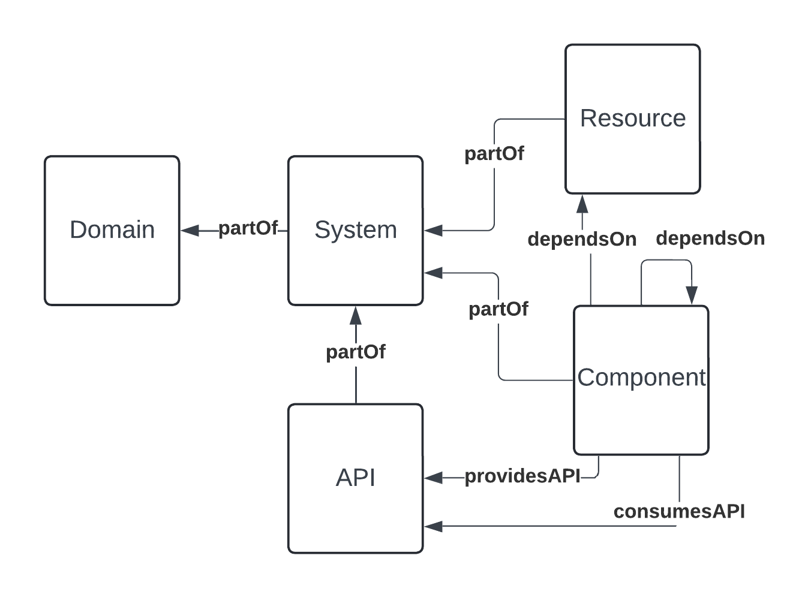

Roadie allows various ways to import items into its catalog. Each catalog item in Roadie is referred to as an "entity". Roadie supports 5 main kinds of entity: components; systems; domains; apis; and resources. Entity kinds are associated with one another using entity relations.

We provide various ways to populate the catalog. Generally you will store entity files in a code repository and then provide Roadie with the URL of that file for it to be imported as a catalog entry. However you may also import a catalog item via the Roadie CLI or API.

This tutorial will guide you through the steps required to connect Roadie to your Data source and import the items into the Roadie catalog.
