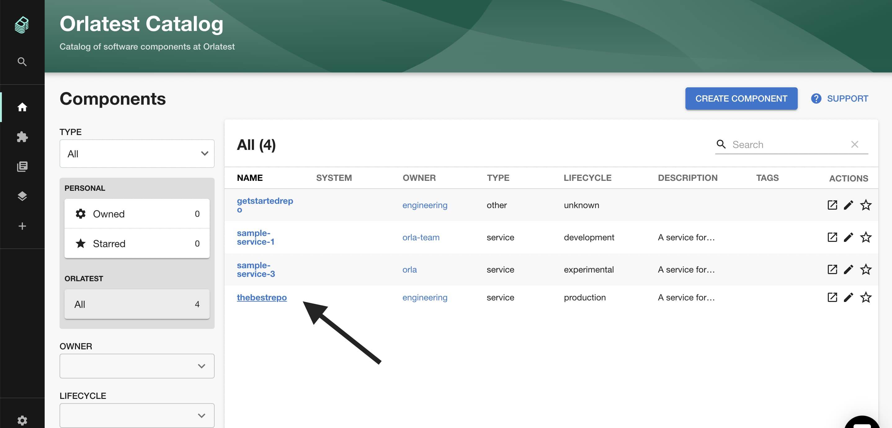
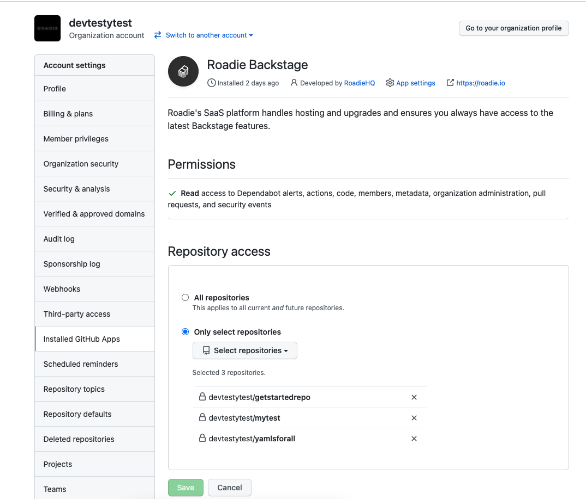

## Introduction

This tutorial will show you how to add components such as services or websites to the Backstage catalog.

To represent something in Roadie Backstage you will generally need to write some YAML to describe it and upload the file to the SCM you have [linked to Roadie](/docs/getting-started/adding-a-catalog-item) such as a Github repository.

The base file to describe entities is by default named `catalog-info.yaml` but you can name it anything you like.

## Prerequisite 

You must install the GitHub App in order to import components in private repositories. The steps to do this are [here](/docs/getting-started/adding-a-catalog-item/).

## Step 1: Create your 'catalog-info.yaml' file

Create a file called `catalog-info.yaml` in the root of your GitHub repo and add the following YAML to it. 

Make sure to update the following variables:

 1. Set `<github-org>` to the name of your GitHub organization.
 2. Set `<github-repo>` to the name of your repo.
 3. Set `<github-username>` to your GitHub username.
 
You can find all the supported schema information for representing a wide variety of entity types (i.e. Component, API, Resource) in Roadie Backstage in the Backstage documentation here [https://backstage.io/docs/features/software-catalog/descriptor-format#contents](https://backstage.io/docs/features/software-catalog/descriptor-format#contents)

```yaml
apiVersion: backstage.io/v1alpha1
kind: Component
metadata:
  name: <github-repo>
  title: Sample Service # optional, human readable component name
  description: My first Backstage catalog item.
  annotations:
    github.com/project-slug: <github-org>/<github-repo>
spec:
  type: service
  owner: user:<github-username>
  lifecycle: experimental
```

## Step 2: Import Your Component YAML file into Backstage

Components can be manually added to Backstage by using the catalog importer available at `/import/entity`. 

To do this, simply copy/paste the URL of the YAML file into the importer (see video below).

[](https://www.loom.com/share/b96f07f0579a423f8cb762e8c1b7f3fe "Adding a Component")

To automatically discover `catalog-info.yaml` files, you can also set up a location entity. For more information on this, please visit [here](/docs/integrations/github-discovery/).

ℹ️ Note: If you are only trialing backstage, we do not recommend setting up the discovery. It is much easier to manually add files through the catalog importer. Feedback is also much faster.

## Step 3: View your Component

Click the Home link in the Backstage sidebar to go back to the catalog where you should see your component. Depending on the type of component you imported, you might have to cycle through the tabs until you see your component.



## Troubleshooting FAQs

**Component Not Appearing?**

If your component is not appearing make sure Backstage has permissions to read the repo that you added the yaml file to.

You can check this by going to the Github settings of a repo that Backstage already has access to, then follow `Settings>Integrations>Configure`, and making sure your repo is listed in the allowed repos:




**Something Else?**

You can find more [common catalog issues and their fixes here](/docs/details/troubleshooting-the-catalog/). 

## What Next? 

Let's [add some docs to the component we just created](/docs/getting-started/technical-documentation/) so that others in your organization can easily learn how to use it.
