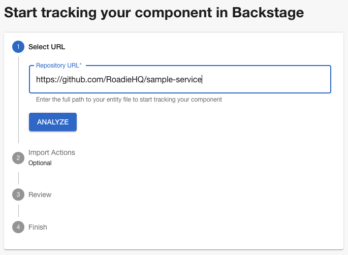
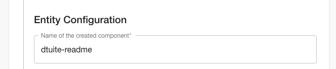
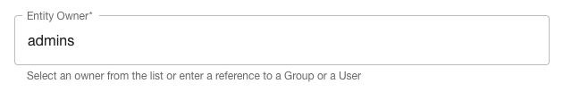
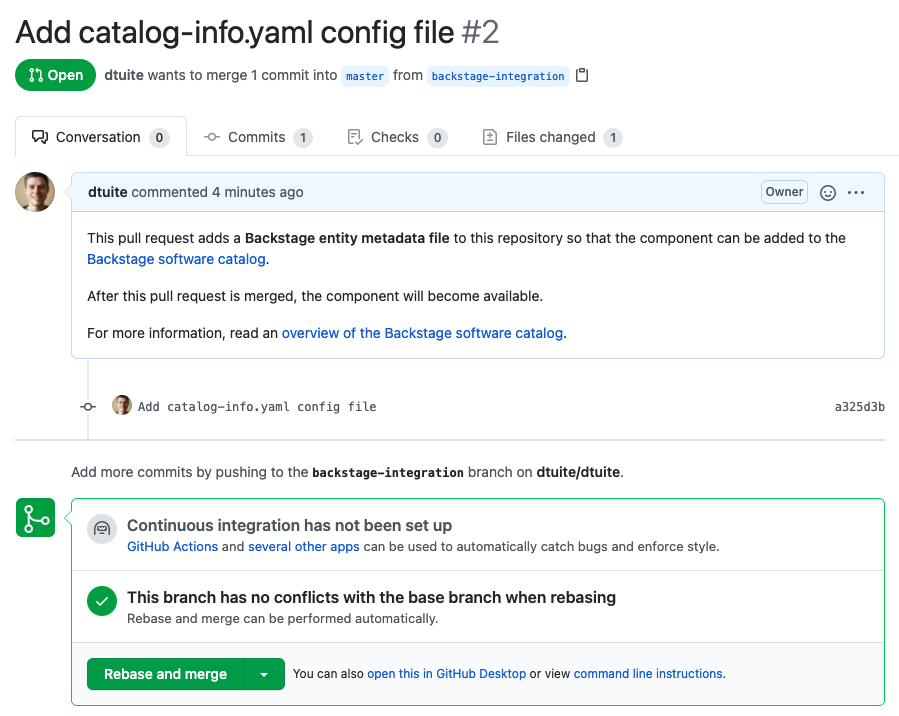
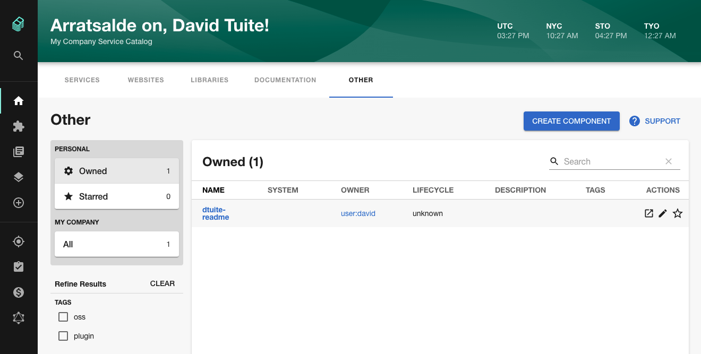

## Introduction

This tutorial will show you how to add components such as services or websites to the Backstage catalog.

Each component that Backstage tracks must be represented by a YAML file which describes it. These YAML files look something like this:

```yaml
apiVersion: backstage.io/v1alpha1
kind: Component
metadata:
  name: sample-service-1
  description: |
    A service for testing Backstage functionality. Configured for
    GitHub Actions.
  annotations:
    github.com/project-slug: roadiehq/sample-service
spec:
  type: service
  owner: my-team-name
  lifecycle: production
```

You can manually craft these YAML files and add them to Backstage using the catalog importer available at `/catalog-import`.

Alternatively, Roadie can open a pull request into a repository to add the file.

## Adding a component via automated pull request

### Step 1. Open a PR

Visit `https://your-company.roadie.so/catalog-import`.

Enter the URL of a GitHub repository into the Repository URL input field and click Analyze. The next screen will allow you to customize the pull request before it is opened.



Ensure the Name of the created component will make sense to you and your team. This is how other users will refer to your component in Backstage.



Set the owner of the component. You should be able to choose the admin group from the dropdown.



Click Create PR. This will open a pull request against your repository.

Import the component into Backstage by clicking the Import button. You can import the component before the pull request is merged. Backstage will automatically detect when the pull request is merged.

### Step 2. Merge the PR

Review and merge the pull request that Backstage opens on your behalf.



### Step 3. View your component

Click the Home link in the Backstage sidebar to go back to the catalog where you should see your component. Depending on the type of component you imported, you might have to cycle through the tabs until you see your component.



## Configuring Backstage to auto discover github repositories using the github discovery processor

The Roadie team can configure your backstage instance to auto discover catalog yaml files created in your github repositories. To do this, please contact one of us and we will be happy to configure it for you.

We will need a url pattern to discover the catalog files.

```text
https://github.com/AcmeInc/*/blob/main/catalog-info.yaml
```

You can use regular regex syntax in the repository name part of the github url as shown above.

## Next steps

Let's [add some documentation for the component we just created](/docs/getting-started/technical-documentation/) so that others in your organization can easily learn how to use it.
