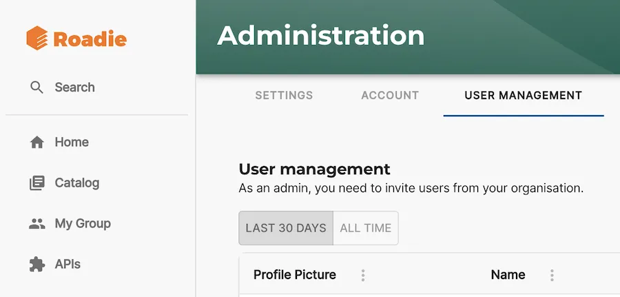
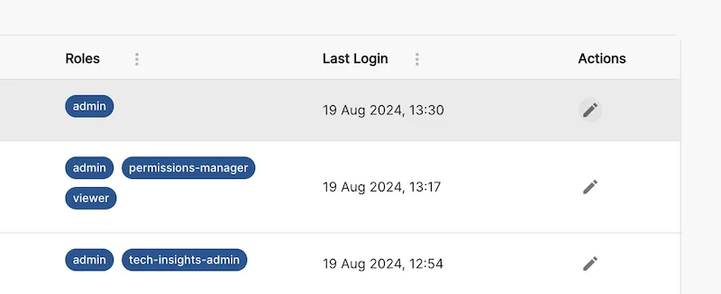
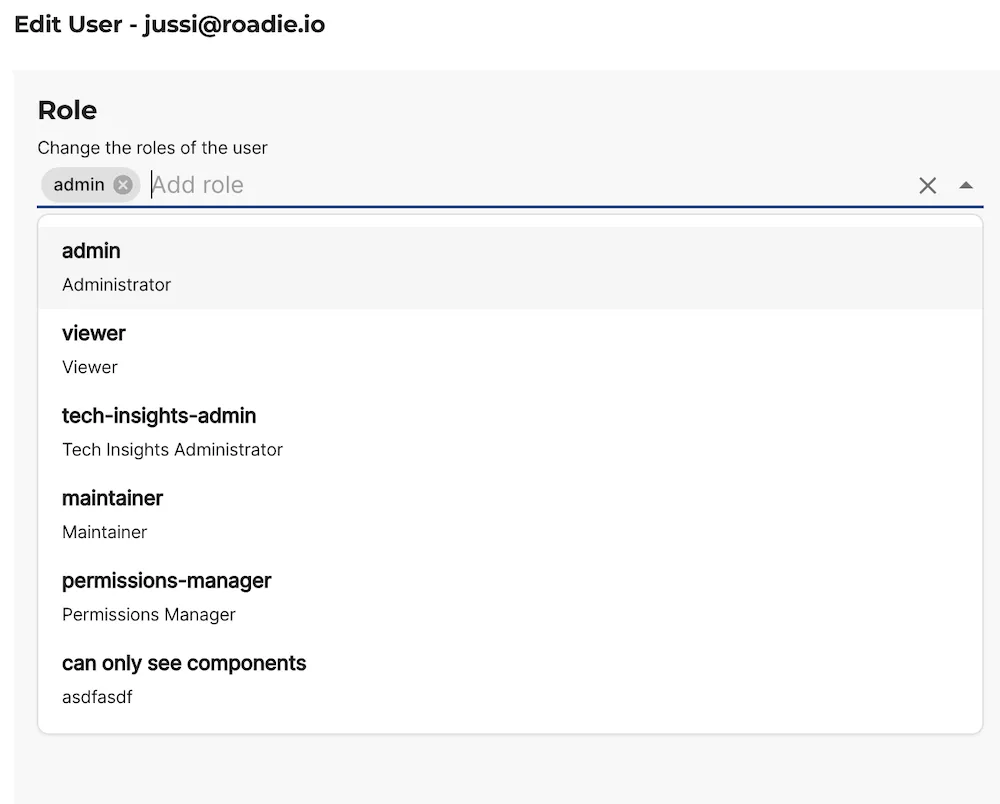

## Introduction

You often want to allow power users to edit the layouts and install plugins while preventing
ordinary users from making unintended changes to the application setup. Roadie Backstage has RBAC built in to enable this.

⚠️ Admins have no ability to read secrets or access other secure information inside Roadie.

## Setup

Initially the first user will be assigned the Admin role and will be able to add other users as well as assign granular Roles to them in the User Management page in Administration.

You can add Roles to users in this page using the edit pencil icon next to each user.

Roadie comes with a predefined set of Roles to use for access control to core app functionality. Custom roles can be configured via the Role Management tab using our predefined set of permissions.

Find out more about [RBAC in Roadie here](/docs/details/permissions/).

## Non-Admins

Non-admins will not be able to access any app level configuration like editing plugin layouts, configuring new plugins or defining plugin config.

You can view the permissions for the Admin group via the Role Management tab in the Administration section.

## Further reading

- [RBAC in Roadie](/docs/details/permissions/)
