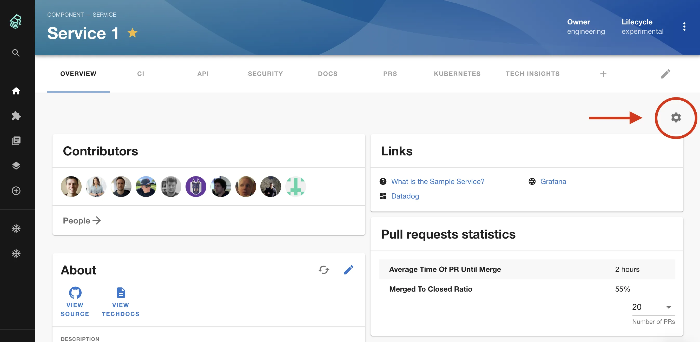
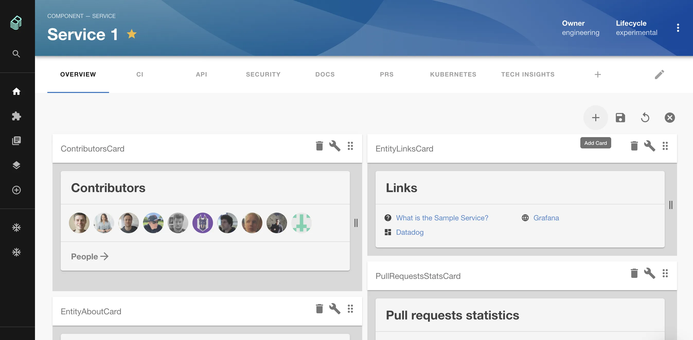
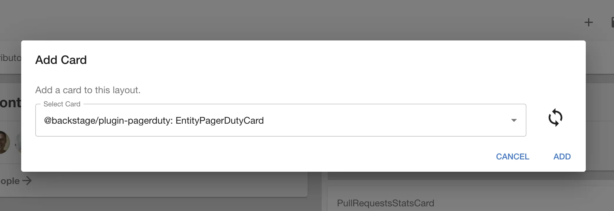
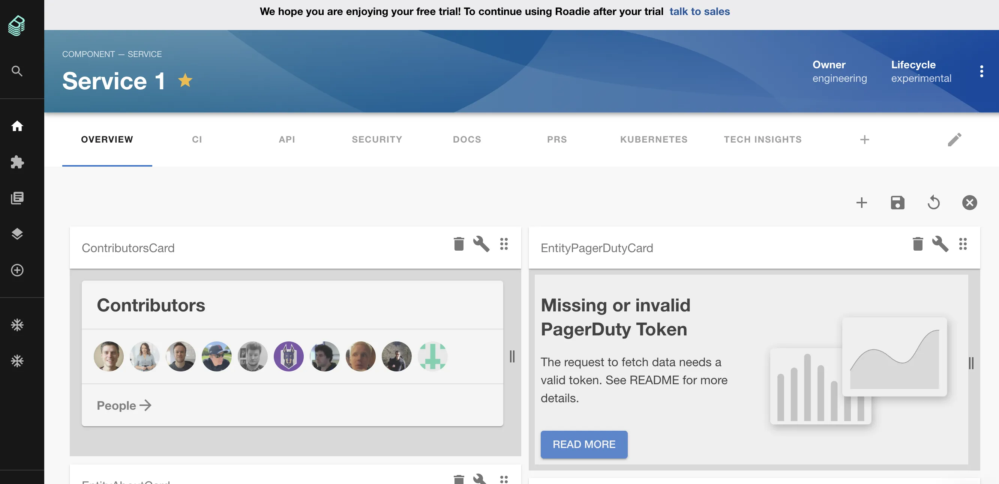
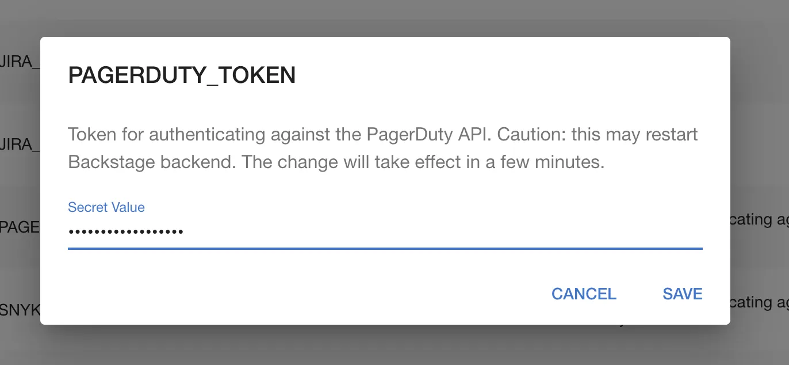
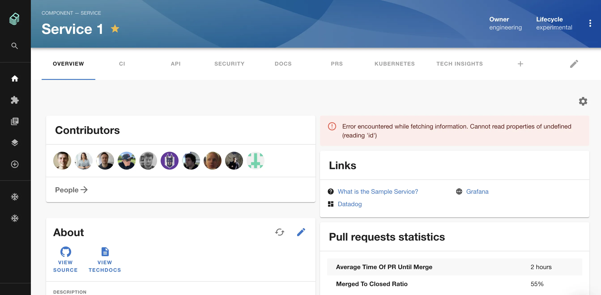
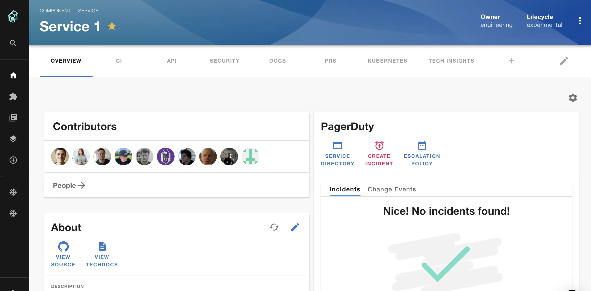

## Introduction

Roadie supports many open-source Backstage plugins out of the box.

See the [Plugins & Integrations](/docs/integrations/) page for a full list of supported plugins, and dedicated instructions for each one. The list of available plugins is also visible to admins in the Administration area.

## Example: Adding the PagerDuty plugin

As an example, we will use PagerDuty in this example, but the process is broadly similar for most plugins.

To add a plugin you must be an admin in Roadie. Learn how to designate certain users as admins [here](/docs/getting-started/assigning-admins/).

## Step 1: Add the UI component

Most plugins make available a Tab or Card which must be added to the Roadie interface.

Let's add the PagerDuty Card to the Component Overview page.

1. Visit the Overview page of a Component in your catalog and click the gear icon in the top right corner.



3. Click the plus icon to add a component.



4. Search for "EntityPagerDutyCard" in the dialog which appears and click "ADD".



5. The PagerDuty card should appear in the interface. Drag it to wherever you would like it to appear.



6. Click the floppy disk icon in the top right to save your changes.

## Step 2: Set up the Config

As you can see, the PagerDuty card is complaining about a missing or invalid token. It cannot access the PagerDuty API without authentication. Let's set a token now.

1. Visit the Administration Settings page in Roadie.

2. Scroll down to find the Pagerduty plugin where you can add an API token.

3. Click the pencil icon to open a dialog where you can set a token. Click SAVE. Please visit the [dedicated PagerDuty plugin docs](/docs/integrations/pagerduty/) to learn where to get this token from.



Once the token is set, we should see something different when we return to the component page. We're not there yet but we're closer!



## Step 3: Set an annotation

For the plugin to work for a component, we need to tell Backstage how to map the service in PagerDuty to the Component in Roadie Backstage.

1. Open the `catalog-info.yaml` file for the component in question in your text editor.
2. Add the PagerDuty annotation. Please visit the [dedicated PagerDuty plugin docs](/docs/integrations/pagerduty/) to learn where to get this "integration-key".

```yaml
apiVersion: backstage.io/v1alpha1
kind: Component
metadata:
  name: sample-service-1
  title: Sample Service 1
  description: |
    A service for testing Backstage functionality. Configured for
    GitHub Actions.
  annotations:
    pagerduty.com/integration-key: 78743832u48973894798
spec:
  type: service
  owner: my-team-name
  lifecycle: production
```

It can take a few minutes for Backstage to find and ingest this new value. Once it does, you should see the PagerDuty card render correctly in Roadie Backstage.



That's it! Now any service can correctly display information from PagerDuty simply by adding the annotation.

## Next steps

Now that you have things set up, why not [invite a colleague to check out Roadie Backstage](/docs/getting-started/user-management/).
