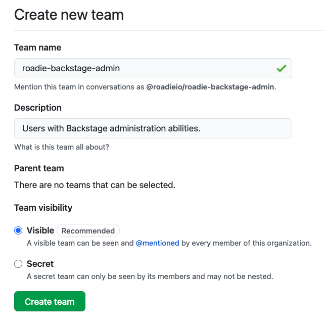
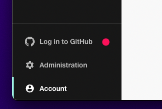

## Introduction

You often want to allow power users to edit the layouts and install plugins while preventing
ordinary users from making unintended changes to the application setup. Roadie Backstage has a
concept of admins to enable this.

## Prerequisites

For automatic Admin group management you will need to have [installed the Roadie GitHub app](/docs/getting-started/install-github-app/) before proceeding with this step.

For manual management you should be aware of the correct usernames of the users you are assigning to admin group


## Automatic admin group discovery with GitHub teams

To automatically designate admins you can use GitHub Teams which will be automatically discovered if you have installed the Roadie GitHub application.

1. Visit GitHub Teams in your organization's GitHub account and click the New Team button.

2. Set the Team name to `roadie-backstage-admin`. This is a special value and must be an exact match.

3. Enter a Description such as "Users with Backstage administration abilities.".

4. Leave Parent team unselected and click the Create Team button.



5. Ensure you are logged in to GitHub from Roadie. Click the link in the sidebar to do this.



⚠️  &nbsp;It can take some time for Roadie to refresh the list of teams from GitHub teams. If you do not see admin functions immediately, please wait a few minutes and try again.


## Manual admin group configuration with group entities (advanced alternative)

In case you don't want to install the GitHub app or don't want to manage teams via you can also manually add groups into your Roadie instance.

1. Make a note of the user entity that is assigned to you on the account page of users. You can find this information from `https://<your-tenant>.roadie.so/Account`.
   * In case you have not logged into GitHub, this is usually the first part of your email address before the `@` symbol.

2. Create a `catalog-info.yaml` entity definition for `roadie-backstage-admin` group
   ```yaml 
    apiVersion: backstage.io/v1alpha1
    kind: Group
    metadata:
      name: roadie-backstage-admin
      description: Administrators of Roadie
    spec:
      type: team
      profile:
        displayName: Admins
        email: admins@roadie.io
        picture: https://avatars.dicebear.com/api/identicon/roadie-backstage-admin.svg
      children: []
    ```
Note that the name of the administration group needs to be `roadie-backstage-admin` to grant users assigned to that group access to the administration section of the Roadie instance.


3. Create a `catalog-info.yaml` entity definition for administrator users and assign to admin group
    ```yaml
    apiVersion: backstage.io/v1alpha1
    kind: User
    metadata:
      name: my-username-before-at-symbol
    spec:
      profile:
        displayName: My Na-me
        email: my-username-before-at-symbol@domain.com
        picture: https://avatars.dicebear.com/api/avataaars/my-username-before-at-symbol.svg
      memberOf: [roadie-backstage-admin]
    ```

> Users and groups don't necessarily need to reside in different files. If you want to use a single file to import multiple entities, separate multiple yaml documents within a file with three horizontal lines `---`.

4. Import both group and user entity definitions to your Roadie instance
   1. Navigate to `https://<your-tenant>.roadie.so/catalog-import` and input the path to the entity definitions file(s).
