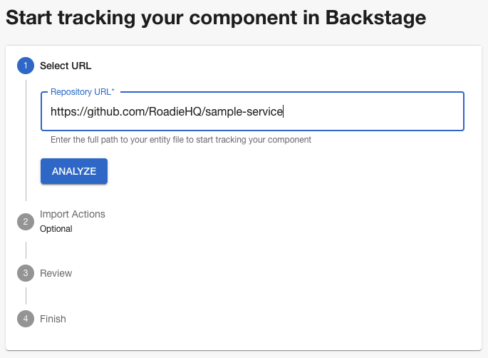
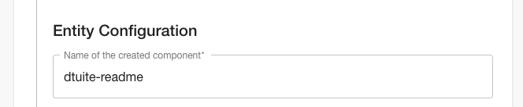
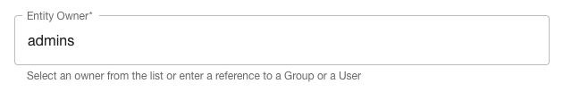
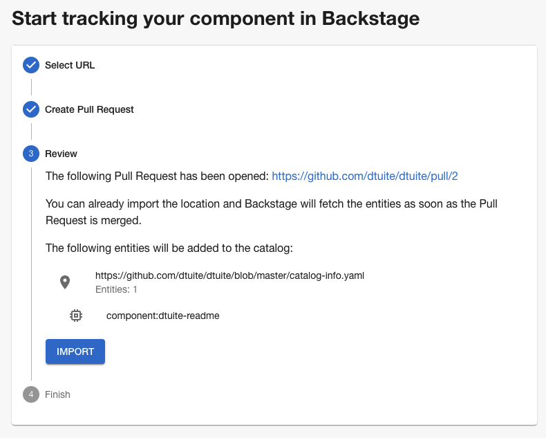
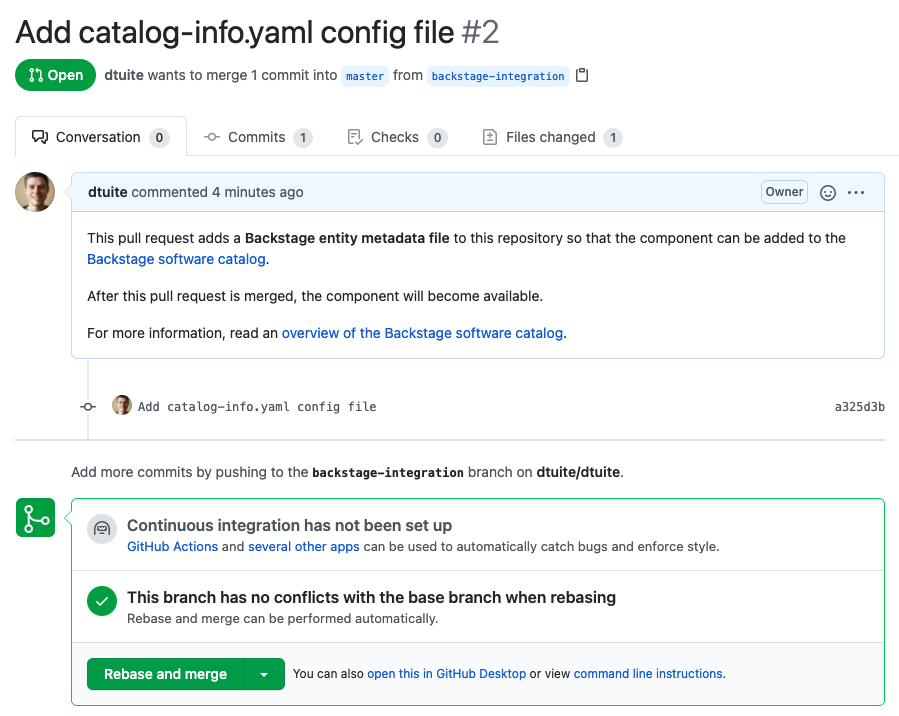
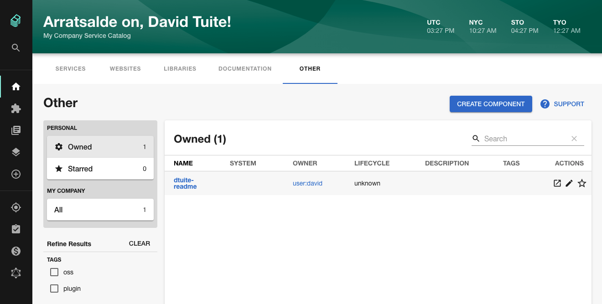

## Introduction

This tutorial will guide you through the steps required to populate Roadie with a component which is owned by you.

3 kinds of Backstage resource are used in this tutorial.

1. The `User` entity represents an employee at your company.
2. The `Group` entity represents a team or larger organizational structure.
3. The `Component` entity represents a piece of software like a website or backend service.

## Prerequisites

In order to complete this guide, you will need the following things:

1. Access to a Roadie account. If you do not yet have access, please [sign up for a demo](/).
2. A GitHub Cloud or GitHub Enterprise Cloud account. Roadie also supports Bitbucket and GitLab but you must contact us directly to discuss your needs.
3. A test service on GitHub which you can make changes to.

## Connect Roadie to GitHub

Roadie needs 2 connections to GitHub in order to function.

1.  It needs a Personal Access Token to access the YAML metadata files that Backstage needs to operate.
2.  It needs an OAuth client ID and Secret so that your user can make requests from the browser to the GitHub API.

Use the steps below to create a Client ID and secret and Personal Access Token (PAT) for Roadie.

If you wish to tightly restrict the access that Roadie has, please [follow this guide](/docs/github-token/).

### Step 1. Create a Personal Access Token (PAT)

Visit the [developer settings of your GitHub account](https://github.com/settings/tokens) and create a PAT which has the scopes `repo` and `user`.

The official GitHub docs for creating a Personal Access Token are [here](https://docs.github.com/en/github/authenticating-to-github/creating-a-personal-access-token).

### Step 2. Create OAuth Credentials

Visit the Developer Settings of your GitHub organization account. Click "New OAuth App".

Fill out the following information in the form. Be sure to replace `your-company` with your Roadie subdomain.

| Form Field                 | Value                                                                    |
| -------------------------- | ------------------------------------------------------------------------ |
| Application name           | Roadie Backstage                                                         |
| Homepage URL               | `https://your-company.roadie.so`                                         |
| Application description    | Backstage service catalog and developer UI provided by https://roadie.io |
| Authorization Callback URL | `https://your-company.roadie.so/api/auth/github/handler/frame`           |


Click "Register Application" and then "Generate a new client secret".


Take a note of the Client ID and the generated Client Secret. You will need these in the next step.


### Step 3. Add the PAT and OAuth credentials to Roadie

Visit the Secrets management interface on Roadie Backstage at `https://your-company.roadie.so/secrets`.

Find the `GITHUB_TOKEN` field. Click the Pencil Icon to edit the field.


Enter the PAT into the input and click the Save button.


Do the same thing for the `GITHUB_CLIENT_ID` and `GITHUB_CLIENT_SECRET` values.

Wait until Roadie has activated the token before proceeding.

## Add an admin group and user

Now that Roadie has GitHub access, we can load in a User and Group.

There are automated ways to pull users and teams from GitHub, Active Directory and other places. For the purposes of this tutorial, we will do it manually.

### Step 1. Define a user and admin group

On your local machine, create a YAML file named `admins.yaml` with the following content.

```yaml
apiVersion: backstage.io/v1alpha1
kind: Group
metadata:
  name: admins
  description: Backstage administrators
spec:
  type: team
  profile:
    displayName: Backstage Admins
    email: # {EMAIL}
  children: []
---
apiVersion: backstage.io/v1alpha1
kind: User
metadata:
  name: # {LOGIN}
spec:
  profile:
    displayName: # {NAME}
    email: # {EMAIL}
  memberOf: [admins]
```

Replace the placeholder values as described:

| Placeholder | Value                                                                                  |
| ----------- | -------------------------------------------------------------------------------------- |
| `{NAME}`    | Your full name. This helps your colleagues recognise you inside Backstage.             |
| `{LOGIN}`   | The portion of the email address that you use to log into Roadie up to the `@` symbol. |
| `{EMAIL}`   | Your company email address. This helps your colleagues contact you if needed.          |

### Step 2. Put the file on GitHub

Put this file on GitHub in a respository that Roadie can access. Take a note of the full path to the file on GitHub. It will look like this: `https://github.com/your-org/your-repo/blob/main/admins.yaml`.

### Step 3. Import the group to Roadie

Open the importer in Roadie Backstage by visiting `https://your-company.roadie.so/catalog-import`.

Paste the path to the YAML file into the input and click Analyze.


If you see a "Login Required" dialog, click GitHub to log in to GitHub via OAuth.

Click import on the confirmation screen which appears.


Your group and user has now been imported. Click the link for `group:admin` to view your imported Group.


## Add a Component to the catalog

We can also add components (such as services or websites) to Roadie using the same importer.

This time we don't need to manually craft the YAML. Instead, Roadie will open a pull request into a repository to add the metadata file that Backstage needs.

### Step 1. Open a PR

Visit `https://your-company.roadie.so/catalog-import`.

Enter the URL of a GitHub repository into the Repository URL input field and click Analyze. The next screen will allow you to customize the pull request before it is opened.



Ensure the Name of the created component will make sense to you and your team. This is how other users will refer to your component in Backstage.



Set the owner of the component. You should be able to choose the admin group from the dropdown.



Click Create PR. This will open a pull request against your repository.

Import the component into Backstage by clicking the Import button. You can import the component before the pull request is merged. Backstage will automatically detect when the pull request is merged.

Click the displayed link to view the pull request on GitHub. Review it and merge it to add the component to Backstage.



### Step 2. Review the PR

Review the pull request that Backstage opens by clicking the link.



### Step 3. View your component

Click the Home link in the Backstage sidebar to go back to the catalog where you should see your component. Depending on the type of component you imported, you might have to cycle through the tabs until you see your component.



## Conclusion

You now have enough knowledge to add users, groups and components to the Backstage service catalog. In a future guide, we will explore how you can use this information to improve discoverability.
