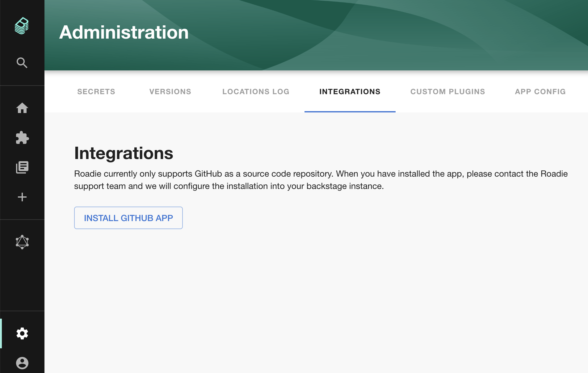
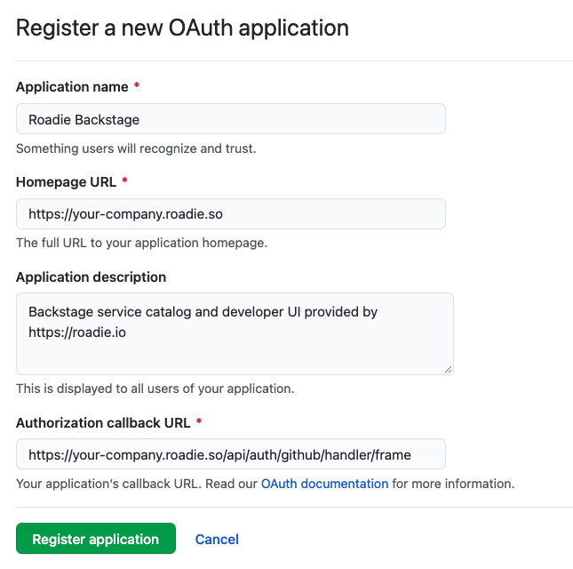
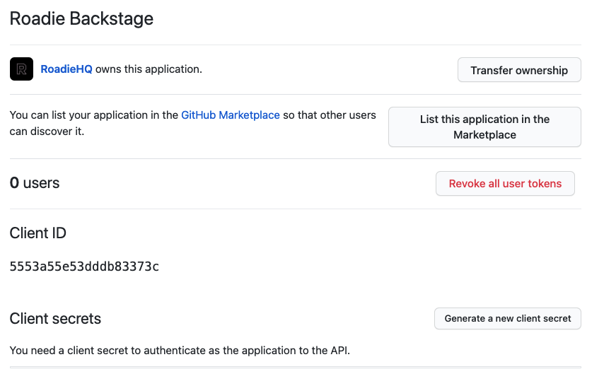
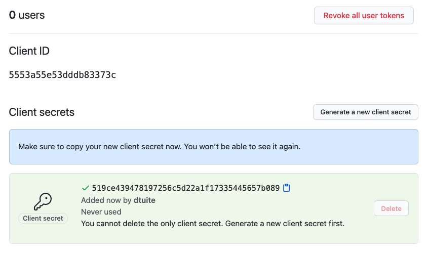
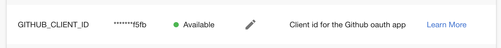
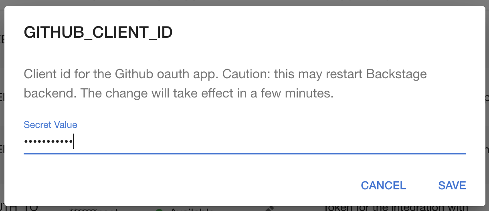
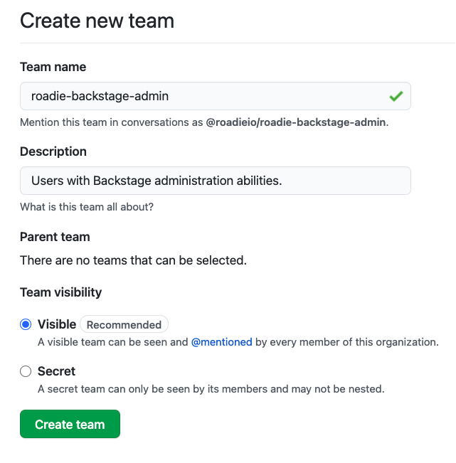
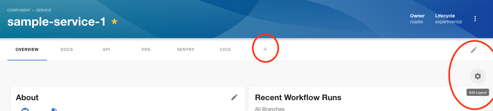

## Introduction

This tutorial will guide you through the steps required to set Roadie up for basic use within your organization. Once completed, you will:

 1. Be an admin user of Roadie.
 2. Have connected Roadie to your organization's GitHub account.

There are 3 kinds of Backstage resource used in this tutorial.

1. The `User` entity represents an employee at your company.
2. The `Group` entity represents a team or larger organizational structure.
3. The `Component` entity represents a piece of software like a website or backend service.

## Prerequisites

In order to complete this guide, you will need the following things:

1. Access to a Roadie account. If you do not yet have access, please [join the waiting list](/evaluation-request).
2. A GitHub Cloud or GitHub Enterprise Cloud account.
3. A test service on GitHub which you can make changes to.

## Connect Roadie to GitHub

Roadie needs 2 connections to GitHub in order to function.

1.  A GitHub app installation to access the YAML metadata files that Backstage needs to operate.
2.  An OAuth client ID and secret so that your user can make requests from the browser to the GitHub API.

Use the steps below to install the GitHub App.

### Important Note!
When you install the GitHub app you will have an option to lock down access to a select few repositories in your GitHub org. There is currently an upstream limitation which prevents GitHub Teams from being synced into Backstage unless you select the “All repositories” option. 

Choosing “Only select repositories” will correctly lock down access but will break some important functionality due to the sync problem.

We are working to contribute a fix upstream that will allow you to choose limited respositories, but for now please choose the “All repositories” option.

### Step 1. Install the GitHub App

You can find a link to install the GitHub app in the Backstage application:

1. Click the Administration link in the bottom left
2. Click the Settings tab along the top of the Administration page and then the Integrations link
3. Click on the link to install the GitHub app.
4. Follow the steps to install the App
5. You may need to wait up to 2 minutes for the GitHub integration to become active

### Step 2. Create OAuth Credentials

Visit the Developer Settings of your GitHub organization account. Click "New OAuth App".

Fill out the following information in the form. ⚠️ &nbsp;Be sure to replace `your-company` with your Roadie subdomain.

| Form Field                 | Value                                                                    |
| -------------------------- | ------------------------------------------------------------------------ |
| Application name           | Roadie Backstage                                                         |
| Homepage URL               | `https://your-company.roadie.so`                                         |
| Application description    | Backstage service catalog and developer UI provided by https://roadie.io |
| Authorization Callback URL | `https://your-company.roadie.so/api/auth/github/handler/frame`           |

Click "Register Application" and then "Generate a new client secret".

Take a note of the client ID and the generated client Secret. You will need these in the next step.

### Step 3. Add the OAuth credentials to Roadie

Visit the Secrets management interface on Roadie Backstage at `https://your-company.roadie.so/administration`.

Find the `GITHUB_CLIENT_ID` field. Click the Pencil Icon to edit the field.

Enter the Client ID into the input and click the Save button.

Do the same thing for the `GITHUB_CLIENT_SECRET` value.

Wait until Roadie has activated the token before proceeding.

## Add an admin group and user

Roadie admins have special powers such as the ability to add and remove Backstage plugins. We will use GitHub teams to create an admin group for Roadie.

ℹ️  &nbsp;Admin groups are **not** a security measure. They hide certain UX features from regular users in order to simplify the experience. Backstage does not currently support role based access control (RBAC).

### Step 1. Create an admin group on GitHub teams

Visit GitHub Teams in your organization's GitHub account and click the New Team button.

Set the Team name to `roadie-backstage-admin`. This is a special value and must be an exact match.

Enter a Description such as "Users with Backstage administration abilities.".

Leave Parent team unselected and click the Create team button.

By default, GitHub adds your account to the team as a member. You are now an admin on Roadie and should have access to two main features:

1. Access to the Secrets panel via the "Administration" link in the sidebar.
2. The ability to add and remove plugin cards and tabs (see red-circled icons).

ℹ️  &nbsp;It can take some time for Roadie to refresh the list of teams from GitHub teams. If you do not see admin functions immediately, please wait a few minutes and try again.

## Next steps

Let's [add a component to Backstage](/docs/getting-started/adding-components/).
