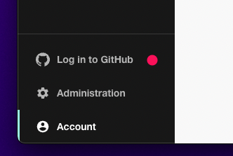

## Introduction

This tutorial will guide you through the steps required to set Roadie up for basic use within your organization. Once completed, you will:

 1. Have connected Roadie to your organization's GitHub account.
 2. Be an admin user of Roadie.

### Allow Listing

If your IT department requires an allow list of domains, please use the following:
```
<yourtenant>.roadie.so
*.roadie.systems
```

If your IT department requires IP addresses, this can be provided to you by one of our support assistants.

## Step 1: Install the Roadie GitHub app

Installing the GitHub App will allow Roadie to access the YAML metadata files that Backstage needs to operate. Learn more about the [permissions required](/docs/integrations/github-app-permissions/).

1. Click the Administration link in the bottom left of the application.


2. Click the Settings tab along the top of the Administration page.


3. Click on Integrations in the left sidebar.


4. Click "Add GitHub App"


5. Choose your GitHub organization and follow the steps to install the app.

⚠️  &nbsp;You may need to wait up to 2 minutes for the GitHub integration to become active.

ℹ️  &nbsp;If you are not an owner of your GitHub organization, you will need to ask an owner to approve the App installation and then contact us to enable the App.

## Step 2: Create an admin group and user

Roadie admins have special powers such as the ability to add and remove Backstage plugins. We use GitHub Teams to designate admins.

1. Visit GitHub Teams in your organization's GitHub account and click the New Team button.

2. Set the Team name to `roadie-backstage-admin`. This is a special value and must be an exact match.

3. Enter a Description such as "Users with Backstage administration abilities.".

4. Leave Parent team unselected and click the Create Team button.


5. Ensure you are logged in to GitHub from Roadie. Click the link in the sidebar to do this.



⚠️  &nbsp;It can take some time for Roadie to refresh the list of teams from GitHub teams. If you do not see admin functions immediately, please wait a few minutes and try again.

## Next steps

Now that you have connected to GitHub and made yourself an admin, you can [start adding components](/docs/getting-started/adding-components/).
