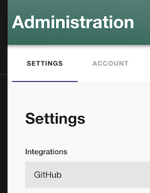
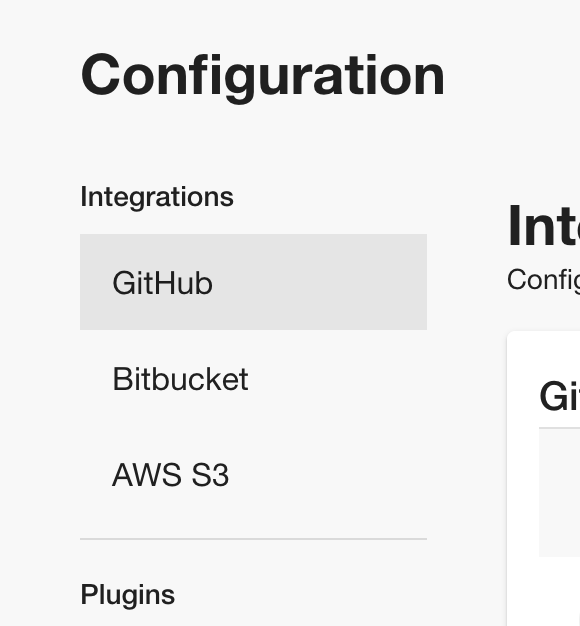

## Introduction

This tutorial will guide you through the steps required to connect Roadie to your GitHub org. If you are configuring GitHub enterprise, please follow the steps [here](/docs/details/github-enterprise/).

## Prerequisites

If your IT department filters your outbound access by hostname, you may need to allow access to Roadie hostnames before proceeding. More information on this can be found [here](/docs/details/allowlisting-roadie-traffic/).

## Step 1: Install the Roadie GitHub app

Installing the GitHub App will allow Roadie to access the YAML metadata files that Backstage needs to operate. Learn more about the [permissions required](/docs/integrations/github-app-permissions/).

1. Click the Administration link in the bottom left of the application.

2. Click the Settings tab along the top of the Administration page.

3. Click on GitHub under Integrations in the left sidebar.

4. Open the GitHub accordion and click "Add GitHub App"

5. Choose your GitHub organization and follow the steps to install the app.

ℹ️ &nbsp;If you are not an owner of your GitHub organization, you will need to ask an owner to approve the App installation and then contact us to enable the App.

Roadie will ingest any `catalog-info.yaml` files added to your Github repos. If you'd like to have more granular control(e.g. you don't want to call them catalog-info.yaml, or you'd like to have them inside a folder etc.) over what files should roadie add to the catalog go to the [github discovery docs](/docs/integrations/github-discovery/)

If you used Backstage before and you already have `catalog-info.yaml` files in your repos please go to the [initial discovery](/docs/integrations/initial-github-discovery) docs.

## Next steps

Now that a connection to GitHub is established, you can [make yourself an admin on Roadie](/docs/getting-started/create-admin-group/).

To load users and groups from GitHub Teams please see [here](/docs/integrations/github-teams/).
