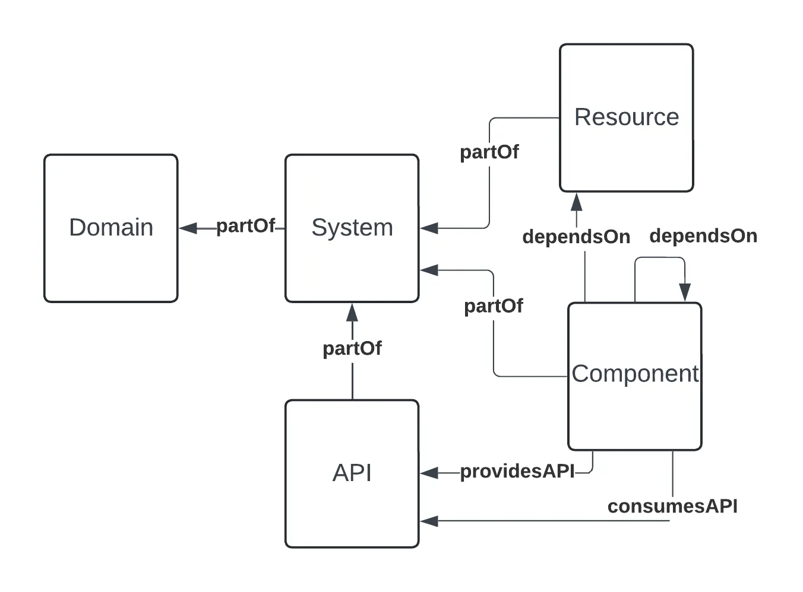

## Introduction

Backstage, the open source project upon which Roadie is built, has an opinionated stance on the structure of a software catalog. We've built some flexibility into that model, but at it's core we still maintain concepts of: `entities`, `kinds`, `relations` and `types`, all stored in metadata about a given entity.

## Catalog Entities

Each catalog item in Roadie is referred to as an "entity". You can find all the kinds and their available fields supported in Roadie [here](../../catalog/modeling-entities).

### Kinds

Roadie supports a few main `kinds` of entity:

**Business** or 'ecosystem' kinds, which model the organisational context in which software is created:

- Domain - a collection of entities and Systems that form some distinct part of your organisation;
- System - a collection of different entities that have a set function.
- Product - a collection of different entities that constitute a product.

**Software** kinds, which model the individual elements of your software:

- Components - for example a website or a data pipeline. Components can be traced in source control or represent some open source or commercial product.
- APIs - attached to components but a first-class citizen of the data model, APIs form the boundaries between Components.
- Resources - pieces of infrastructure required by Components.
- Repositories - source code representations of other entities, often created automatically when a source code management tool like GitHub is connected to Roadie.

And **ownership** kinds, which model

- Users - a person
- Groups - a team, an interest group, or a part of the organisation that you wish to demarcate.

There is also a special kind called **Locations** which provides a reference by which Backstage looks for catalog data.

## Relations

Entity kinds are associated with one another using entity relations.



Relations in Roadie are [more flexible](../../catalog/showing-dependencies) than standard Backstage relationships. You can find all the [supported relationships here](../../catalog/showing-dependencies)

Relations are represented in the `catalog-info.yaml` files for a given entity. Often they can be added automatically such as when you import users and teams from an external IDP [like Okta](../../integrations/okta).

```
{
  // ...
  relations: [
    {
      type: ownedBy
      targetRef: group:default/developers
    }
  ]
}
```

More information on relations can be found [here](../../catalog/showing-dependencies).

## Types

You can also assign types to each entity as you see fit. Types are user-defined and can be used as you see fit.

Types may include:

- Website;
- Database;
- or Library.

More information can be found [here](../../catalog/modeling-entities).

## Other metadata

### Reserved fields

A number of fields are reserved with special meaning:

- name
- namespace
- uid
- title
- description
- labels
- annotations
- tags
- links

More details can be found in the [Backstage docs](https://backstage.io/docs/features/software-catalog/descriptor-format/#common-to-all-kinds-the-metadata).

### Adding your own data

The metadata object is currently left open for extension. This often allows the storing of useful information about a given entity that can then be rendered in the Roadie UI. For example,

```
{
  // ...
  metadata: {
    name: teachers,
    purple-monkey: dishwasher
    // ...
  }
}
```
