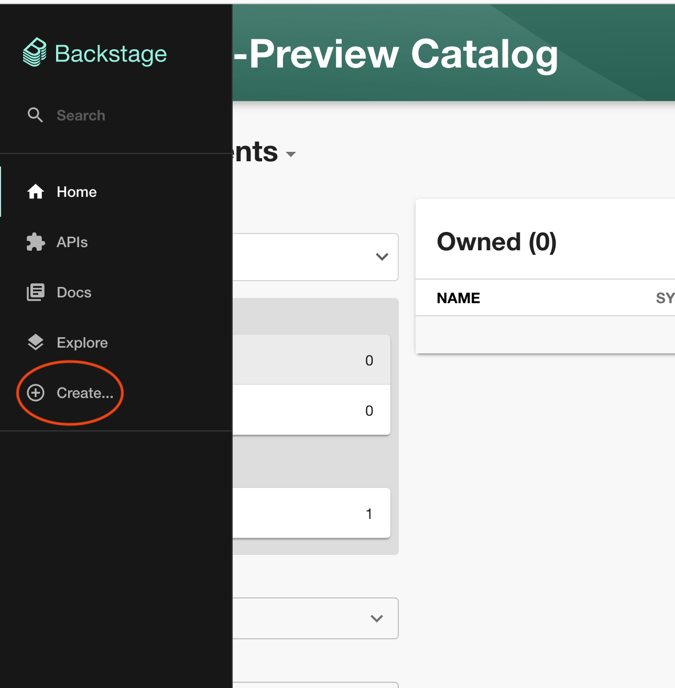
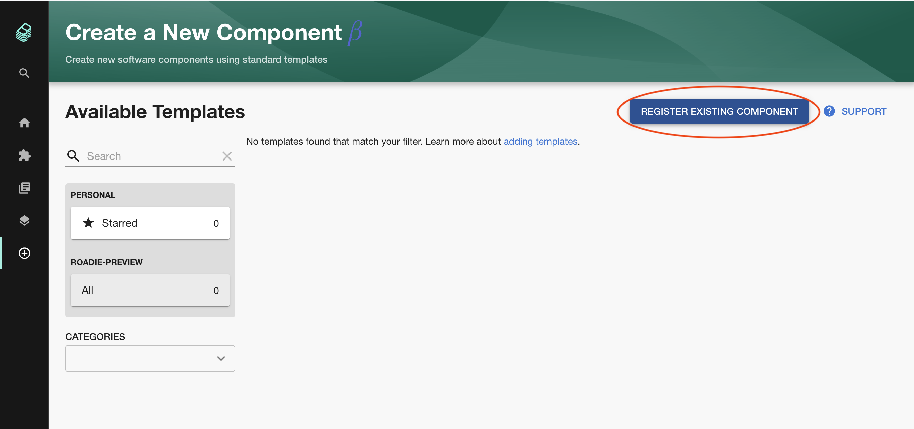
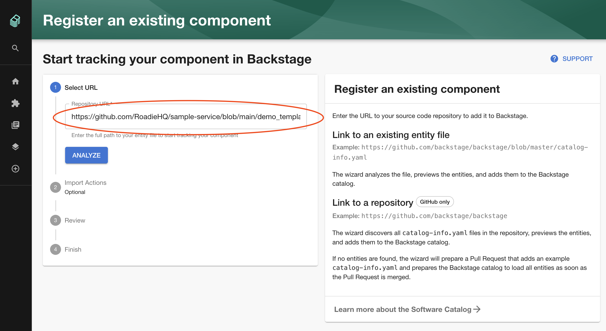
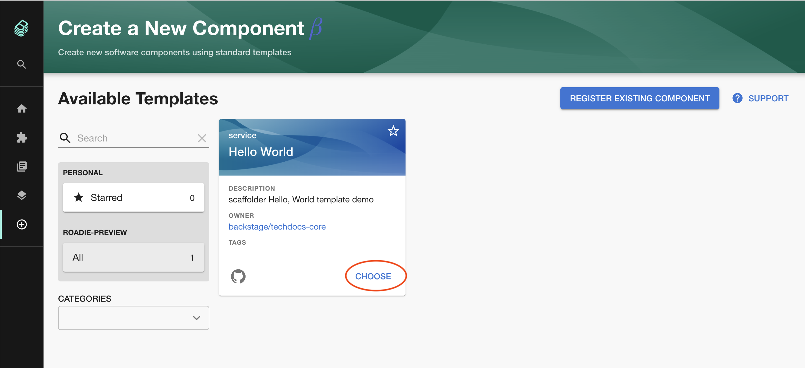

## Introduction

This tutorial will show you how to create a basic scaffolder template in Backstage.

## Prerequisite 

You must have installed the Github App in order to use the scaffolder. If you have not done this you can find the steps to do this [here](/docs/getting-started/install-github-app/).

## Steps

You can either follow the text or the video, or both.

<div style="position: relative; padding-bottom: 52.42718446601942%; height: 0;"><iframe src="https://www.loom.com/embed/da6159c4ca39458cb5ad03138612a5a3" frameborder="0" webkitallowfullscreen mozallowfullscreen allowfullscreen style="position: absolute; top: 0; left: 0; width: 100%; height: 100%;"></iframe></div>

### Step One. Enable the scaffolder

Visit the `Administration > Settings > Scaffolder` and make sure the enabled check box is selected, press save and apply and restart.

### Step Two. Create a template.yaml file in a repository

You can either create the following file in your own repository or [use the public example](https://github.com/RoadieHQ/sample-service/blob/main/demo_template.yaml) we prepared. 

<details>
  <summary>Expand here to see an example template.yaml</summary>

```yaml
apiVersion: backstage.io/v1beta2
kind: Template
# some metadata about the template itself
metadata:
  name: hello-world
  title: Hello World
  description: scaffolder Hello, World template demo
spec:
  owner: backstage/techdocs-core
  type: service

  parameters:
    - title: Fill in some steps
      required:
        - name
      properties:
        name:
          title: Name
          type: string
          description: Name of new project
          ui:autofocus: true
          ui:options:
            rows: 5

  # here's the steps that are executed in series in the scaffolder backend
  steps:
    - id: log-message
      name: Log Message
      action: debug:log
      input:
        message: "Hello, {{ parameters.name }}"
```

</details>

### Step Three. Import the template.yaml file into backstage

Click the "Create..." button in the Backstage menu.



In the "Create a New Component" page, click the "Register Existing Component" button


Enter the URL of the template that you created in Step Two.


Click Analyze, and Import.

### Step Four. Run the template

Visit the "Create a New Component" page again by clicking the "Create..." menu item.


You should see the template that you have just imported. Click the choose button.



Enter a the required parameters and click "Next Step" and then "Create"


After a couple of seconds you should see the "Task Activity" page with the output of the task.


## What Next? 

You can see the full list of Scaffolder Tasks that we support at Roadie by visiting `https://<tenant-name>.roadie.so/create/actions`
