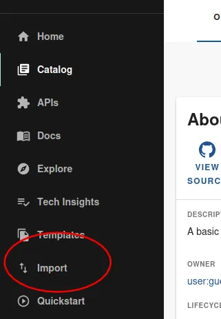
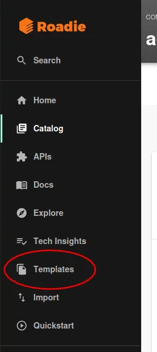
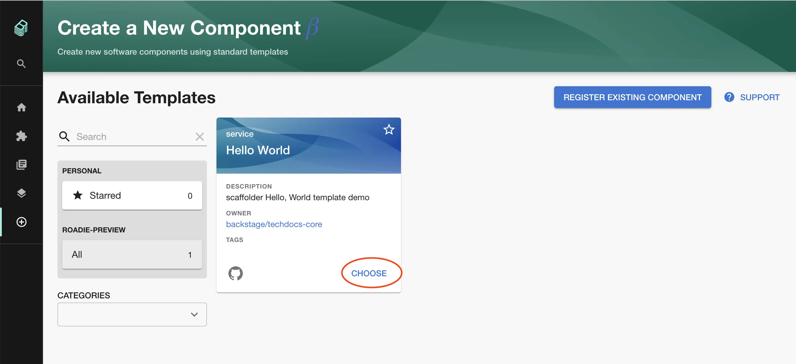
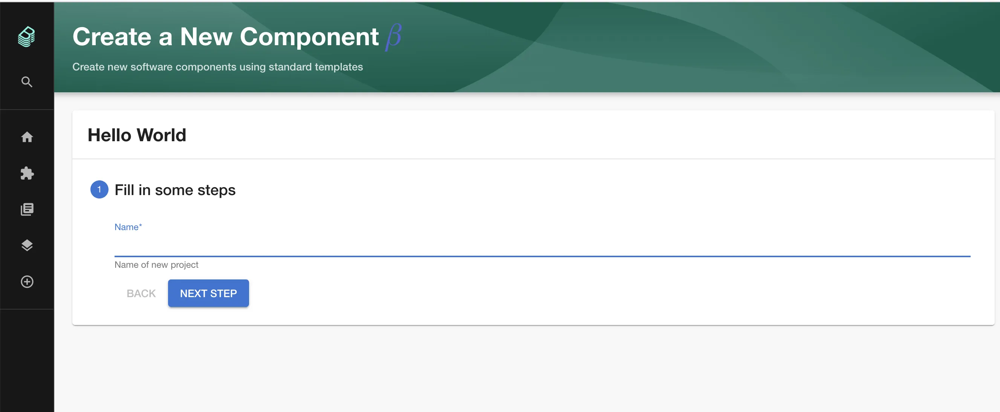
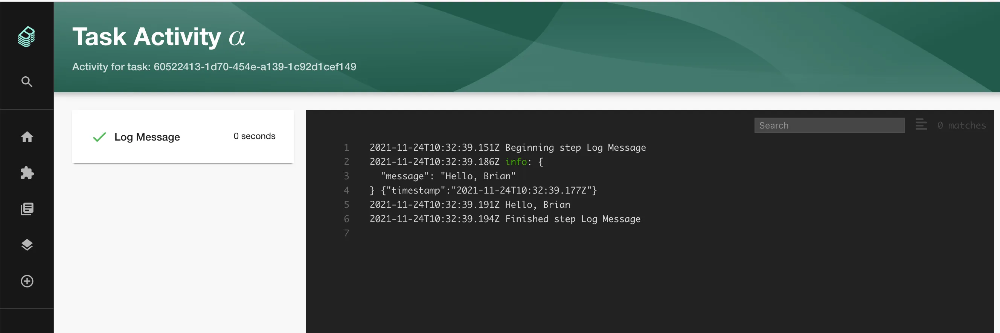

## Introduction

The Roadie Backstage Scaffolder is a feature that allows you to define software templates to create new software projects, update existing ones or simply perform repeated tasks in a consistent manner.

Scaffolder templates are defined in YAML files and loaded into the Backstage catalog in the same way that other entities are loaded into Backstage. A template contains one or more `steps` which run sequentially during execution.

A Scaffolder template is then run on demand by the users of Backstage to execute the software template.

**You can find detailed docs on writing all kinds of Scaffolder templates [here](/docs/details/scaffolder/).**

## Example: Adding a component to the Catalog using the Scaffolder

As an example of what the Scaffodler can do, let's to create a basic scaffolder template in Backstage.

In order to use the full range of tools and actions provided by the Scaffolder, Roadie must have access to your source code management tool. If you have not done this you can find the steps to do it [here](/docs/getting-started/adding-a-catalog-item/).

## Steps

You can either follow the text or the video, or both.

<div style="position: relative; padding-bottom: 52.42718446601942%; height: 0;"><iframe src="https://www.loom.com/embed/da6159c4ca39458cb5ad03138612a5a3" frameborder="0" webkitallowfullscreen mozallowfullscreen allowfullscreen style="position: absolute; top: 0; left: 0; width: 100%; height: 100%;"></iframe></div>

### Step 1. Enable and set up the Scaffolder

Visit the `Administration > Settings > Scaffolder` and make sure the enabled check box is selected, press save and apply and restart.

Optionally you can also use the grouping functionality of Scaffolder templates from these settings. The Scaffolder templates are grouped together if they contain tags defined in this section of settings.

### Step 2. Create a template.yaml file in a repository

You can either create the following file in your own repository or [use the public example](https://github.com/RoadieHQ/sample-service/blob/main/demo_template.yaml) we prepared.

<details>
  <summary>Expand here to see an example template.yaml</summary>

```yaml
apiVersion: scaffolder.backstage.io/v1beta3
kind: Template
# some metadata about the template itself
metadata:
  name: hello-world
  title: Hello World
  description: scaffolder Hello, World template demo
spec:
  owner: backstage/techdocs-core
  type: service

  parameters:
    - title: Fill in some steps
      required:
        - name
      properties:
        name:
          title: Name
          type: string
          description: Name of new project
          ui:autofocus: true
          ui:options:
            rows: 5

  # here's the steps that are executed in series in the scaffolder backend
  steps:
    - id: log-message
      name: Log Message
      action: debug:log
      input:
        message: 'Hello, ${{ parameters.name }}'
```

</details>

### Step 3. Import the template.yaml file into backstage

Click the "Import" button in the Backstage menu.



Enter the URL of the template that you created in Step Two.


Click Analyze, and Import.

### Step 4. Run the template

Visit the Scaffolder templates page by clicking the "Templates" menu item.



You should see the template that you have just imported. Click the choose button.



Enter the required parameters and click "Next Step" and then "Create"



After a couple of seconds you should see the "Task Activity" page with the output of the task.



## Next steps

You can see the full list of Scaffolder Tasks that we support at Roadie by visiting `https://<tenant-name>.roadie.so/templates/actions`

You can find detailed docs on writing Scaffolder templates [here](/docs/details/scaffolder/).
