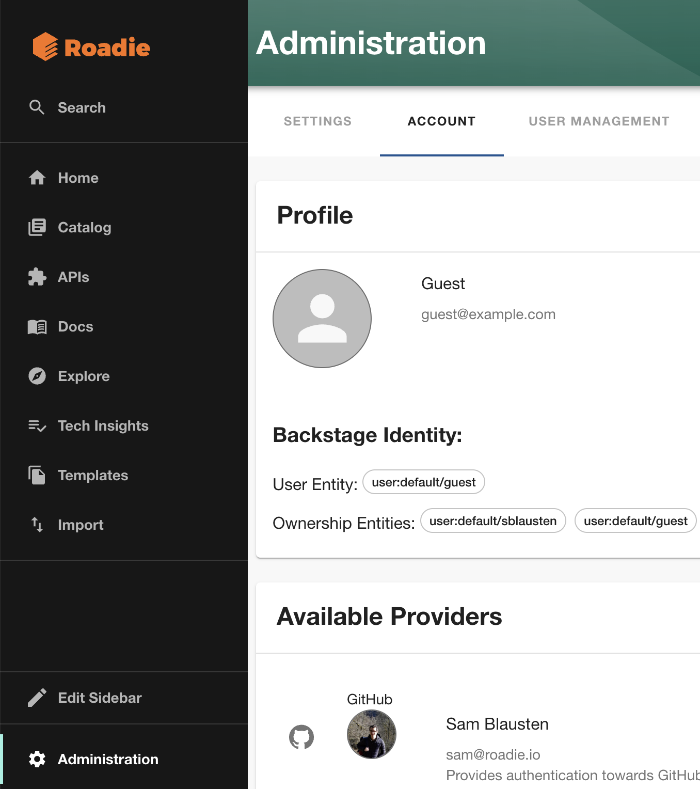
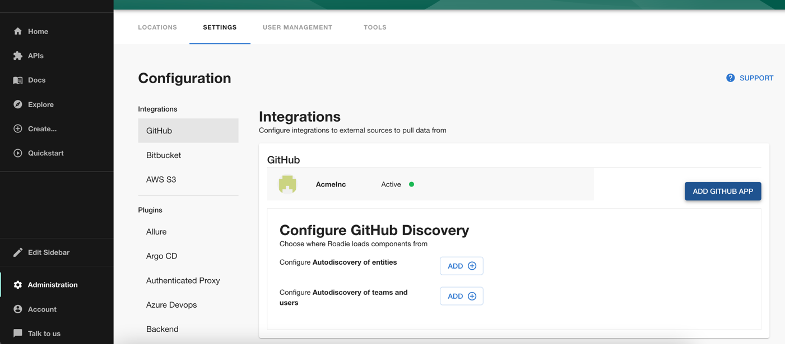

## Prerequisites

You should already have a knowledge of how to add entities to the Backstage catalog as described [here](/docs/getting-started/adding-components/).
## Introduction

Users logged in to Backstage have an identity that can be used to determine if a user has ownership over any entity. This is done using User and Group entities in Backstage. This page describes how to configure Backstage to work with ownership.

## Backstage Identity

When a user logs into Roadie, the user is authenticated either by Roadie's own authentication system, or your own companies Identity Provider.

Either way, we have configured Backstage to populate the logged in users identity as follows:

- We will take the users email address and trim off the domain part of it and use this as the users ID in backstage
- We set the display name and the email in backstage as it appears in the login ID.
- We associate the logged in user with the user component for the user ID in the default namespace. e.g. if my email is `fname@example.com`, my user is associated with the following user entity in backstage `user:default/fname`
- If the user is also logged in to GitHub via the frontend of Backstage, then the user will also be associated with the entity represented by the GitHub username. e.g. if my GitHub handle is `fnamegh` then the identity will be associated with the entity `user:default/fnamegh`

You can always inspect the Backstage Identity for the logged in user by clicking the "Account" link on the bottom left of the Backstage sidebar.



## Creating Users and Groups

Now that you know how Roadie is associating the logged in user with Backstage entities you can start creating users and groups. Roadie currently provides two ways to create users and groups. You can use GitHub Teams or create Users and Group configuration manually.


### Manually creating users and groups
If you need to learn about how to add components to Backstage, you can see that [here](/docs/getting-started/adding-components/).

You will start by creating a user. This user must be in the `default` namespace and be named based on the userId described in the Backstage Identity mentioned above.

```yaml
apiVersion: backstage.io/v1alpha1
kind: User
metadata:
  namespace: default
  name: fname
spec:
  profile:
    displayName: Fname Lname
    picture: https://blah.com/fname
  memberOf:
    - engineering
```

This user will be associated to the logged in user with the userid `fname`.

Next you can create a groups to represent the structure of the organization for this user as follows.

```yaml
---
apiVersion: backstage.io/v1alpha1
kind: Group
metadata:
   namespace: default
   name: engineering
spec:
   type: team
   profile:
      displayName: engineering
      picture: https://blah.com/engineering
   children: []
   parent: technology
---
apiVersion: backstage.io/v1alpha1
kind: Group
metadata:
  namespace: default
  name: technology
spec:
  type: department
  profile:
    displayName: technology
    picture: https://blah.com/technology
  children: []
```

Now components can be setup to be owned by groups within the structure you have created by adding the `owner` field to the components as follows:

```yaml
apiVersion: backstage.io/v1alpha1
kind: Component
metadata:
  namespace: default
  name: my-library-project
spec:
  type: library
  owner: group:default/engineering
  lifecycle: production
```

### Using GitHub teams to create users and groups

You might also choose to load your users and groups from GitHub teams. This can be done by visiting the GitHub integration settings page Administration > Settings > GitHub



Click on the "Add" button beside "Configure Autodiscovery of teams and users". Now enter the name of your GitHub organization and click Save.

In a few minutes you should start to see Groups and Users loaded into the catalog. When your users login to GitHub in Backstage, they will be associated with the teams that they are a member of in Backstage.

#### Deprecation Notice:

To fully support using multiple Github orgs in Roadie Backstage we are switching to a different mechanism for ingesting groups from you Github orgs' team hierachy. 

New discovery locations for Github teams will be added under the `github-multi-org` type. These will ingest teams using a namespace of your Github org rather than the default namespace. i.e. `group:roadiehq/engineering` rather than previously `group:default/engineering` 

If you manually refer to teams in your Backstage `.yaml` files using the default namespace, you can leave the existing `github-org` locations as they are and nothing will change. 

However, we recommend migrating to the new org namespaced groups as this fixes some bugs in admin management on Roadie Backstage as well as providing more clarity of the sourcing of your groups and teams.

##### Migration guide:

1. Search for all `group:default` code references across your Github orgs' Backstage yaml files that refer to teams sourced from your Github orgs. 
2. Prepare PRs to modify these to reference the correct namespace for the Github org that these teams should be associated with or are sourced from. (In the case of manually defined Groups you can leave the default namespace.)
3. Notify your users that you are migrating Groups to a new namespace system and ask them to merge the PRs by a specific day.
4. Add new urls referencing the same Github orgs in the GitHub integration settings page at Administration > Settings > GitHub. These will appear under the new `github-multi-org` type which will use your org name as a namespace. (You will see duplicate group names in the `/explore/groups` page until you complete step 5)
5. Once the PRs changing group namespaces are merged you can delete the `github-org` autodiscovery urls.

NB: When changing Team discovery urls, it will take a few minutes for the changes to propagate through Roadie Backstage so that you can see the new teams on the `/explore/groups` page.
