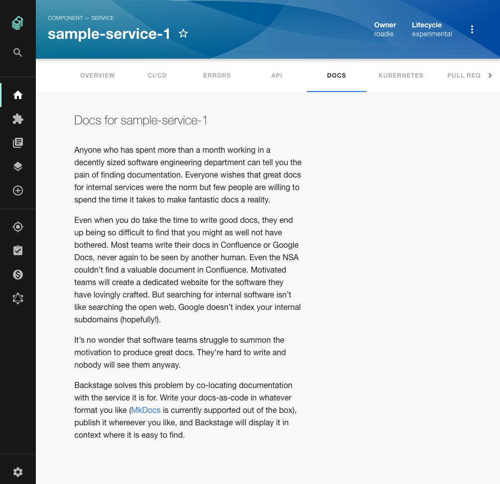
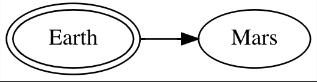
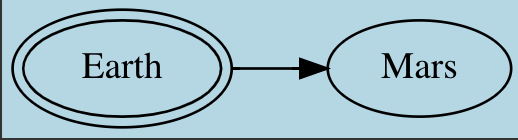
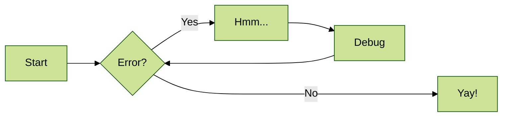

## Introduction

The TechDocs feature of Roadie Backstage allows markdown files written alongside the code of your components to appear in Backstage as styled HTML documentation. Because this documentation is centralized in Backstage, it is more likely to be found and used by other people in your organization.



## Adding documentation to a component

Under the hood, Backstage uses the popular [MkDocs library](https://www.mkdocs.org/) to render documentation.

### Plugins

We currently include the following MkDocs plugins in our build process:
- [plantuml](https://plantuml.com/en/)
- [search](https://www.mkdocs.org/user-guide/configuration/#search)
- [mkdocs-monorepo-plugin](https://github.com/backstage/mkdocs-monorepo-plugin)
- [admonition](https://squidfunk.github.io/mkdocs-material/reference/admonitions/#admonitions)
- [toc](https://python-markdown.github.io/extensions/toc/)
- [pymdown](https://facelessuser.github.io/pymdown-extensions/)
- [markdown_inline_graphviz](https://pypi.org/project/markdown-inline-graphviz/)
- [plantuml_markdown](https://pypi.org/project/plantuml-markdown/)
- [mdx_truly_sane_lists](https://pypi.org/project/mdx-truly-sane-lists/)

- [mkdocs-awesome-pages-plugin](https://github.com/lukasgeiter/mkdocs-awesome-pages-plugin)
- [mkdocs-schema-reader](https://pypi.org/project/mkdocs-schema-reader/)
- [mkdocs-minify-plugin](https://github.com/byrnereese/mkdocs-minify-plugin)
- [mkdocs-git-revision-date-localized-plugin](https://github.com/timvink/mkdocs-git-revision-date-localized-plugin)
- [mkdocs-glightbox](https://github.com/blueswen/mkdocs-glightbox)
- [markdown-inline-mermaid](https://github.com/mermaid-js/mermaid)

### Theme
Backstage uses an opinionated theme based on [material-mkdocs](https://github.com/backstage/mkdocs-techdocs-core#theme). 

NB: Some styles will always be overridden regardless of the mkdocs-material plugin theme settings and this can cause unexpected behavior for those who override the theme setting in a mkdocs.yaml file.


## Prerequisites
In order to write and view changes to docs you will need to install:

- NodeJS: You will need an active [LTS release of NodeJS](https://nodejs.org/en/about/releases/).
- Docker: Please refer to the [installation instructions for Docker](https://docs.docker.com/engine/install/).
- npx: npm install -g npx

### Step 1: Add the mkdocs configuration file

Create a file called `mkdocs.yml` in the root of a component you want to document in Backstage. Inside that YAML file, add the following content, replacing `{component-name}` with the human name of your component.

```yaml
site_name: '{component-name}'

plugins:
  - techdocs-core

# Uncomment to add extensions if desired
#markdown_extensions:
#  - markdown_inline_mermaid
```

### Step 2: Add markdown documentation

Create a directory called `docs` in the root of your component. Inside that directory, create a file called `index.md` with some markdown content inside. No frontmatter is required.

```markdown
This is the documentation.
```

Your component's directory structure should now look something like this:

```
├── README.md
├── catalog-info.yaml
├── docs
│   └── index.md
├── mkdocs.yml
└── src
    └── // The code of your component
```

Ensure you publish this new content to GitHub.

### Step 3: Update the YAML metadata

We can use the `catalog-info.yaml` file of our component to tell Backstage where to find the documentation.

To do this, add the `backstage.io/techdocs-ref` annotation to the list of annotations. 

If your docs are in the root of the repo, as described above, you can set the techdocs annotation to this:

```yaml
annotations:
  backstage.io/techdocs-ref: dir:.
```

If your docs are located elsewhere, you must explicitly point to them like this:

```yaml
apiVersion: backstage.io/v1alpha1
kind: Component
metadata:
  name: sample-service
  description: # ...
  annotations:
    backstage.io/techdocs-ref: url:https://github.com/your-org/your-repo/tree/main
spec:
  type: service
  owner: engineering
  lifecycle: experimental
```

⚠️  The GitHub URL **must** be prefixed with `url:` or the documentation will not render in Backstage.

### Step 4: Test your documentation
You can generate / serve your docs locally to view what they would look like when they are deployed to Roadie.

To generate the docs to the site directory of the project you can run the following command:

```bash
npx @techdocs/cli generate --docker-image roadiehq/techdocs
```

To start a local server at port 3000 containing the generated docs, you can run the following command:
```bash
npx @techdocs/cli serve --docker-image roadiehq/techdocs
```

NB: We have seen some issues generating and serving plantuml and mermaid diagrams sometimes on M1 Macbooks due to unresolved 
bugs in open source dependencies. Please reach out to us anyway if you run into any difficulties.

### Step 5: Publish your documentation

Commit the changes made in steps 1 through 3 to your repository. Roadie Backstage will pick up the changes shortly after they are merged to the default branch.

## Viewing documentation in Backstage

To view your documentation in Backstage, first find the service in your service catalog and click it to open the Overview page.

On the Overview page, click Docs in the tab bar. You should now see your documentation.


## Customize graphs in TechDocs

In order to customize the look of the graphs you will need to use the [Graphviz attributes](https://graphviz.org/doc/info/attrs.html). Setting different values for specific set of attributes will result in graph being rendered that way. For example, let's say we want to change background color from white to lightblue in following graph: 



which could be defined in TechDocs with following code:

```

```

Adding 'bgcolor' attribute in the Graphviz code above (so its final form is):

```

```

will result in graph being rendered in lightblue color.




This way you can customize the graph adding or removing any attribute you want. 

## Using Mermaid Diagrams

Roadie supports using Mermaid JS to render diagrams. It must first be enabled in your `mkdocs.yaml`:

```yaml
markdown_extensions:
  - markdown_inline_mermaid
```

Then you can add mermaid diagrams as follows:
````

````

## Adding more docs

Let's add a page called Local Development to our docs.

All that is required is to create a markdown file called `local-development.md` inside the `docs` directory of our component.

Add some content to it.

Commit and merge these changes to the default branch of your repo on GitHub and Backstage will pick up the changes after
a short period of time.


By default, the structure of the docs pages will mirror that of the file system. You can also explicitly describe your 
page structure using the `nav` object in your mkdocs.yaml. Both approaches are described [here](https://www.mkdocs.org/user-guide/writing-your-docs/#file-layout).

Similarly, mkdocs will determine a title for your document according to [these rules](https://www.mkdocs.org/user-guide/writing-your-docs/#meta-data). 


## Handling Documentation Monorepos

If you need to have a place to store docs that are not related to a specific codebase or component, you may want to use a single repository to collect that meta documentation.

Nested file structures and sub-directories can be modeled using the [Monorepo plugin for techdocs](https://github.com/backstage/mkdocs-monorepo-plugin). 

1. Add to your root `mkdocs.yaml` file.
```yaml
plugins:
  - monorepo
```

2. Reference other `mkdocs.yaml` files in sub-directories using the `!include` syntax like so:

```yaml
nav:
  - Intro: 'index.md'
  - Authentication: 'authentication.md'
  - API:
    - v1: '!include ./v1/mkdocs.yml'
    - v2: '!include ./v2/mkdocs.yml'
```

Standalone repos for documentation not related to a codebase or component should still be modeled in Roadie Backstage 
with a catalog-info.yaml file. The docs repo entity can be described with the following kind and spec type:

```yaml
---
apiVersion: backstage.io/v1alpha1
kind: Component
...
spec: 
  type: documentation
...
```

## Including existing markdown files

Mkdocs only processes markdown files in the mkdocs directory (defaults to `docs/`). If you've existing docs
which live closer to the code e.g. a README.md in the root or at some other level they can't be referenced in the mkdocs.yaml.

It is possible to use the [PyMdown snippets extension](https://facelessuser.github.io/pymdown-extensions/extensions/snippets/#snippets) to include markdown files from outside the mkdocs docs directory in markdown files within it. 

To enable this extension update your mkdocs.yaml: 

```yaml
markdown_extensions:
  # ... other extensions 
  - pymdownx.snippets:
      check_paths: true
```

Then you can include snippets in your markdown files. If a snippet is the only content in a file then the content is replaced
by the referenced file. For example, to include a file TEST.md at the root of our repo we could do the following:
 - Create a file under the docs directory e.g. `docs/test.md`
 - Add a snippet to test.md (the snippet path is relative to the mkdocs.yaml file)
    ```markdown
    --8<-- "TEST.md"
    ```

## Troubleshooting

### Visual differences in rendered output
Backstage is using [MkDocs](https://www.mkdocs.org/user-guide/) and [python-markdown](https://python-markdown.github.io/) to render the markdown files for TechDocs. Each markdown implementation renders HTML differently. e.g. markdown files as displayed in GitHub can often look different within Backstage TechDocs.

### Nest Markdown in a collapsable section

If you would like to nest markdown in a collapsable section, you can use the HTML `details` component and the `md_in_html` markdown plugin.

First add the `md_in_html` to the `mkdocs.yaml` file.

```yaml
markdown_extensions:
  - md_in_html
```

Then add the following `details` section to the markdown file.

```markdown
<details markdown="1">
<summary>Collabsable Title</summary>

Content of the collapsable and an image below


</details>
```

### Nest Image within a list

If you would like to nest an image within a list so that it appears as part of the list item, you will need a line break and spacing before the image. e.g.

```markdown
- Item 1

  Lorem ipsum dolor sit amet, consectetur adipiscing elit, sed do eiusmod tempor incididunt ut labore et dolore magna aliqua. Ut enim ad minim veniam, quis nostrud exercitation ullamco laboris nisi ut aliquip ex ea commodo consequat.

  

- Item 2

  
```

## Further reading

1. Backstage TechDocs uses MkDocs under the hood and the [MkDocs configuration and user guide](https://www.mkdocs.org/user-guide/) will broadly apply to your Backstage documentation setup. In particular, the ["Writing your docs"](https://www.mkdocs.org/user-guide/writing-your-docs/) page is a good place to start
2. You can see the rendering rules used by the plugin here - [https://python-markdown.github.io/](https://python-markdown.github.io/) NB: they are slightly different from Github Flavoured Markdown.
3. The [official Backstage TechDocs guide](https://backstage.io/docs/features/techdocs/techdocs-overview).

## Next steps

If you use OpenAPI specs in your organization you can [learn how to associate them with your components](/docs/getting-started/openapi-specs).
