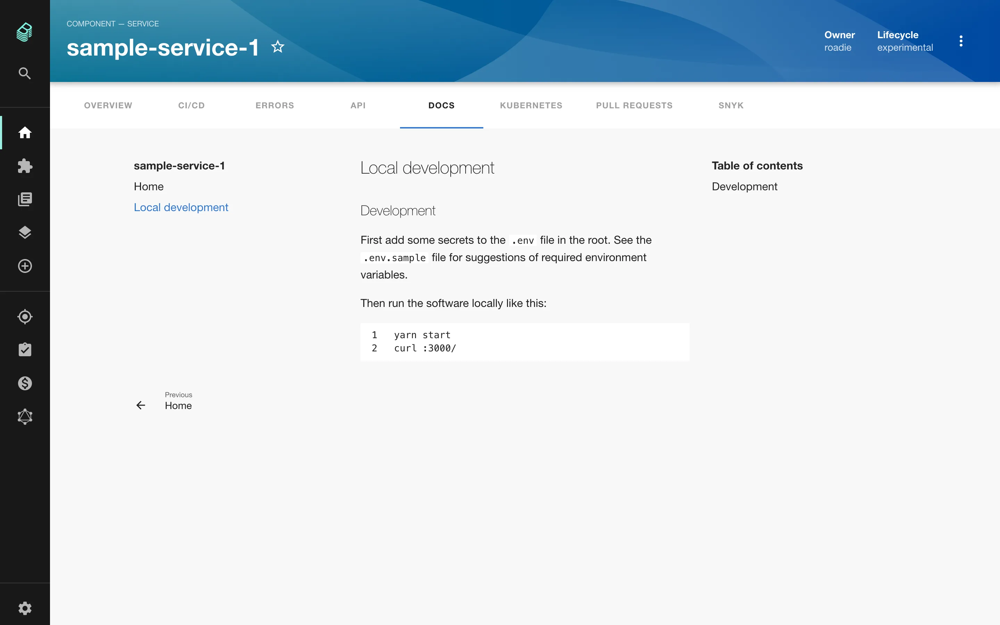

## Introduction

The Tech Docs feature of Roadie Backstage allows markdown files written alongside the code of your components to appear in Backstage as styled HTML documentation. Because this documentation is centralized in Backstage, it is more likely to be found and used by other people in your organization.


## Adding documentation to a component

Under the hood, Backstage uses the popular [MkDocs library](https://www.mkdocs.org/) to render documentation.

## Prerequisites
In order to write and view changes to docs you will need to install:

- NodeJS: You will need an active [LTS release of NodeJS](https://nodejs.org/en/about/releases/).
- Docker: Please refer to the [installation instructions for Docker](https://docs.docker.com/engine/install/).
- npx: `npm install -g npx`

### Step 1: Add the MkDocs configuration file

Create a file called `mkdocs.yml` in the root of a component you want to document in Backstage. Inside that YAML file, add the following content, replacing `{component-name}` with the human name of your component. 

```yaml
site_name: '{component-name}'

plugins:
  - techdocs-core

# Uncomment to add extensions if desired
#markdown_extensions:
#  - markdown_inline_mermaid
```

Note that `techdocs-core` plugin is automatically added to Roadie tech docs build and can be omitted from the plugins list if wanted.

### Step 2: Add markdown documentation

Create a directory called `docs` in the root of your component. Inside that directory, create a file called `index.md` with some markdown content inside. No frontmatter is required.

```markdown
This is the documentation.
```

Your component's directory structure should now look something like this:

```
├── README.md
├── catalog-info.yaml
├── docs
│   └── index.md
├── mkdocs.yml
└── src
    └── // The code of your component
```

Ensure you publish this new content to GitHub.

### Step 3: Update the YAML metadata

We can use the `catalog-info.yaml` file of our component to tell Backstage where to find the documentation.

To do this, add the `backstage.io/techdocs-ref` annotation to the list of annotations. 

If your docs are in the root of the repo, as described above, you can set the tech docs annotation to this:

```yaml
annotations:
  backstage.io/techdocs-ref: dir:.
```

If your docs are located elsewhere, you must explicitly point to them like this:

```yaml
apiVersion: backstage.io/v1alpha1
kind: Component
metadata:
  name: sample-service
  description: # ...
  annotations:
    backstage.io/techdocs-ref: url:https://github.com/your-org/your-repo/tree/main
spec:
  type: service
  owner: engineering
  lifecycle: experimental
```

⚠️  The GitHub URL **must** be prefixed with `url:` or the documentation will not render in Backstage.

### Step 4: Test your documentation
You can generate / serve your docs locally to view what they would look like when they are deployed to Roadie.

To generate the docs to the site directory of the project you can run the following command:

```bash
npx @roadiehq/techdocs-cli generate
```

To start a local server at port 3000 containing the generated docs, you can run the following command:
```bash
npx @roadiehq/techdocs-cli serve
```

### Step 5: Publish your documentation

Commit the changes made in steps 1 through 3 to your repository. Roadie Backstage will pick up the changes shortly after they are merged to the default branch.

## Viewing documentation in Backstage

To view your documentation in Backstage, first find the service in your service catalog and click it to open the Overview page.

On the Overview page, click Docs in the tab bar. You should now see your documentation.


## Adding more docs

Let's add a page called Local Development to our docs.

All that is required is to create a markdown file called `local-development.md` inside the `docs` directory of our component.

Add some content to it.

Commit and merge these changes to the default branch of your repo on GitHub and Backstage will pick up the changes after
a short period of time.



By default, the structure of the docs pages will mirror that of the file system. You can also explicitly describe your 
page structure using the `nav` object in your `mkdocs.yaml`. Both approaches are described [here](https://www.mkdocs.org/user-guide/writing-your-docs/#file-layout).

Similarly, MkDocs will determine a title for your document according to [these rules](https://www.mkdocs.org/user-guide/writing-your-docs/#meta-data).

## Next steps

To learn more about TechDocs on Roadie, please visit our [in-depth TechDocs documentation](/docs/details/techdocs/).

If you use OpenAPI specs in your organization you can [learn how to associate them with your components](/docs/details/openapi-specs/).
