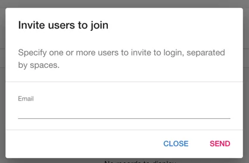

## Introduction

Roadie provides backstage with an authentication and user management feature for your new tenant.

When the tenant is created the user requesting the tenant is added as the first user in Roadie Backstage. This user may choose to add another user.

## Step 1: Visit the User Management page

The user management page is contained under the Administration side bar menu item.

## Step 2: Invite a user

To add a new user click the invite a new user button and enter the users email address.

Enter the users email and click send.

We will send an email to the users email address. The user will be asked to set a password and will them be redirected to login to backstage.

## Removing users

At present we do not provide the ability to remove a user. However, we can take care of that on your behalf. Please speak to a support person and we will do that for you.

## Single Sign On

Roadie supports Single Sign On via Okta or other providers. Please reach out to support via the chat widget in the bottom right corner of Roadie Backstage.

## Next steps

By default, every user of Roadie Backstage is an admin, with full powers to edit layouts and change configuration. To control which users get to be admins, you can [set up an admin group](/docs/getting-started/assigning-admins/).
