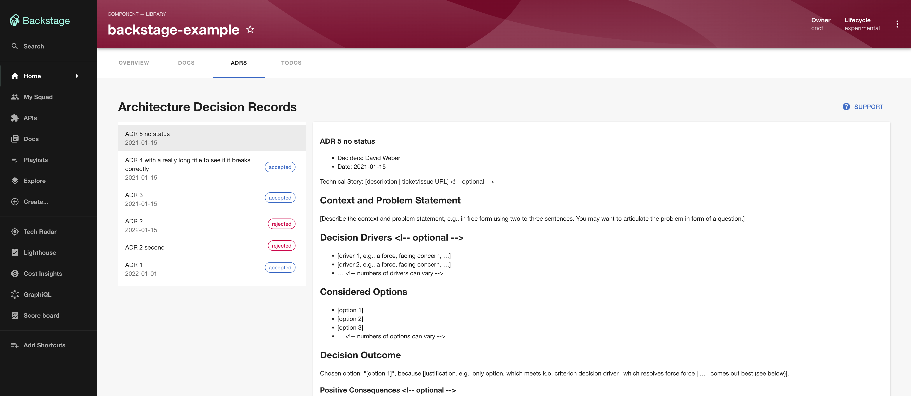

## Introduction

The Architecture Decision Records (ADR) plugin allows you to explore ADRs associated with your entities, as well as discover ADRs across other entities using the Search. Use this to inform your own architectural decisions based on the experiences of previous projects.

This plugin helps teams document and share architectural decisions, making it easier to understand the reasoning behind technical choices and learn from past decisions across different projects.

## ADR Entity Configuration

### Step 1: Add the ADR Tab

The ADR plugin is available as a tab on entity pages in Roadie. 




### Step 2: Annotate your entities

Add the following annotation to entities to link ADR files to the entity:

```yaml
metadata:
  annotations:
    backstage.io/adr-location: [RELATIVE_PATH_TO_ADR_FILES_DIR]
```

The value for `backstage.io/adr-location` should be a path relative to your `catalog-info.yaml` file or an absolute URL to the directory which contains your ADR markdown files.

For example, if you have the following directory structure, you would set `backstage.io/adr-location: docs/adrs`:

```
repo-root/
  README.md
  src/
  catalog-info.yaml
  docs/
    adrs/
      0001-use-adrs.md
      0002-use-cloud.md
```

## Troubleshooting

### ADRs not appearing

1. Verify that the `backstage.io/adr-location` annotation is correctly set on your entity
2. Ensure the ADR directory path is correct relative to your `catalog-info.yaml` file
3. Check that your repository integration is properly configured


## References

- [ADR Plugin on npm](https://www.npmjs.com/package/@backstage-community/plugin-adr)
- [MADR Template Documentation](https://github.com/adr/madr)
- [Architecture Decision Records Overview](https://adr.github.io/)
