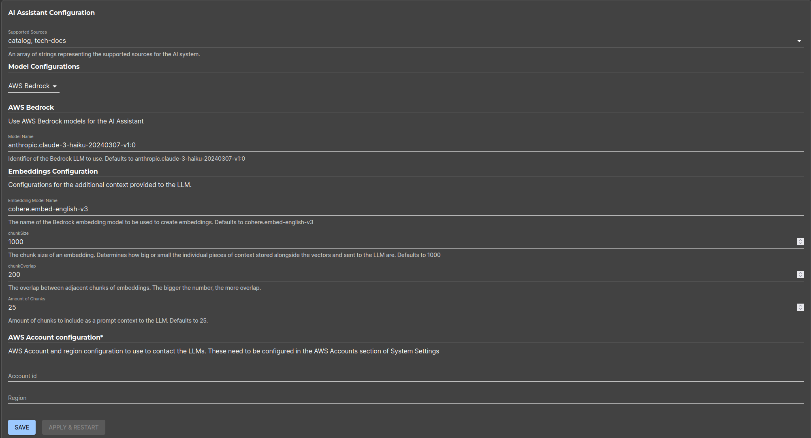
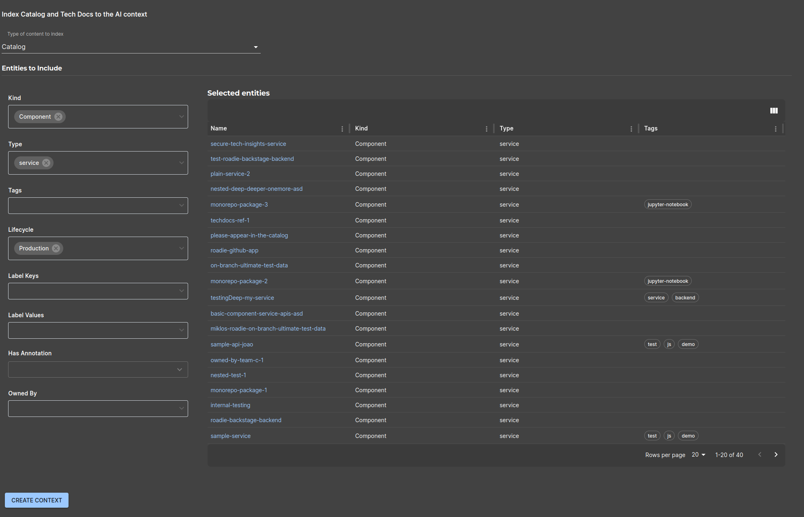
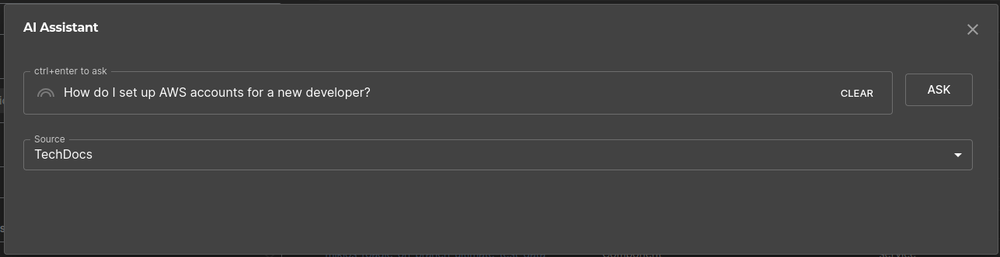

## Introduction


Roadie AI Assistant allows you to intelligently query your catalog and technical documentation for relevant information. The plugin uses RAG (retrieval augmented generation) techniques to produce relevant context for external large language models. It provides context-driven responses to queries by integrating seamlessly with your existing catalog information and tech-docs.

You can customize your model configurations and embedding-based document indexing, as well as define the correct information to index for better accuracy for the responses. 

This guide describes the necessary steps to configure the AI Assistant with appropriate model settings, embeddings, and document indexing. By following these steps, you will be able to optimize how the assistant processes and retrieves information from your organization's catalog and technical documents.

NB: The AI assistant is in Alpha still and is not ready to be used for mainstream workloads due to the currently limited scope of its abilities and inconsistent results for more complex queries.

## At a Glance
| | |
|---: | --- |
| **Prerequisites** |  |
| **Considerations** |  |
| **Supported Environments** | ☐ Private Network via Broker <br /> ☐ Internet Accessible via IP Whitelist <br /> ☒ Cloud Hosted |

## Step 1: Configure the Supported Sources

The AI Assistant by default does not index any content from your Roadie instance. You can enable the plugin to handle catalog entities and Technical Documentation. 

1. **Navigate to** `Administration > Settings > AI Assistant`.
2. Under **Supported Sources**, ensure that all the necessary sources (catalogs, tech-docs) are listed and checked for indexing.
3. Click **Apply & Restart** for changes to take effect.

## Step 2: Set Model and Embedding Parameters

To enable the AI Assistant to use the desired LLM provider and language model, configure the following settings:

### 2.1 Model Configuration

1. Under the **Model Configuration** section, choose the LLM model provider (e.g., AWS Bedrock).
2. Specify the model to be used for embedding and question answering tasks (e.g., `anthropic.claude-3-haiku-20240307-v1:0`).

### 2.2 Embedding Configuration

1. **Embedding Model Name**: Choose an appropriate model (e.g., `cohere.embed-english-v3`).
2. **Chunk Size**: Define the chunk size for dividing documents. This defaults to 1000 characters.
3. **Overlap Size**: Set the overlap size between chunks. Bigger the number, more overlapping content each chunk has. 
4. **Chunks**: Define the total number of chunks to be added as a context when sent to the LLM. The bigger the number, more chunks and thus more context is sent to the model. This also incur higher costs due to more tokens used. This defaults to `25` chunks.




## Step 3: Indexing Catalog and Technical Documents

The AI Assistant requires access to specific entities and documentation to provide context-aware answers. Currently no entities or documentation is automatically indexed. You can index tech-docs either manually within the docs main page (`https://<your-tenant>.roadie.so/docs`) or via selecting the wanted entities using the entity filter within the configuration section. 

### 3.1 Select type of content to be indexed

Select from the list of options which content to index. Currently supported items include `catalog entities` and `tech docs`.

### 3.2 Select Entities to Include

1. In the **Entities to Include** section, select relevant entities by specifying filters such as:
    - **Kind** (e.g., `Component`, `Service`, `API`).
    - **Type** (e.g., `repository`, `tenant`).
    - **Tags** (e.g., `hello=world`).
    - **Lifecycle** (e.g., `active`, `deprecated`).
2. The selected entities are displayed in a table, showing the repository, type, and relevant tags for each entity.





## Step 4: Using the AI Assistant 

The AI Assistant is available via a shortcut keybinding `ctrl` + `comma`, as well as a sidebar link AI Assistant. 

The recommended usage is to **point the asked questions either towards catalog or tech-docs** for best results. 




## Permissions and Annotations

### AWS Bedrock

AWS Bedrock integration uses `AWS Accounts` configuration settings within your Roadie instance. For information on how to configure AWS Accounts, take a look at the [documentation in here.](/docs/integrations/aws-plugins/)

Within the AI Assistant configuration you can select the configured AWS Account and the region where your Bedrok model is located.

The Roadie AI Assistant requires the connected account to have the following permissions:
```
{
    "Version": "2012-10-17",
    "Statement": [
        {
            "Sid": "VisualEditor0",
            "Effect": "Allow",
            "Action": [
                "bedrock:InvokeModel",
                "bedrock:InvokeModelWithResponseStream"
            ],
            "Resource": "*"
        }
    ]
}
```

Additionally, you may want to limit the available models by modifying the `Resource` block in the above example to point to the exact models you want to have available.

### OpenAI

OpenAI integration works with an OpenAI API token. You can set the token in the secrets section of the configuration page.

To ensure the AI Assistant can access and index the correct resources, ensure that appropriate permissions are in place:

```

```