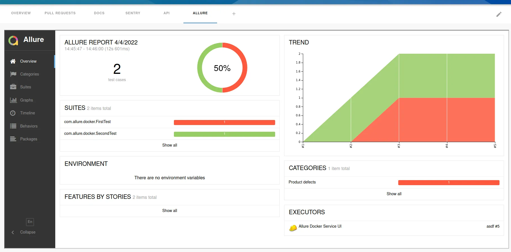
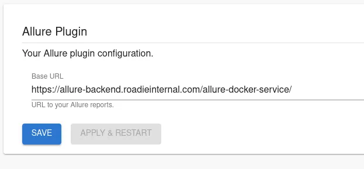

## Introduction

The Allure plugin can display the Allure reports of the component in your Roadie Backstage catalog.



This page explains how to configure it in Roadie Backstage.

## At a Glance
| | |
|---: | --- |
| **Prerequisites** | 1. You must be an admin in Roadie. By default, all users are admins. Learn how to designate certain users as admins [here](/docs/getting-started/assigning-admins/). <br /> 2. Your Allure reports must be accessible by Roadie backend instances. To allow list Roadie access you can check our IPs [here](/docs/details/allowlisting-roadie-traffic/). |
| **Considerations** |  |
| **Supported Environments** | ☐ Private Network via Broker <br /> ☐ Internet Accessible via IP Whitelist <br /> ☒ Cloud Hosted |

## Step 1: Save your hosted Allure report URL into Roadie

Navigate to `Administration > Settings > Allure` and set up the URL where your Allure reports are hosted. Note that this URL needs to be accessible from Roadie backend.



## Step 2: Modify your catalog-info.yaml files to contain a reference to the Allure project 

```yaml
# catalog-info.yaml
...
metadata:
  annotations: 
    qameta.io/allure-project: projectname
...
```

## Step 3: Add Allure Report UI component to your Roadie instance

The plugin provides an UI component with a name `EntityAllureReportContent` which can be added as a tab into your Roadie instance. Learn how to do that in [here](/docs/details/updating-the-ui/). 

## Useful information

The Allure plugin constructs the displayable path based on the *base URL* defined in Roadie config section and *project id* defined in the catalog manifest file. The final URL requested by the plugin looks like this: 
```text
<Base URL>/projects/<Project Id>/reports/latest/index.html
```


## References

- [Allure reports documentation](https://docs.qameta.io/allure/)
- [Allure plugin on NPM](https://www.npmjs.com/package/@backstage/plugin-allure)
- [Allure Docker Service documentation](https://github.com/fescobar/allure-docker-service)
