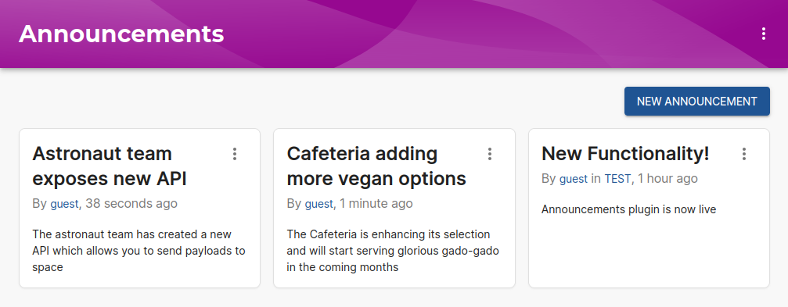
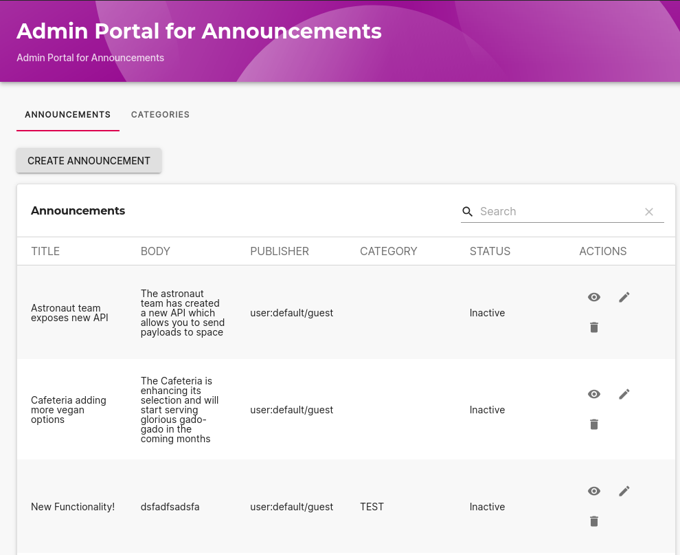
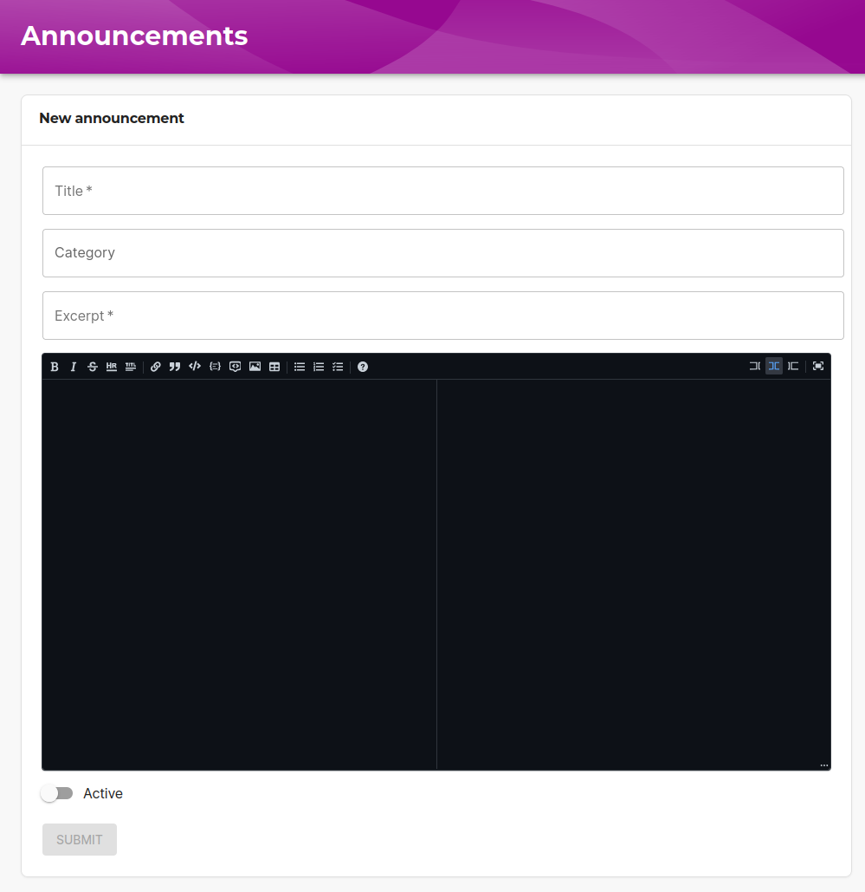
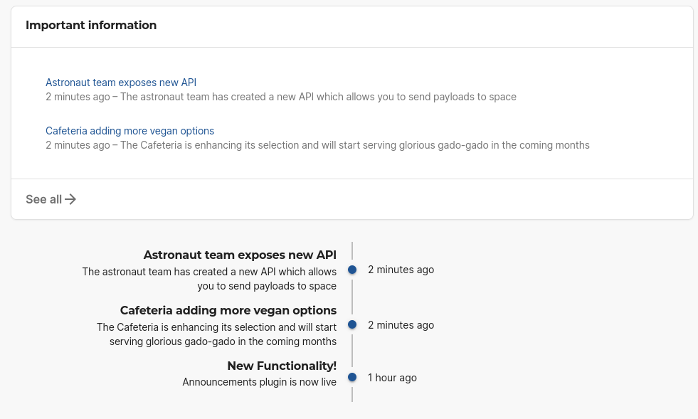
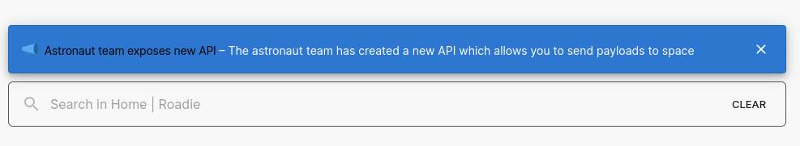

## Introduction

The [Announcements](https://github.com/backstage/community-plugins/tree/main/workspaces/announcements) plugin manages and displays announcements within your Roadie instance.

## At a Glance
| | |
|---: | --- |
| **Prerequisites** |  |
| **Considerations** |  |
| **Supported Environments** | ☐ Private Network via Broker   ☐ Internet Accessible via IP Whitelist   ☒ Cloud Hosted |

## Functionality and Components

The announcements plugin exposes multiple components and extensive functionality to inform your Roadie users with messages and important information. All of these components can be configured using the [Roadie UI customization](/docs/getting-started/configure-ui/) functionality.

The plugin is managed from within the `AnnouncementsPage` component that contains a collection of past announcements, an admin section to configure multiple categories of announcements as well as needed form functionality to create and edit announcements.

\

`AnnouncementsCard` is a component that can be added to both home and entity pages to display information. The card can be configured to show announcements from only specific categories or for example only active announcements. Within Roadie you can easily configure these properties using the builtin props form functionality.

The plugin additionally introduces an `AnnouncementsTimeline` card which can be used to show a timeline of messages in a succinct format.

To keep users informed about latest announcements, you can use the `NewAnnouncementBanner` which can be configured to the homepage to display new, unseen announcements.

## References

- [The announcements Backstage plugin](https://github.com/backstage/community-plugins/tree/main/workspaces/announcements) 

