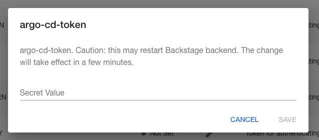
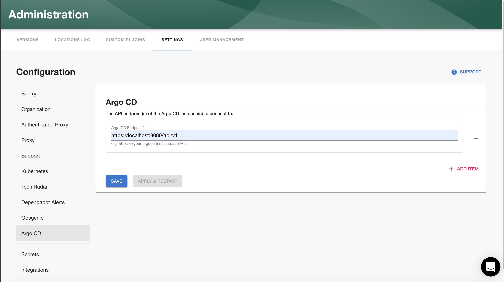
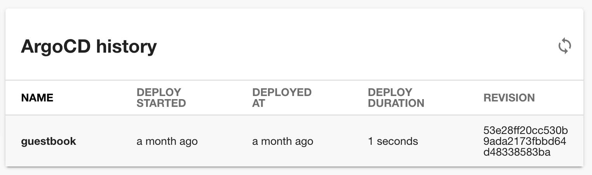
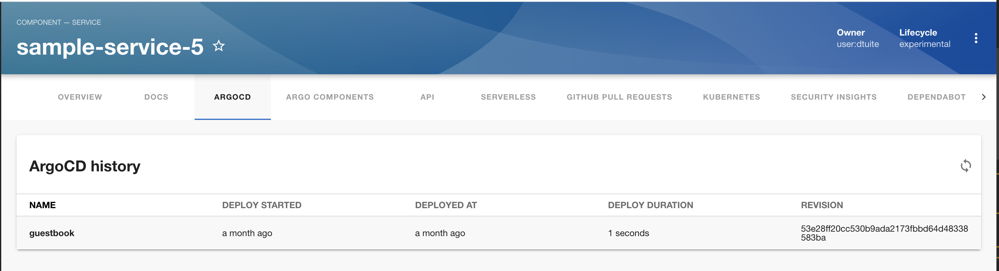

## Introduction

The Argo CD plugin can present the current status of an application in your Roadie Backstage catalog.


This page explains how to configure it in Roadie Backstage.

## Prerequisites

1. You must be an admin in Roadie. By default, all users are admins. Learn how to designate certain users as admins [here](/docs/getting-started/getting-started-for-admins/).

## Step 1: Create an API token

Roadie requires an API token to be able to connect to Argo CD.

You can generate a token via the Argo CD CLI or UI. 

Via the CLI run:

```bash
argocd account generate-token --account <your-account> --id <optional-id>
```

Alternatively, visit the Argo CD UI at `/settings/accounts/<your-account>` click "Generate New" in the "Tokens" section.

## Step 2: Store the API token in Roadie

Visit the Roadie Secrets page ([show me how](/docs/details/setting-secrets/)) and enter the token into the `argo-cd-token` secret.



## Step 3: Configure Roadie with your Argo CD endpoint

Enter your Argo CD server API endpoint into Roadie.

1. Click "Administration" in the sidebar, then "Settings" in the tabs.
2. Find "Argo CD" in the Configuration sidebar.
3. Enter your Argo CD server API endpoint click "Save" then "Apply & Restart".



## Step 4: Add the UI elements

The Argo CD plugin provides two type of UI elements. 

The `EntityArgoCDOverviewCard` presents the current status of an application: 


The `EntityArgo CDHistoryCard` displays the deployment history of an appliction:



Both can be [added to component dashboards](/docs/getting-started/updating-the-ui/#updating-dashboards).

The `EntityArgo CDContent` displays similar information to the history card and can be [added as a tab](/docs/getting-started/updating-the-ui#updating-tabs) to component layouts.



## Multiple Argo CD Instances

If you require integrating with multiple Argo CD servers contact Roadie via the in-app chat widget and we will enable it for you.

## References

- [Argo CD Backstage plugin codebase](https://github.com/RoadieHQ/roadie-backstage-plugins/tree/main/plugins/backstage-plugin-argo-cd)
