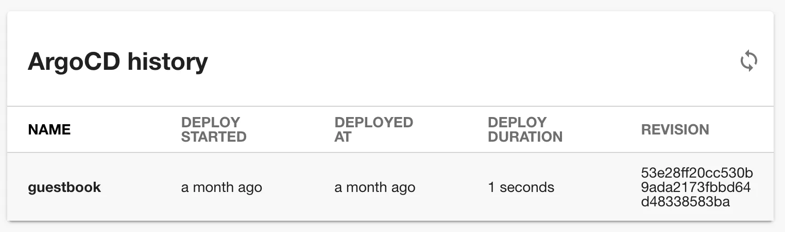

## Introduction

The Argo CD plugin can present the current status of an application in your Roadie Backstage catalog. You also have the possibility to see your Argo CD deployments history and their corresponding revisions, as well as more detailed information about currently deployed applications.


This page explains how to configure it in Roadie Backstage.

## At a Glance

| | |
|---: | --- |
| **Prerequisites** | **Configuration Data:** <ul><li>API Token</li></ul> |
| **Considerations** |  |
| **Supported Environments** | ☒ Private Network via Broker <br /> ☒ Internet Accessible via IP Whitelist <br /> ☒ Cloud Hosted  |

## Step 1: Create an API token

Roadie requires an API token to be able to connect to Argo CD.

You can generate a token via the Argo CD CLI or UI. 

Via the CLI run:

```bash
argocd account generate-token --account <your-account> --id <optional-id>
```

Alternatively, visit the Argo CD UI at `/settings/accounts/<your-account>` click "Generate New" in the "Tokens" section.

## Step 2 (option a): Configure Argo CD with app locator method within your Roadie instance

Select **App Locator** as the configuration method in Argo CD settings page in Roadie.

The app locator method configuration allows you to dynamically search and identify Argo CD registered applications from multiple Argo CD instances. It also provides you with more comprehensive configuration options and granular control on which resources would be accessible/inaccessible within Roadie. This is the preferred configuration method. 


### Basic Configuration


Enter your Argo CD server frontend URL into Roadie. This is used to construct links to individual Argo CD applications.

Configure your username and password _on the global level_ for all your Argo CD instances. You can use this option if all instances are using the same credentials. In general, it is better to leave these empty and rely on instance specific credentials instead.

Add instances of Argo CD server into your configuration. Click "Add Item" to add a new instance. Select either token or username and password credentials configuration for your instance. Fill in the details of your instance. You need to add a unique identifier for each instance you are configuring.

Enter your Argo CD server API endpoint or [broker endpoint](/docs/integrations/broker/) (in the format `broker://my-token`) into Roadie. For more information about broker configuration and needed Broker configuration files, you can take a look at the provided configurations within the [Roadie Agent repository](https://github.com/RoadieHQ/roadie-agent/tree/main/dockerfiles/argocd).

Note that the API endpoint within this configuration method should be pointing to the root URL of the server. 


### Additional Options

The App Locator method provides additional configuration options to allow more fine-grained control. 


The configuration options are as follows:
* **Wait Cycles**: Between the Argo CD project delete and application delete there is a loop created to check for the deletion of the application before the deletion of a project can occur. Between each check there is a 3 second timer. The number of cycles to wait is an optional configuration value as shown above as Wait Cycles. If Wait Cycles is set to 25, the total time the loop can last before erroring out is 75 seconds.
* **Revisions to Load**: The ArgoCDHistoryCard loads all app revisions by default. If your app has many revisions, this can lead to a lot of requests and long loading times. Therefore, you can limit the number of revisions to load
* **Project Allow/Block Lists**: In order to control what kind of resources are allowed or blocked by default on the created argo projects you can configure a block and/or allow list at both the cluster and namespace levels. 
* **Namespaced Apps**: If you want to use the Argo CDs "Applications in any namespace" beta feature, you have to explicitly enable it in the configuration. After enabling the feature, you can use `argocd/app-namespace` annotation on entities

NB: You can use the [Roadie Broker](/docs/integrations/broker/) if your Argo CD API is not publicly accessible. This is usually the preferred connection method.


## Step 2 (option b): Configure Argo CD with proxy method within your Roadie instance

Select **Proxy** as the configuration method in Argo CD settings page in Roadie.

Enter your Argo CD server frontend URL into Roadie. This is used to construct links to individual Argo CD applications.
Enter your Argo CD server API endpoint or [broker endpoint](/docs/integrations/broker/) (in the format `broker://my-token`) into Roadie.


#### Step by step

1. Click "Administration" in the sidebar, then "Settings" in the tabs.
2. Find "Argo CD" in the Configuration sidebar.
3. Enter your Argo CD server API endpoint.
4. Add the Argo CD API token in the Secrets section.
5. Click "Save" then "Apply & Restart". 

You can add multiple Argo CD instances using the proxy method. The configuration uses the configured secrets in order, where the first instance configuration uses secret with a name `argo-cd-token`, the second uses secret `argo-cd-token-2` etc.


NB: You can use the [Roadie Broker](/docs/integrations/broker/) if your Argo CD API is not publicly accessible. 


## Step 3: Add the UI elements

The Argo CD plugin provides two type of UI elements. 

The `EntityArgoCDOverviewCard` presents the current status of an application: 


The `EntityArgoCDHistoryCard` displays the deployment history of an appliction:



Both can be [added to component dashboards](/docs/details/updating-the-ui/#updating-dashboards).

The `EntityArgoCDContent` displays similar information to the history card and can be [added as a tab](/docs/getting-started/updating-the-ui#updating-tabs) to component layouts.


## Step 4: Add annotations
Add one of the following annotations to the yaml config file of a component

```
metadata:
  annotations:
    argocd/app-name: <your-app-name>
```

```
metadata:
  annotations:
    argocd/app-selector: <app-selector>
```

## References

- [Argo CD Backstage plugin backend](https://github.com/RoadieHQ/roadie-backstage-plugins/tree/main/plugins/backend/backstage-plugin-argo-cd-backend)
- [Argo CD Backstage plugin frontend](https://github.com/RoadieHQ/roadie-backstage-plugins/tree/main/plugins/frontend/backstage-plugin-argo-cd)
