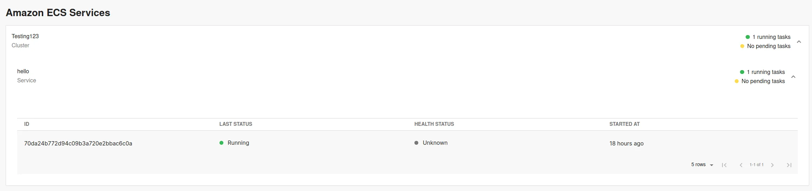
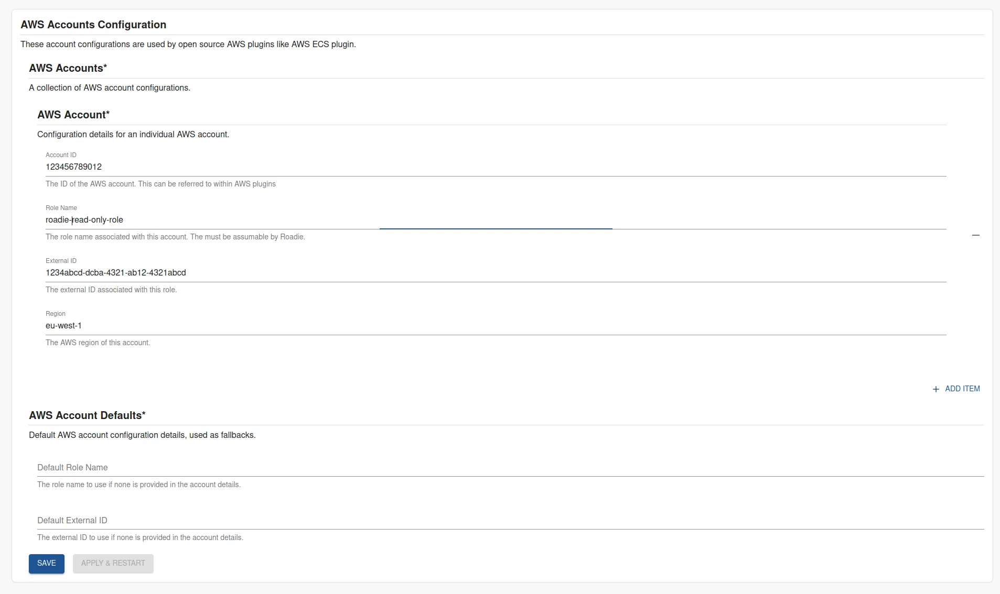

## Introduction

Amazon Web Services have produced and open sourced their own plugins for the Backstage ecosystem, which are also compatible to be configured on Roadie instances. These plugins introduce functionality to visualize running AWS resources like ECS Tasks and Services. 

This guide describes how to set up Roadie to use AWS account configurations and to enable AWS plugins.




##  Step 1: Get the roadie IAM details

Navigate to `Administration > Settings > AWS Resources` and make a note of the Roadie backend role ARN and account ID. This is mentioned on the title text of the AWS Resources integration settings page.

##  Step 2: Create a federated role in your account for Roadie

Follow the steps [here](/docs/details/accessing-aws-resources) to create the role. 

The role needs to follow this naming convention `arn:aws:iam::*:role/<your-tenant-name>-roadie-read-only-role` where <your-tenant-name> matches your organisation's name used in the url of your Roadie instance.

You'll need to attach policies to the role to be able to retrieve information about the resources you want ingested. The supported resources and their needed policies are listed in a table at the end of this page. You can use the same role for multiple resource types as long as the needed permissions are granted to it.

For quick experimentation, you can use `AWS<ResourceType>ReadOnlyAccess` policies provided by AWS, but the best practice is to allow only specific needed operations.


##  Step 3: Configure your Roadie instance to use the new role


On the AWS Resources settings page `Administration > Settings > AWS Accounts` in Roadie click `Add Item`. 
Here you can select the type of resource you want to be ingested. The possible options are listed in the table at the bottom of the page.

After choosing a resource, you need to define the role (created in step 2 above) to be used to ingest these resources, as well as the AWS region to use and the optional External ID configured for the role 

After the role configuration is done, you can click the 'Test Role' button to check if the role is assumable by Roadie.




## Step 4: Add the AWS UI component into your system

Roadie exposes AWS ECS plugin `EntityAmazonEcsServicesContent` component as a tab that can be added to entity pages of your Roadie installation. You can achieve this by following the guide on [how to modify the UI](/docs/details/updating-the-ui/). 


## Permissions and Annotations

You can attach the following permission policies to the assumable AWS role to allow it to retrieve and display information about your running AWS resources. 

### ECS Plugin 

The permissions needed for ECS plugin to work and be able to list your ECS resources are as follows: 

```json
{
  "Version": "2012-10-17",
  "Statement": [
    {
      "Effect": "Allow",
      "Action": [
        "ecs:DescribeServices",
        "ecs:ListTasks",
        "ecs:DescribeTasks",
        "ecs:DescribeClusters"
      ],
      "Resource": "*"
    }
  ]
}
```

The plugin exposes two annotations that can be used to point to the correct ECS Cluster information to display:

The first one is using the specific ARN value of the ECS service.

```yaml
# Example
apiVersion: backstage.io/v1alpha1
kind: Component
metadata:
  # ...
  annotations:
    aws.amazon.com/amazon-ecs-service-arn: arn:aws:ecs:us-west-2:123456789012:service/cluster1/myapp-service # specific ECS service by ARN
  # ...
```


The second option is to tag ECS resources and identify them based on the tags.

```yaml
# Example
apiVersion: backstage.io/v1alpha1
kind: Component
metadata:
  # ...
  annotations:
    aws.amazon.com/amazon-ecs-service-tags: hello=world # Comma separated list of tags
  # ...
```


## References

- [AWS Labs Plugins Repository](https://github.com/awslabs/backstage-plugins-for-aws/tree/main)
- [AWS node account configuration NPM package](https://www.npmjs.com/package/@backstage/integration-aws-node)
