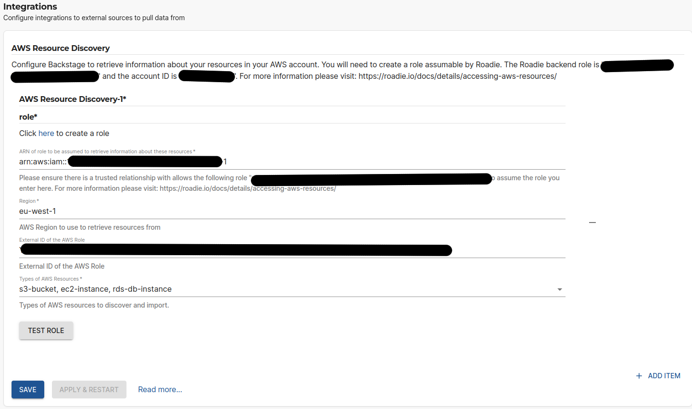

## Introduction

Roadie has the capability to automatically ingest resources from AWS. This is done by automatic discovery and currently ingests all configured resource types per AWS region.

This guide describes how to set up Roadie to access your specific AWS resources and automatically ingest them.


##  Step 1: Get the roadie IAM details

Navigate to `Administration > Settings > AWS Resources` and make a note of the Roadie backend role ARN and account ID. This is mentioned on the title text of the AWS Resources integration settings page.

##  Step 2: Create a federated role in your account for Roadie

Follow the steps [here](/docs/details/accessing-aws-resources) to create the role. 

The role needs to follow this naming convention `arn:aws:iam::*:role/<your-tenant-name>-roadie-read-only-role` where <your-tenant-name> matches your organisation's name used in the url of your Roadie instance.

You'll need to attach policies to the role to be able to retrieve information about the resources you want ingested. The supported resources and their needed policies are listed in a table at the end of this page. You can use the same role for multiple resource types as long as the needed permissions are granted to it.

For quick experimentation, you can use `AWS<ResourceType>ReadOnlyAccess` policies provided by AWS, but the best practice is to allow only specific needed operations.


##  Step 3: Configure your Roadie instance to use the new role



On the AWS Resources settings page `Administration > Settings > Aws Resources` in Roadie click `Add Item`. 
Here you can select the type of resource you want to be automatically ingested. The possible options are listed in the table at the bottom of the page.

After choosing a resource, you need to define the role (created in step 2 above) to be used to ingest these resources, as well as the AWS region to use and the optional External ID configured for the role 

After the role configuration is done, you can click the 'Test Role' button to check if the role is assumable by Roadie.


## Resources and needed permissions

In the below table you can see the available resources to be ingested and the AWS permissions that are needed to be granted for the assumable role for them to appear to the Catalog.

| Resource        | Description                               | AWS Policy Action(s)                            |
|-----------------|-------------------------------------------|-------------------------------------------------|
| lambda-function | AWS Lambda Functions                      | `lambda:ListFunctions`                          |
| eks-cluster     | AWS Elastic Kubernetes Service Clusters   | `eks:ListClusters`, `eks:DescribeCluster`       |
| s3-bucket       | AWS Simple Storage Service Buckets        | `s3:ListBucket`, `s3:ListAllMyBuckets`          |
| dynamodb-table  | AWS DynamoDB tables                       | `dynamodb:ListTables`, `dynamodb:DescribeTable` |
| ec2-instance    | AWS Elastic Compute Cloud instances       | `ec2:DescribeInstances`                         |
| rds-db-instance | AWS Relational Database Service instances | `rds:DescribeDBInstances`                       |


You can see an example JSON needed to construct the policy by expanding the code snippet below. For cases where multiple role policy actions are defined, you can add needed additional statement blocks into the policy.  

<details>

<summary>Needed minimal policy</summary>

```json
{
  "Version": "2012-10-17",
  "Statement": [
    {
      "Sid": "RoadieAllowPolicy",
      "Effect": "Allow",
      "Action": [
        "lambda:ListFunctions"
      ],
      "Resource": "*"
    }
  ]
}
```
</details>