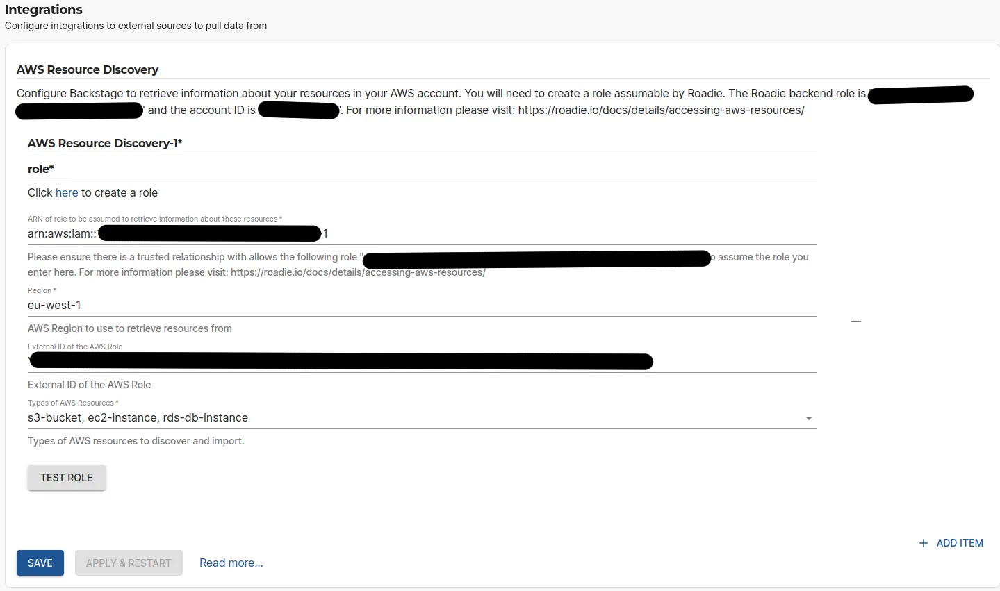
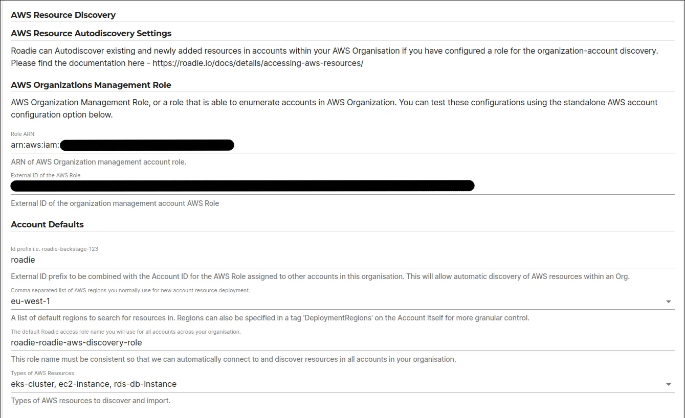

## Introduction

Roadie has the capability to automatically ingest resources from AWS. This is done by automatic discovery and currently ingests all configured resource types per AWS region. You can configure AWS resource ingestion either by manually adding standalone account/region configurations or by using AWS organization structure to autodiscover accounts and their resources. The discovered AWS resources will be registered as `Resource` kind entities within Roadie. The type of the `Resource` entity indicates the AWS resource type.

This guide describes how to set up Roadie to access your specific AWS resources and automatically ingest them.


## Configuring connectivity to AWS

### Step 1: Get the roadie IAM details

Navigate to `Administration > Settings > AWS Resources` and make a note of the Roadie backend role ARN and account ID. This is mentioned on the title text of the AWS Resources integration settings page.

### Step 2: Create a federated role in your account for Roadie

Follow the steps [here](/docs/details/accessing-aws-resources) to create the role. 

The role needs to follow this naming convention `arn:aws:iam::*:role/[your-tenant-name]-roadie-read-only-role` where <your-tenant-name> matches your organisation's name used in the url of your Roadie instance.

<div role="alert">
  <div class="docs-cta__tip_title">Defining the correct AWS role</div>
  <div  class="docs-cta__tip_message">
    <p>⚠️ The enforced naming convention for acceptable assumable roles dictates that the role name needs to start with text <code>[tenant-name]-roadie-</code>. If other naming conventions are used, the role assumption is blocked by security measures.
    </p>
  </div>
</div>


You'll need to attach policies to the role to be able to retrieve information about the resources you want ingested. The supported resources and their needed policies are listed in a table at the end of this page. You can use the same role for multiple resource types as long as the needed permissions are granted to it.

For quick experimentation, you can use `AWS<ResourceType>ReadOnlyAccess` policies provided by AWS, but the best practice is to allow only specific needed operations. You can see the needed policies in a table at the end of this page.

### Step 3: Configure external id

It is best practice (and mandatory for `autodiscovery` configuration) to configure an external id for your assumable role. 

**(A)**

For Autodiscovery configuration, you are able to define **an external id prefix within the Roadie application**. The final external id will be constructed based on this prefix, a delimiter character of `-` and the AWS account number in question, encoded into a **base64** string. 


For example if you have defined external id prefix `roadie` and the account id is `123456789012` the final external id will be `cm9hZGllLTEyMzQ1Njc4OTAxMg==`. The preferred way for these is naturally creating the roles and their configurations using infrastructure as code tools. The following approaches can be used for specific tools:
* Terraform: `base64encode("roadie-123456789012")`
* Pulumi (JS/TS): `Buffer.from('roadie-123456789012').toString('base64')`
* Bash: `echo -n 'roadie-123456789012' | base64`
* Browser Devtools: `btoa("roadie-123456789012")`


**(B)** 

For standalone configurations this can be any string conforming to regular expression pattern `[\w+=,.@:\/-]*`.  


### Example trust policy
```json
{
  "Version": "2012-10-17",
  "Statement": [
    {
      "Effect": "Allow",
      "Principal": {
        "AWS": "arn:aws:iam::123456789012:root"
      },
      "Action": "sts:AssumeRole",
      "Condition": {
        "StringEquals": {
          "sts:ExternalId": "cm9hZGllLTEyMzQ1Njc4OTAxMg=="
        },
        "StringLike": {
          "aws:PrincipalArn": "*role/demo-role-abcdABCD*"
        }
      }
    }
  ]
}
```

The values `123456789012` and `demo-role-abcdABCD` can be replaced with the values found within your Roadie instance, the external id is the value from step 3.


##  Configuring your Roadie instance to discover AWS resources

### Option 1 - Standalone AWS account configuration



On the AWS Resources settings page `Administration > Settings > AWS Resources` in Roadie click `Add Item`. 
Here you can define the role (created in step 2 above) to be used to ingest these resources, as well as the AWS region to use and the optional External ID configured for the role.

After the role configuration is done, you can click the 'Test Role' button to check if the role is assumable by Roadie. Finally,  you can select the types of resources you want to be ingested. The possible options are listed in the table at the bottom of the page.

You can add multiple integrations towards multiple AWS accounts or regions.

### Option 2 - AWS Organizations based autodiscovery



On the AWS Resources settings page `Administration > Settings > AWS Resources` fill out the AWS Resource Autodiscovery Settings.

In here you define 2 pieces of information:

#### 1. AWS role with access to AWS organizations information

The AWS Organizations Management role is used to retrieve a list of AWS accounts within your AWS organization. This role should have access to the following policies:  
* `organizations:ListAccounts`
* `organizations:ListTagsForResource`


#### 2. Default settings to be used for each AWS account

The default settings for role assumption are the configurations that are used to assume a role on each of the AWS accounts that are discovered with the AWS Organizations Management Role. Within this settings section you can configure the regions to retrieve resources from, as well as all the resource types that should be ingested. The role name set in here must be present in each of the AWS accounts and it should have access to read the relevant chosen resources in the configured regions. You can see the needed permissions at the table in the end of this page.

The external id prefix is the same, but the external id will be different for each AWS account. Note the process on how to determine the external id from the above documentation. 

For the moment all discovered AWS accounts are using the same role name and regions. if there is a need to divert from this pattern, you can add additional standalone AWS account configurations. 


#### 3. Configure individual accounts with different regions and resources

The autodiscovery option of AWS resources ingestion uses AWS organization account tags to override global configurations set up on the roadie system. With these tags you can configure more fine-grained approaches on which resources, from which regions, to ingest from specific accounts. The supported tags are as follows: 

| Tag Key           | Example values            | Description                                                                                                   |
|-------------------|---------------------------|---------------------------------------------------------------------------------------------------------------|
| `resources`       | `eks-cluster s3-bucket`   | **Space separated** list of resources to ingest from this account. See available resources in the table below |
| `regions`         | `eu-west-1 eu-central-1`  | **Space separated** AWS region codes to ingest resources from                                                 |
| `roadie-excluded` | (Empty value) / any value | The presence of this tag indicates to skip this specific AWS account from being ingested                      |


## Resources and needed permissions

The table below lists the permissions required of the assumable role in order for the Catalog to ingest those resource types.

| Resource             | Description                                  | AWS Policy Action(s)                                                              |
|----------------------|----------------------------------------------|-----------------------------------------------------------------------------------|
| lambda-function      | AWS Lambda Functions                         | `lambda:ListFunctions`, `lambda:ListTags`                                         |
| eks-cluster          | AWS Elastic Kubernetes Service Clusters      | `eks:ListClusters`, `eks:DescribeCluster`                                         |
| s3-bucket            | AWS Simple Storage Service Buckets           | `s3:ListBucket`, `s3:ListAllMyBuckets`, `s3:GetBucketTagging`                     |
| dynamodb-table       | AWS DynamoDB tables                          | `dynamodb:ListTables`, `dynamodb:DescribeTable`, `dynamodb:ListTagsOfResource`    |
| ec2-instance         | AWS Elastic Compute Cloud instances          | `ec2:DescribeInstances`                                                           |
| rds-db-instance      | AWS Relational Database Service instances    | `rds:DescribeDBInstances`                                                         |
| sns-topic            | AWS SNS Topics                               | `sns:ListTopics`, `sns:ListTagsForResource`                                       |
| organization-account | AWS Organization Accounts                    | `organizations:ListAccounts`, `organizations:ListTagsForResource`                 |
| opensearch-domain    | AWS OpenSearch Domains                       | `es:ListDomainNames`, `es:DescribeDomain`,`es:ListTags`                           |
| elasticache-cluster  | AWS ElastiCache (Redis or Memcached) Cluster | `elasticache:DescribeCacheClusters`, `elasticache:ListTagsForResource`            |
| sqs-queue            | AWS SQS Queues                               | `sqs:ListQueues`, `sqs:GetQueueAttributes`, `sqs:ListQueueTags`                   |
| subnet               | AWS VPC Subnets                              | `ec2:DescribeSubnets`                                                             |
| load-balancer        | AWS Load Balancers                           | `elasticloadbalancing:DescribeLoadBalancers`, `elasticloadbalancing:DescribeTags` |
| security-group       | AWS VPC Security Groups                      | `ec2:DescribeSecurityGroups`                                                      |
| ebs-volume           | AWS EBS Volumes                              | `ec2:DescribeVolumes`                                                             |
| vpc                  | AWS VPC                                      | `ec2:DescribeVpcs`, `ec2:DescribeDhcpOptions`                                     |


You can expand the code snippet below to show an example policy document for the AWS role. You can add additional statement blocks into the policy document where multiple role policy actions are required.

<details>

<summary>Needed minimal policy</summary>

```json
{
  "Version": "2012-10-17",
  "Statement": [
    {
      "Sid": "RoadieAllowPolicy",
      "Effect": "Allow",
      "Action": [
        "lambda:ListFunctions"
      ],
      "Resource": "*"
    }
  ]
}
```
</details>


## Additional information

The resource providers enhance their functionality to allow additional metadata inclusion to the provided entities. This is done by using tags within the AWS resource. 
The tagging functionality of AWS is used to determine the owner of each resource. By default, Roadie uses tag with a key `owner` to determine what value to use for the owner field of the generated entity.

You can additionally use the following tags to indicate relationships within the catalog:
`system` -> To indicate that this AWS resources is part of a system (expected value: fully qualified name)
`domain` -> To indicate that this AWS resources is part of a domain (expected value: fully qualified name)
`dependsOn`  -> To indicate that the resource depends on something (expected value: comma separated list of fully qualified names)
`dependencyOf` -> To indicate that the resource is a dependency of something  (expected value: comma separated list of fully qualified names)


For EKS Cluster ingestion you are also able to specify the `spec.type` value to use when these resource entities are ingested. The default value is `eks-cluster`, other popular value that could be more descriptive is `kubernetes-cluster`.


See more information about relationships in [Backstage docs](https://backstage.io/docs/features/software-catalog/well-known-relations).
