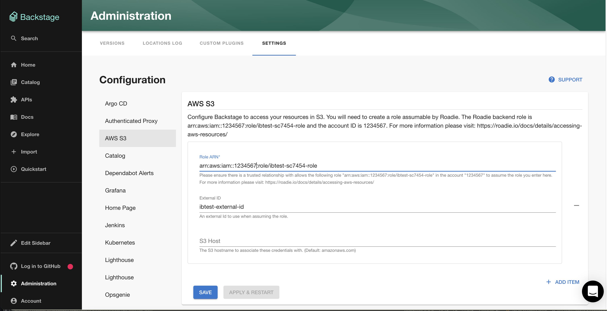

## Introduction

S3 can be a useful place to store certain resources used by backstage plugins like OpenApi spec files.  

This guide describes how to set up access for Roadie to your S3 buckets in your infrastructure and configure it.

##  Step 1: Get the roadie IAM details

Navigate to `Administration > Settings > AWS S3` and make a note of the Roadie backend role ARN and account ID.


##  Step 2: Create a federated role in your account for Roadie

Follow the steps [here](/docs/details/accessing-aws-resources) to create the role. 

The role needs to follow this naming convention `arn:aws:iam::*:role/<your-tenant-name>-roadie-read-only-role` where <your-tenant-name> matches your organisation's name used in the url of your Roadie instance.

You'll need to attach a policy which allows access to the required S3 buckets such as `AmazonS3ReadOnlyAccess`. This policy grants roadie read access to all buckets. 
If you do not want to grant this access you can [create your own policy](https://docs.aws.amazon.com/IAM/latest/UserGuide/access_policies_create-console.html) 
which restricts access to only certain buckets. e.g. 

```json
{
  "Version": "2012-10-17",
  "Statement": [
    {
      "Effect": "Allow",
      "Action": [
        "s3:GetObject"
      ],
      "Resource": "arn:aws:s3:::my-bucket/*"
    },
    {
      "Effect": "Allow",
      "Action": [
        "s3:ListBucket"
      ],
      "Resource": "arn:aws:s3:::my-bucket"
    }
  ]
}
```

##  Step 3: Configure your Roadie instance to use the new role

On the AWS S3 settings page `Administration > Settings > Aws S3` in Roadie click `Add Item` and enter the newly created 
role ARN and external ID. The S3 host is only required if you're using different roles for different buckets. 


