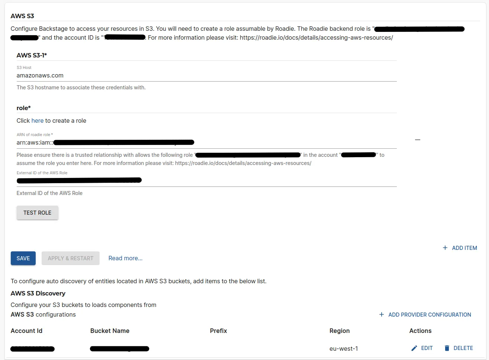
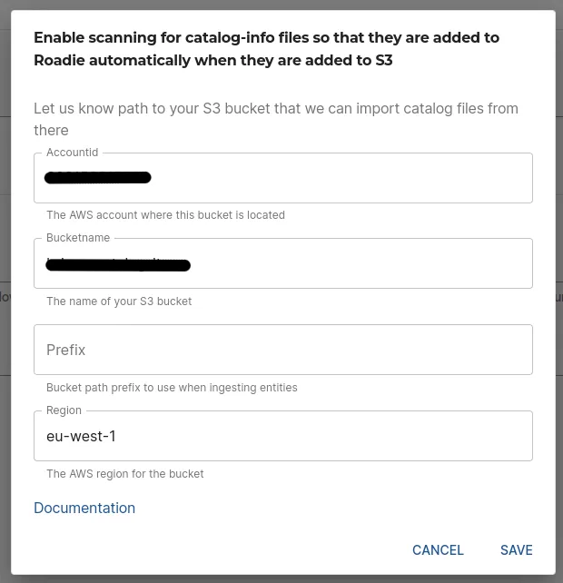

## Introduction

S3 can be a useful place to store certain resources used by backstage plugins like OpenApi spec files.

This guide describes how to set up access for Roadie to your S3 buckets in your infrastructure and configure it.

To configure autodiscovery of entities from S3 buckets, see documentation about [AWS S3 Autodiscovery.](/docs/details/location-management#aws-s3-autodiscovery)

## At a Glance

|                            |                                                                                                  |
| -------------------------: | ------------------------------------------------------------------------------------------------ |
|          **Prerequisites** |                                                                                                  |
|         **Considerations** |                                                                                                  |
| **Supported Environments** | ☐ Private Network via Broker <br /> ☐ Internet Accessible via IP Whitelist <br /> ☒ Cloud Hosted |

## Step 1: Get the roadie IAM details

Navigate to `Administration > Settings > AWS S3` and make a note of the Roadie backend role ARN and account ID. This is mentioned on the title text of the AWS S3 integration settings page.

## Step 2: Create a federated role in your account for Roadie

Follow the steps [here](/docs/details/accessing-aws-resources) to create the role.

You'll need to attach a policy which allows access to the required S3 buckets such as `AmazonS3ReadOnlyAccess`. This policy grants roadie read access to all buckets.
If you do not want to grant this access you can [create your own policy](https://docs.aws.amazon.com/IAM/latest/UserGuide/access_policies_create-console.html)
which restricts access to only certain buckets. An example minimal policy needed to retrieve files from S3 buckets is below

<details>

<summary>An example minimal S3 Read policy</summary>

```json
{
  "Version": "2012-10-17",
  "Statement": [
    {
      "Effect": "Allow",
      "Action": ["s3:GetObject"],
      "Resource": "arn:aws:s3:::my-bucket/*"
    },
    {
      "Effect": "Allow",
      "Action": ["s3:ListBucket"],
      "Resource": "arn:aws:s3:::my-bucket"
    }
  ]
}
```

</details>

## Step 3: Configure your Roadie instance to use the new role

On the AWS S3 settings page `Administration > Settings > Aws S3` in Roadie click `Add Item` and enter the newly created
role ARN and external ID. The S3 host is only required if you're using different roles for different buckets.

After the role configuration is done, you can click the 'Test Role' button to check if integration configuration has succeeded. You can add multiple roles and AWS accounts within this configuration.



## Step 4: Configure your S3 buckets to retrieve data from

After you have set up your AWS accounts and assumable role configurations so Roadie is able to reach your S3 buckets, you can configure the bucket and their paths. Within the list of AWS S3 Discovery configuration you can add the details where to retrieve catalog manifest files.

Within the configuration modal, add values to indicate the AWS account, the S3 bucket, possible path within the bucket and the AWS region to use when retrieving the information. Note that the AWS account id must match one of the roles that have been configured in the above section.



## References

- [Open Source documentation for AWS S3 Provider](https://backstage.io/docs/integrations/aws-s3/discovery/)
