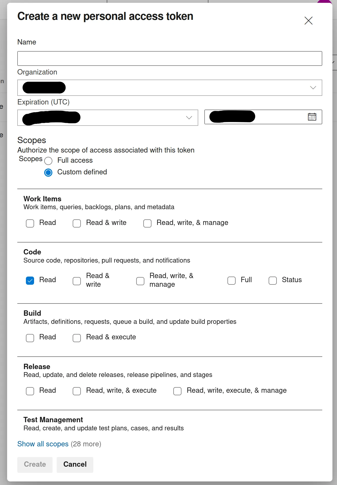
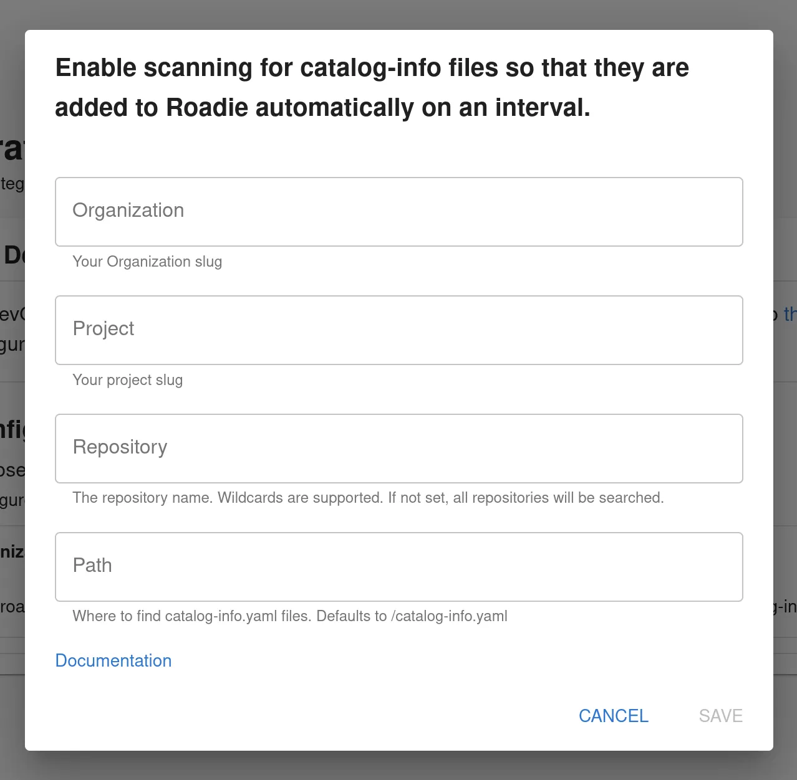

## At a Glance
| | |
|---: | --- |
| **Prerequisites** |  |
| **Considerations** |  |
| **Supported Environments** | ☐ Private Network via Broker   ☐ Internet Accessible via IP Whitelist   ☒ Cloud Hosted |

## Introduction

Azure DevOps is a popular alternative to GitHub as an SCM provider. 

This guide describes how to set up access for Roadie to your Azure DevOps repositories and retrieve relevant entities from that source.

##  Step 1: Install Azure CodeSearch for your Azure DevOps organization

Azure discovery is driven by the Code Search feature in Azure DevOps, this may not be enabled by default. For Azure DevOps Services you can confirm this by looking at the installed extensions in your Organization Settings.

If the Code Search extension is not listed then you can install it from the [Visual Studio Marketplace](https://marketplace.visualstudio.com/items?itemName=ms.vss-code-search&targetId=f9352dac-ba6e-434e-9241-a848a510ce3f).

##  Step 2: Generate Azure DevOps personal access token (PAT)

In your Azure DevOps navigate to the User Settings > Tokens page in `https://dev.azure.com/<your-organization>/_usersSettings/tokens`. Within this page you can generate a token to grant Roadie access to read your entity manifest files.

1. Click 'New Token'
2. Create an access token with _at least_ repository Read permissions.

##  Step 3: Store Azure access token as a secret in Roadie

Navigate to `https://<your-tenant>.roadie.so/administration/settings/secrets` and locate a secret with a name `AZURE_TOKEN`. Update the value of this secret with the token created in the step above.

The updating of secrets within the Roadie application takes a few minutes. You will see the status of the secret change when it becomes available.

##  Step 4: Configure your Roadie instance to use Azure DevOps as a source to retrieve entities

Navigate to `https://<your-tenant>.roadie.so/administration/settings/integrations/azure`.
   

Add a provider configuration pointing to your entities within your Azure DevOps organization and project. The updating of provider configurations within the Roadie application takes a few minutes. When the update cycle is complete, you should be able to find your discovered entities in the catalog and the [locations log](/docs/details/location-management/#managing-locations).

## References

- [Azure DevOps Discovery documentation in Backstage](https://backstage.io/docs/integrations/azure/discovery)

