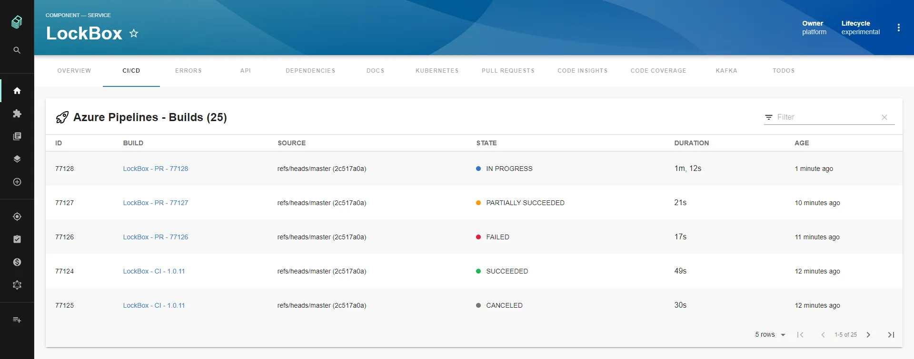
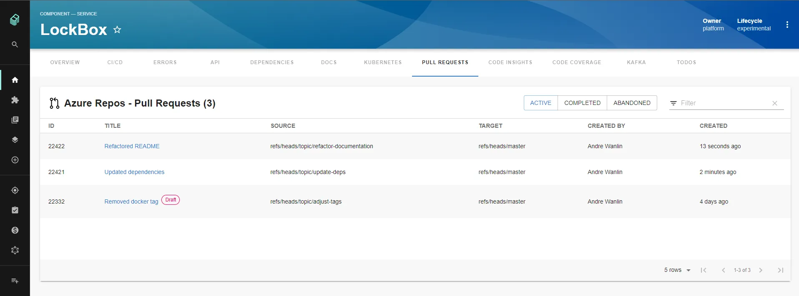
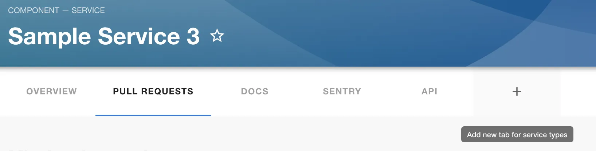

## Introduction

[Microsoft’s Azure DevOps](https://dev.azure.com/) is a hosted service providing development and collaboration tools.

This plugin provides visualisations for some components of Azure Devops in your components using annotations. 

### Azure Pipelines
Azure Pipelines is a CI/CD, testing, and deployment system that can connect to any Git repository. 

The plugin lists the latest builds for a given Azure Repo.


Credit: [Andrew Wanlin](https://github.com/awanlin) from Keyloop

### Azure Repos
Azure Repos is a Git repository service. 

The plugin lists the latest Active, Completed, or Abandoned Pull Requests for a given repository.


Credit: [Andrew Wanlin](https://github.com/awanlin) from Keyloop

## At a Glance
| | |
|---: | --- |
| **Prerequisites** |  |
| **Considerations** |  |
| **Supported Environments** | ☐ Private Network via Broker <br /> ☐ Internet Accessible via IP Whitelist <br /> ☑ Cloud Hosted |

## Setup
(NB: You must be a Backstage admin to add this plugin.)

### Global Settings
You will need to set your Azure Devops Organization name in the Settings page under the "Azure Devops" section.

Then you will need to add a [Personal Access Token](https://docs.microsoft.com/en-us/azure/devops/organizations/accounts/use-personal-access-tokens-to-authenticate?view=azure-devops&tabs=preview-page) with read access to both Code and Build.

This is set within Roadie at the following URL or via Settings under the Secrets section:

```text
https://<tenant-name>.roadie.so/administration/settings/secrets
```

### Annotations
You will first need to add the following annotation in your Component's `catalog-info.yaml` file:

```dev.azure.com/project-repo: <project-name>/<repo-name>```

Let's break this down a little: `<project-name>` will be the name of your Team Project and `<repo-name>` will be the name of your repository which needs to be part of the Team Project you entered for `<project-name>`.

```yaml
apiVersion: backstage.io/v1alpha1
kind: Component
metadata:
    # ...
    annotations:
      dev.azure.com/project-repo: my-project/my-repo
spec:
  type: service
  # ...
```

If you are only using Azure Pipelines along with a different SCM tool then you can use the following two annotations to see Builds:

```yaml
dev.azure.com/project: <project-name>
dev.azure.com/build-definition: <build-definition-name>
```
In this case `<project-name>` will be the name of your Team Project and `<build-definition-name>` will be the name of the Build Definition you would like to see Builds for. If the Build Definition name has spaces in it make sure to put quotes around it


## Adding the Plugin

The `EntityAzurePipelinesContent` and `EntityAzurePullRequestsContent` components can be added as new tabs to your Components that have an annotation in their `catalog-info.yaml` files. 




## Limitations
- Currently, multiple organizations are not supported. You can set your organization in the Settings page.
- Azure DevOps Server (on-premise) is not supported.