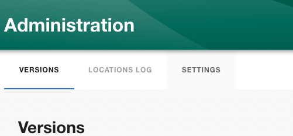
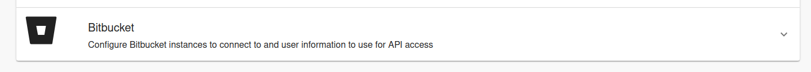
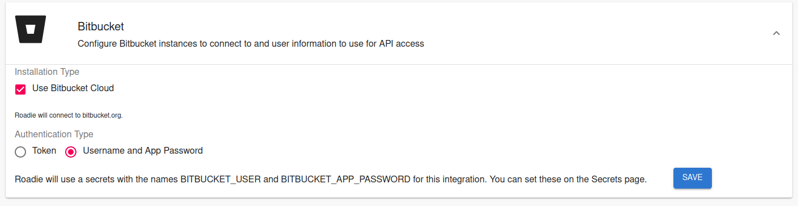

## Introduction

This tutorial will guide you through the steps required to connect Roadie to your Bitbucket repositories.

## Step 1: Save Bitbucket integration config in Roadie

By adding a Bitbucket integration you will allow Roadie to access the YAML metadata files that Backstage needs to operate.

Roadie supports Bitbucket configuration on both Bitbucket Cloud and self-hosted Bitbucket server. The authentication methods supported are either with Token or a Username + Application Password authentication. Username + Application Password is preferred authentication method since it provides more granular options to control the access to give to the integration. If you are connecting to a Bitbucket server Username + Application Password is the only supported connection method. 

1. Click the Administration link in the bottom left of the application.

2. Click the Settings tab along the top of the Administration page.

3. Click on Integrations in the left sidebar.

4. Open the Bitbucket section of the accordion

5. Choose your preferred authentication method, server connection options and click save

⚠️  &nbsp;You may need to wait up to 2 minutes for the Bitbucket integration to become active.
