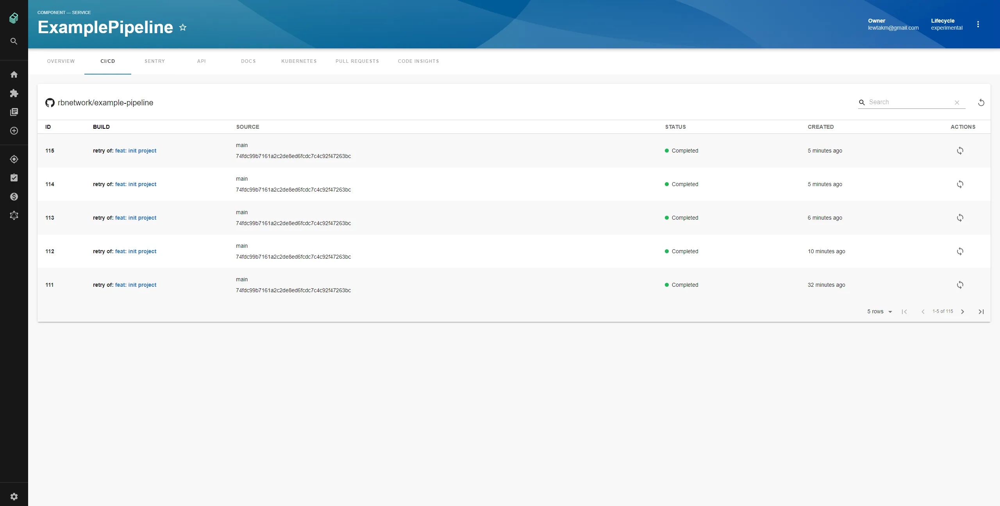
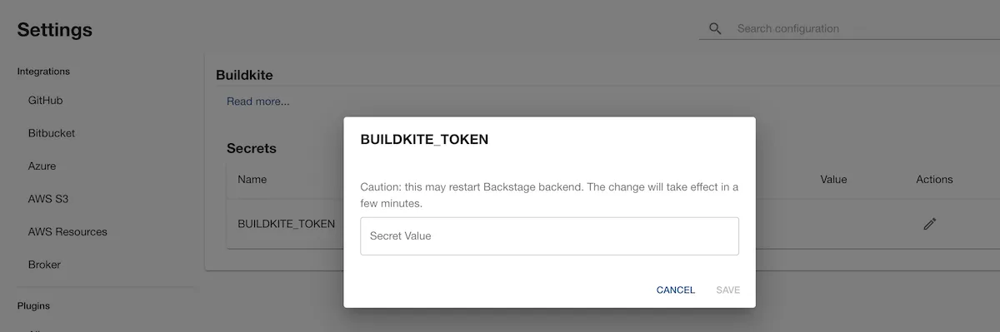
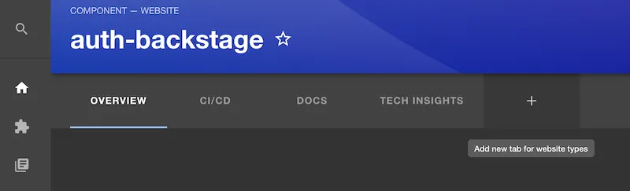
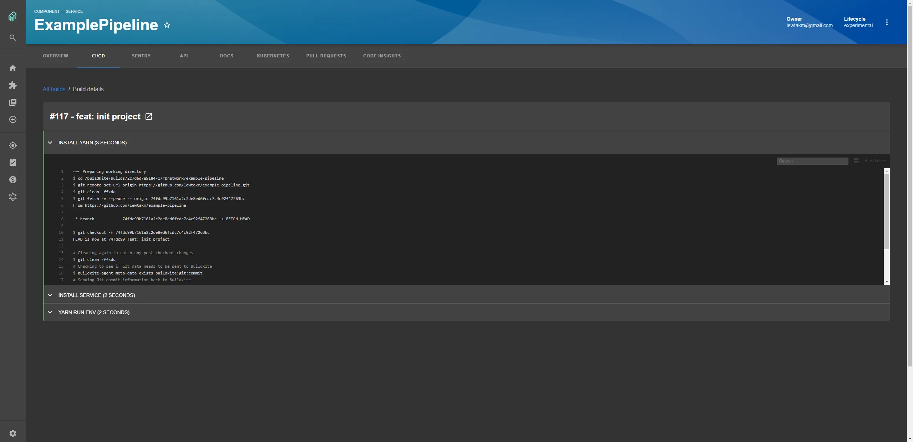

## Introduction

The [Backstage Buildkite plugin](https://roadie.io/backstage/plugins/buildkite/) integrates with Buildkite to show your build information inside Backstage where it can be associated with your services.



## At a Glance
| | |
|---: | --- |
| **Prerequisites** |  |
| **Considerations** |  |
| **Supported Environments** | ☐ Private Network via Broker <br /> ☐ Internet Accessible via IP Whitelist <br /> ☒ Cloud Hosted |

## Add Buildkite to one of your components

### Add the Buildkite annotation
First, add an annotation in the `catalog-info.yaml` file for a service that uses Buildkite like so: 
```yaml
metadata:
  annotations:
    buildkite.com/project-slug: <buildkiteorganization/buildkitepipeline>
```

### Add your API Key
You will need to create an API key for your Org in Buildkite with read permissions.

Then add it to Roadie at `/administration/buildkite`.



### Add the plugin
In Roadie, find and select the service via the Component Catalog or Search.

Click the plus icon to add a new plugin for your component.



Select the EntityBuildkiteContent card from the drop-down and click Create.


You should now see your Buildkite pipeline runs inside Roadie!


You can then click in individual builds to see more info. 



