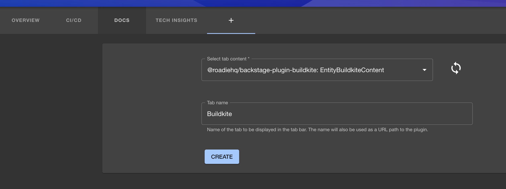

## Introduction

The Backstage Buildkite plugin integrates with Buildkite to show your build information inside Backstage where it can be associated with your services.

## Add a Catalog Graph card to a dashboard

Click the cog icon on the top right of a component Dashboard (or the default Overview) page. Then click the plus icon to add a new card.

Select the EntityBuildkiteContent card from the drop down and click Create.

### Add you API Key
You will need to create an API key for your Org in Buildkite with read permissions.
Then add it in Roadie via Administration -> Settings -> Secrets -> BUILDKITE_TOKEN 

