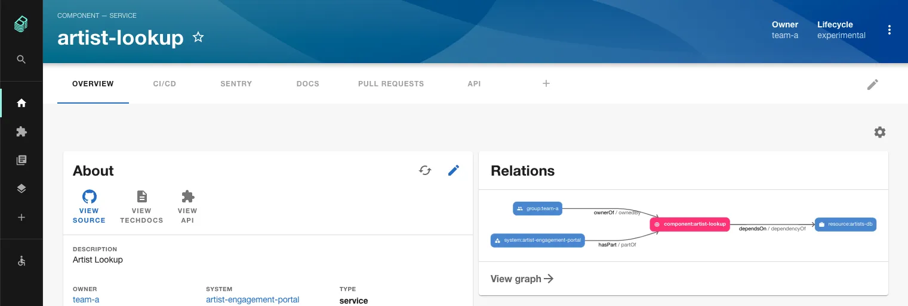
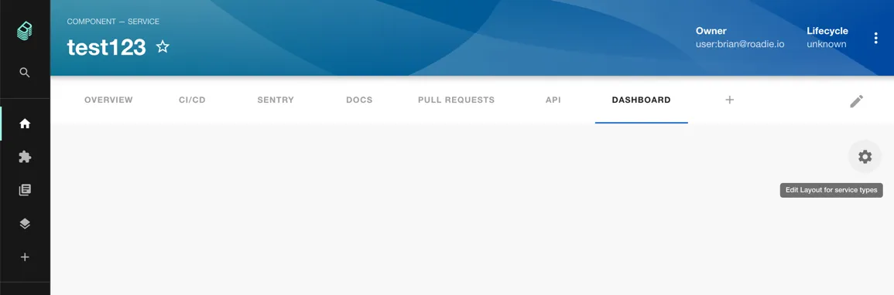
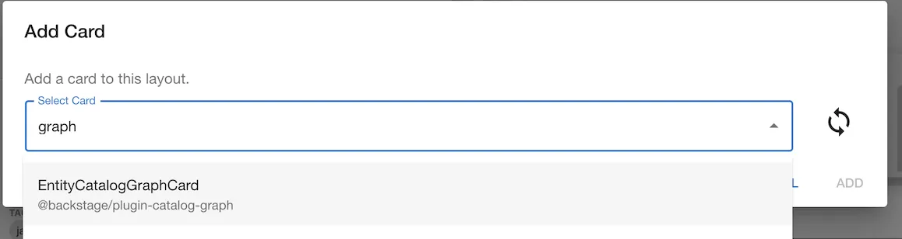

## Introduction

With this plugin, you can visualize the [relations between entities](https://roadie.io/blog/modeling-software-backstage/), like ownership, grouping or API relationships.



## At a Glance

|                            |                                                                                                  |
| -------------------------: | ------------------------------------------------------------------------------------------------ |
|          **Prerequisites** |                                                                                                  |
|         **Considerations** |                                                                                                  |
| **Supported Environments** | ☐ Private Network via Broker <br /> ☐ Internet Accessible via IP Whitelist <br /> ☒ Cloud Hosted |

## Add a Catalog Graph card to a dashboard

Click the cog icon on the top right of a component Dashboard (or the default Overview) page. Then click the plus icon to add a new card.




Select the EntityCatalogGraph card from the drop down and click Add. Press save to submit.



## Add an Overview page

You can also create a page in the sidebar that graphs your whole organisation or a section of it using the CatalogGraphPage component.

To make this work you need to supply some custom props when adding the card. The minimum needed is a rootEntityRef.

If you have created them already, `domains` or core `systems` can be a good way to group all the software together and graph it by specifying them as root entity references:

```json
{
  "initialState": {
    "rootEntityRefs": ["domain:<a top level domain>"]
  }
}
```

If you have not created systems or domains yet you can read more [here](https://roadie.io/blog/modelling-software-backstage) and [here](https://backstage.io/docs/features/software-catalog/descriptor-format#kind-domain).

The Overview page can be further customized to only show certain types of dependencies or kinds of entity using the following include lists:

```json
{
  "initialState": {
    "rootEntityRefs": ["domain:<a top level domain>"],
    "selectedRelations": [
      "ownerOf",
      "ownedBy",
      "consumesApi",
      "apiConsumedBy",
      "providesApi",
      "apiProvidedBy",
      "dependsOn",
      "dependencyOf",
      "parentOf",
      "childOf",
      "memberOf"
    ],
    "selectedKinds": ["component", "domain", "system", "api", "group"]
  }
}
```

See the full [schema of usable filters here](https://backstage.io/docs/reference/plugin-catalog-graph.cataloggraphpage).

## Viewing the graph and navigating through the relationships.

You can click on any of the entities in the graph to go to the page for that entity.

You can also click the View graph link at the bottom of the card to view a full page graph and see the component in the
context of the whole system.


## Adding relationships between components

If you can't see any connections to your component you will first need to define these relationships explicitly in your
component yaml files as explained here https://roadie.io/blog/modeling-software-backstage/.

### Customizing graph parameters.

In order to customize the breadth and depth of the graph on your dashboards you can click the cog icon at the top right
of the page and then the spanner icon in the top right of the card.


Then you can edit the props for the card by adding the following JSON or a subset of it depending on your preferences.

```json
{
  "title": "Relationship Graph",
  "kinds": ["component", "domain", "system", "api", "group"],
  "relations": [
    "ownerOf",
    "ownedBy",
    "consumesApi",
    "apiConsumedBy",
    "providesApi",
    "apiProvidedBy",
    "dependsOn",
    "dependencyOf",
    "parentOf",
    "childOf",
    "memberOf"
  ],
  "maxDepth": 2
}
```

If not specified, your graph will have a depth of 1 by default.
