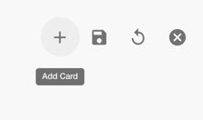
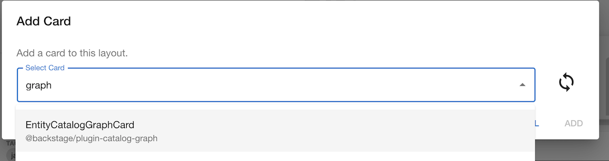
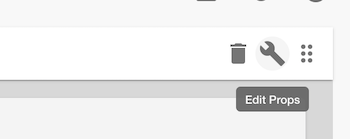
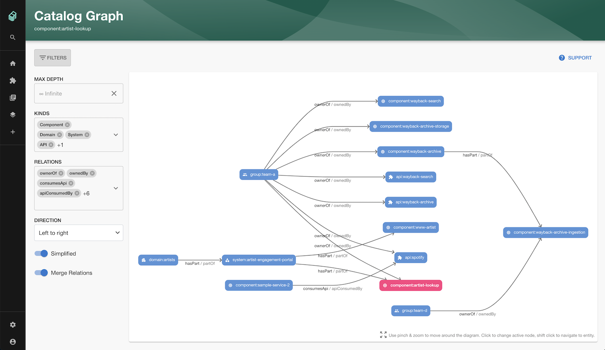

## Introduction

With this plugin, you can visualize the relations between entities, like ownership, grouping or API relationships.

## Add a Catalog Graph card to a dashboard

Click the cog icon on the top right of a component Dashboard (or the default Overview) page. Then click the plus icon to add a new card.




Select the EntityCatalogGraph card from the drop down and click Add. Press save to submit.




### Customize graph parameters.


In order to customize size of the graph you can click the cog icon at the top right of the page and then the spanner 
icon in the top right of the card.





Then you can edit the props for the card by adding the following JSON or a subset of it depending on your preferences.

```json
{
  "selectedKinds": [
    "component",
    "domain",
    "system",
    "api",
    "group"
  ],
  "selectedRelations": [
    "ownerOf",
    "ownedBy",
    "consumesApi",
    "apiConsumedBy",
    "providesApi",
    "apiProvidedBy",
    "dependsOn",
    "dependencyOf",
    "parentOf",
    "childOf",
    "memberOf"
  ],
  "maxDepth": 3
}
```

If not specified, your graph will have a depth of 1 by default.

## Viewing the graph and navigating through the relationships.

You can click on any of the entities in the graph to go to the page for that entity.

You can also click the View graph link at the bottom of the card to view a full page graph and see the component in the 
context of the whole system.


