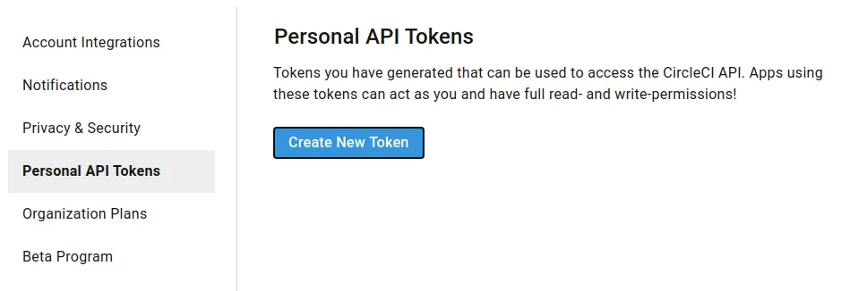
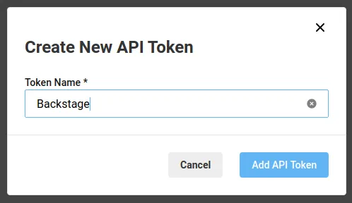

## Introduction

The Backstage Circle CI plugin integrates with Circle CI to show your build information inside Backstage where it can be associated with your services.

## At a Glance
| | |
|---: | --- |
| **Prerequisites** |  |
| **Considerations** |  |
| **Supported Environments** | ☐ Private Network via Broker <br /> ☐ Internet Accessible via IP Whitelist <br /> ☑ Cloud Hosted |

## Using the Plugin

1. Get an API token from CircleCI - see below for instructions on how to get the token.

2. Add the API token in Roadie at `/administration/circle-ci`.

3. Add a circleci.com/project-slug annotation to your respective catalog-info.yaml files following the Component format

```yaml
# Example catalog-info.yaml entity definition file
apiVersion: backstage.io/v1alpha1
kind: Component
metadata:
  # ...
  annotations:
    # This also supports bitbucket/xxx/yyy
    circleci.com/project-slug: github/my-org/my-repo
spec:
  type: service
# ...
```

4. Add the CircleCi plugin to one of your entities with the correct annotation in Roadie as a new tab. 


## Creating a token

In order to make requests to the CircleCI API, you must provide Roadie with an API key.

1. Make sure you are logged in to Circleci as the user you want to use for Backstage. We recommend creating a Github bot account for this.

2. Go to https://app.circleci.com/settings/user/tokens and select Create New Token.

   

3. Give the token a name and click Add API Token.

   

4. Circleci will print the token that Backstage needs.

5. Follow the instructions on how to share the API Token with Roadie.


## References

- [CircleCI docs for creating API tokens](https://circleci.com/docs/api/#add-an-api-token)
