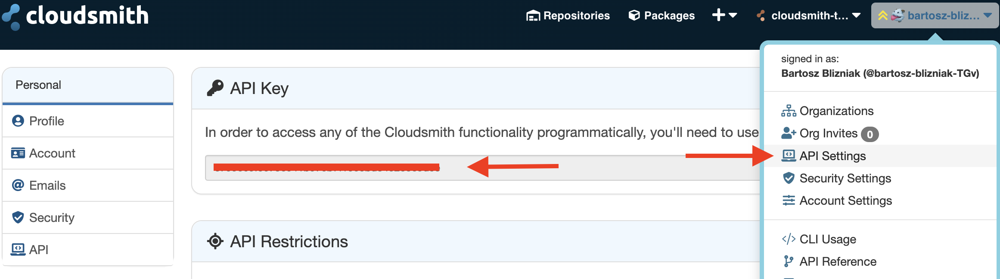
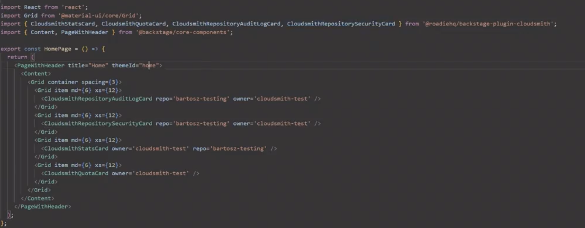

## Introduction

This page describes how to set up the Cloudsmith plugin on Roadie.


## Prerequisites

You'll need a Cloudsmith account and an API token.

### Step 1: Configure the Cloudsmith API token

Navigate to your [Cloudsmith account settings](https://cloudsmith.io/user/settings/api/) and copy your API key.



Once you have your API Key, save it to environment variable called `CLOUDSMITH_API_KEY` on your system.

### Step 2: Import the Cloudsmith plugin and display it

In your `packages/app/src/components/home/Homepage.tsx` file, add the following import statement:



```ts
import {
    CloudsmithStatsCard,
    CloudsmithQuotaCard,
    CloudsmithRepositoryAuditLogCard,
    CloudsmithRepositorySecurityCard,
} from '@roadiehq/backstage-plugin-cloudsmith';
```
    
Then, add the following component to the `grid` array:
    
```html
<Grid item xs={12} md={6}>
    <CloudsmithStatsCard repo="repo-name" owner="org-name"/>
</Grid>

<Grid item xs={12} md={6}>
    <CloudsmithQuotaCard owner='org-name'/>
</Grid>

<Grid item xs={12} md={6}>
    <CloudsmithRepositoryAuditLogCard owner='org-name' repo='repo-name'/>
</Grid>

<Grid item xs={12} md={6}>
    <CloudsmithRepositorySecurityCard owner='org-name' repo='repo-name'/>
</Grid>
```