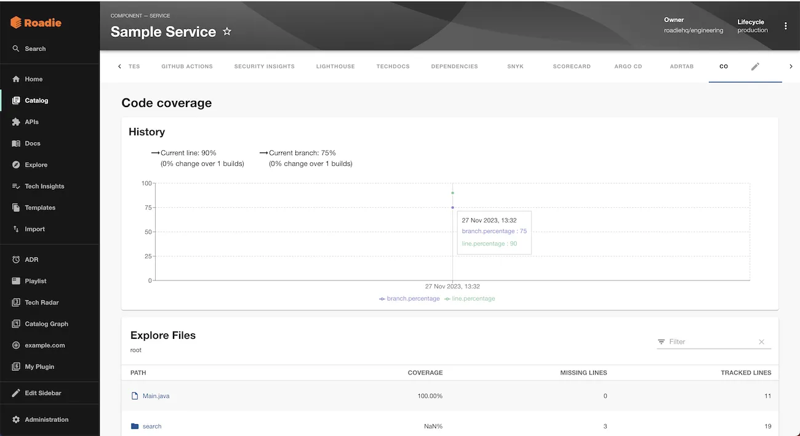

## Introduction

The code-coverage plugin can display the Code Coverage summaries of the components in your Roadie Backstage catalog.

This page explains how to use it in Roadie Backstage.

## At a Glance

|                            |                                                                                                                                                                                                                                                                                                                                                                                                                                                                                             |
| -------------------------: | ------------------------------------------------------------------------------------------------------------------------------------------------------------------------------------------------------------------------------------------------------------------------------------------------------------------------------------------------------------------------------------------------------------------------------------------------------------------------------------------- |
|          **Prerequisites** | 1. You must be an admin in Roadie. By default, all users are admins. Learn how to designate certain users as admins [here](/docs/getting-started/assigning-admins/). <br /> 2. You must have a code-coverage report for your components i.e. Cobertura, LCOV or JaCoCo. See the plugin docs for [currently supported standards](https://www.npmjs.com/package/@backstage-community/plugin-code-coverage-backend#api). <br /> 3. You must have access to the Roadie API and a valid API Key. |
|         **Considerations** |                                                                                                                                                                                                                                                                                                                                                                                                                                                                                             |
| **Supported Environments** | ☐ Private Network via Broker <br /> ☐ Internet Accessible via IP Whitelist <br /> ☒ Cloud Hosted                                                                                                                                                                                                                                                                                                                                                                                            |

## Prerequisites

## Step 1: Upload your code-coverage reports into Roadie

Send a POST request via the Roadie HTTP API with your report for an entity like so:

```bash
export ROADIE_API_TOKEN='abcd'
export ENTITY_REF="component:default/sample-service"
export COVERAGE_TYPE='cobertura'
curl -X POST "https://api.roadie.so/api/code-coverage/report?entity=$ENTITY_REF&coverageType=$COVERAGE_TYPE" \
-H "Content-Type:text/xml" \
-H "Authorization: Bearer $ROADIE_API_TOKEN" \
-d @cobertura.xml
```

See more examples for different code-coverage reports [here](https://www.npmjs.com/package/@backstage-community/plugin-code-coverage-backend#api)

NB: This should probably be run as part of a CI workflow when deploying changes to a service.

## Step 2: Modify your catalog-info.yaml files to tell it to try and fetch the code-coverage report from Roadie

```yaml
# catalog-info.yaml
---
metadata:
  annotations:
    backstage.io/code-coverage: enabled
```

## Step 3: Add the code-coverage UI component to your Roadie instance

The plugin provides an UI component with a name `EntityCodeCoverageContent` which can be added as a tab to entities in your Roadie instance. Learn how to do that in [here](/docs/details/updating-the-ui/).

## References

- [code-coverage Plugin documentation](https://www.npmjs.com/package/@backstage-community/plugin-code-coverage)
