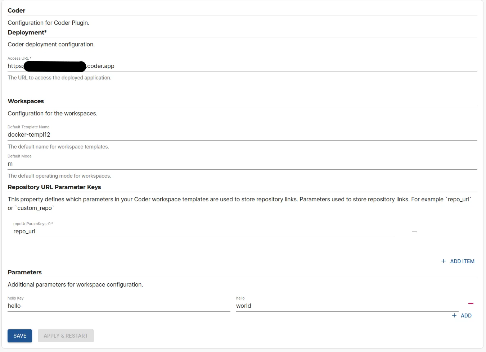

## At a Glance
| | |
|---: | --- |
| **Prerequisites** |  |
| **Considerations** |  |
| **Supported Environments** | ☐ Private Network via Broker   ☐ Internet Accessible via IP Whitelist   ☒ Cloud Hosted |

## Introduction

This page describes how to set up the Coder plugin on Roadie.

## Prerequisites

You'll need a Coder account and templates/workspaces available on that account.

## Step 1: Configure the Coder plugin

Navigate to `/administration/coder` and add needed values to the configuration form. The plugin does not need additional API tokens, but instead uses token generated for each individual user at run time within the plugin components themselves.

To see more information about the available config options, take a look at the "Code plugin configuration options" link in the "More information" section.

## Step 2: Add the Coder plugin to the application

The Coder plugin exposes a Card component that can be added to entity pages. The component exposed by the plugin is called `CoderWorkspacesCard`. You can find more information about how to add cards into the application from the ["Configuring Roadie UI"](/docs/getting-started/configure-ui/) documentation. 

After you have added the plugin component to your entity pages, you can authenticate with Coder directly via the Card component and start seeing the configured workspaces and templates. 

## (Optional) Step 3: Add additional Coder information into your entities. 

Coder uses both application level configuration that you can configure in Roadie administration section and entity level individual configuration to determine the data to display. You can override exposed templates and other values like parameters to be used in templates on the entity level by adding additional information into the `spec.coder` property of your entity. See more information about the available config options from the entity file documentation like in the "More Information" section.  

## More information:

* [Coder plugin documentation](https://github.com/coder/backstage-plugins/tree/main/plugins/backstage-plugin-coder)
* [Coder plugin configuration options](https://github.com/coder/backstage-plugins/blob/main/plugins/backstage-plugin-coder/docs/types.md#coderappconfig)
* [Example Entity File for coder plugin](https://github.com/coder/backstage-plugins/blob/main/plugins/backstage-plugin-coder/docs/catalog-info.md#example-file)
